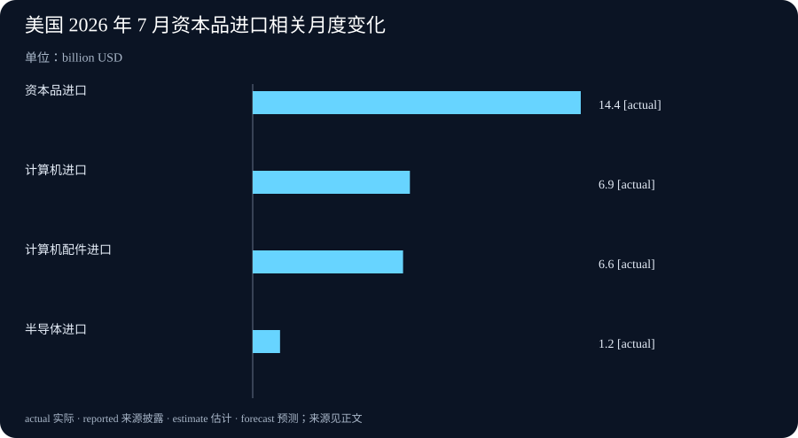

# Daily Intelligence

2026-09-06 · Sunday · 信息截止 07:20（Asia/Shanghai）

## Today’s Thesis｜能力放宽之后，边界必须比模型更确定

高能力网络安全智能体的关键不在于是否减少拒答，而在于组织能否把身份、授权范围、隔离环境、动作审查和事后追溯拼成一个会在执行时生效的控制面。OpenAI 对 Daybreak 的分级访问是供应商方案；7 月美国贸易数据则提醒，单月的计算机进口跳升可以是投资、库存或价格共同作用的结果，不能直接写成 AI 需求的结论。

## Executive Summary｜执行摘要

- OpenAI 8 月 10 日介绍 Daybreak Blue 与 Red 两个受控访问层：前者面向经批准的防御工作，后者面向获授权的高级漏洞研究和测试；访问控制包括身份核验、账户安全、监控、用途限制与法律证明。[来源](https://openai.com/index/expanding-daybreak-as-the-cyber-defense-window-narrows/)
- 公告披露其内部 Advanced Cybersecurity Completion Rate 中，GPT-5.6-Cyber 为 95.0%，GPT-5.6 Sol 为 1.5%，Daybreak Blue 为 2.0%。这是供应商自建评测的“响应率”，不是现实攻击成功率、客户安全成效或跨环境基准。[来源](https://openai.com/index/expanding-daybreak-as-the-cyber-defense-window-narrows/)
- OpenAI 明确建议在受控环境中隔离安全工作流、监控智能体动作，并通过范围化权限配置约束系统和动作；高风险工作仍应增加人工监督。建议本身不证明任何客户已经安全部署。[来源](https://openai.com/index/expanding-daybreak-as-the-cyber-defense-window-narrows/)
- BEA 与 Census 的 7 月贸易初值显示，商品和服务逆差为 886 亿美元；出口环比减少 66 亿，进口增加 108 亿。资本品进口增加 144 亿，其中计算机增加 69 亿、配件增加 66 亿、半导体增加 12 亿；数据经过季调但未按价格调整，且 1 至 6 月已修订。[来源](https://www.bea.gov/news/2026/us-international-trade-goods-and-services-july-2026)

## AI Daily｜访问资格不是执行授权

Daybreak 的结构把“能否接触更高能力”与“可在何处做什么”分开。公告所述 Blue 针对漏洞发现、安全代码审查、恶意软件分析、响应和补丁验证；Red 则提供专门的网络安全模型用于经授权的漏洞研究、利用验证和安全测试。[来源](https://openai.com/index/expanding-daybreak-as-the-cyber-defense-window-narrows/) 这是一种产品访问分层，不是对某个任务或目标系统的自动许可。团队若把通过身份核验理解为可对任意资产测试，边界便在最关键处失效。

更可靠的单位不是一个账户，而是一份可执行的任务授权：目标资产清单、允许的方法、时间窗、隔离方式、数据处理规则、升级联系人与停止条件。模型可以帮助解释代码或提出假设，但网络扫描、利用验证、凭据使用、外联和写入行为应由工作流外的确定性策略再判断。这样，即使模型输出错误或上下文遭污染，损失上限仍由权限层而非语言指令决定。

公告称 Blue 会移除部分系统级网络安全护栏，Red 进一步减少某些高风险双用途任务的拒绝；但同时说明部分高度双用途请求仍会被拒绝。[来源](https://openai.com/index/expanding-daybreak-as-the-cyber-defense-window-narrows/) 这说明护栏不是单一开关。企业需要另行记录自身的接受风险：哪些动作可自动完成，哪些只允许在模拟环境，哪些必须由独立审批人确认。供应商策略、组织策略与客户资产所有者的授权缺一不可。

## Business Daily｜把合规从准入表格变成运行成本

高能力工具的商业价值通常表现为更快的发现、复现、验证与修复，但成本并没有消失，而是转移到身份运营、硬件密钥、隔离实验室、日志保留、审批队列、供应商审查和事故响应。OpenAI 表示将要求 Daybreak 个人账户采用硬件安全密钥，并鼓励 Codex 用户将全权限模式切到自动审查；这些是平台设计选择，组织仍须把它们接到自己的资产、变更和责任流程中。[来源](https://openai.com/index/expanding-daybreak-as-the-cyber-defense-window-narrows/)

采购或内部试点应把指标分为三类。能力指标衡量找到、复现和修复问题所需的时间；控制指标衡量越权尝试被拦截的比例、审查延迟和日志完整性；结果指标衡量真实修复率、重复缺陷、误报、业务中断和事故成本。只看模型完成率会遗漏最昂贵的部分：一次被错误执行的动作可能抵消许多节省的分析时间。

供应商给出的 95.0%、1.5% 和 2.0% 需要被准确保存为内部评测披露。它们的任务集合涉及利用链、认证绕过、权限提升等场景，因而不等同于漏洞发现的准确率，也不能推导本组织生产环境的风险变化。[来源](https://openai.com/index/expanding-daybreak-as-the-cyber-defense-window-narrows/) 合理的下一步是用隔离的自有代码库和已知缺陷构建对照：在同一范围、同一时间和同一人工复核下比较成功、失败、幻觉与升级成本。

## Macro Observation｜硬件贸易是信号，不是因果标签

7 月美国商品和服务逆差从经修订的 712 亿美元扩大至 886 亿美元。出口为 3107 亿，进口为 3993 亿；三个月移动平均逆差升至 785 亿。[来源](https://www.bea.gov/news/2026/us-international-trade-goods-and-services-july-2026) 这些数字描述的是名义、季调后的跨境流量，不能直接代表实际产量、最终需求或产业利润。

值得观察的是资本品进口环比增加 144 亿，其中计算机增加 69 亿、计算机配件增加 66 亿、半导体增加 12 亿。[来源](https://www.bea.gov/news/2026/us-international-trade-goods-and-services-july-2026) 这与计算基础设施投资的方向相容，但尚不能归因给 AI：企业更新周期、库存安排、汇率、价格、贸易政策、一般云计算需求与统计口径都可能影响同一项目。BEA 还说明一至六月数据纳入更全面资料后已修订，进一步表明初值需要保留可变性。

出口端，工业用品和材料减少 87 亿，原油减少 45 亿、非货币黄金减少 39 亿；资本品出口则增加 19 亿。[来源](https://www.bea.gov/news/2026/us-international-trade-goods-and-services-july-2026) 因此，不能从进口侧的计算机变化直接推出整体技术贸易繁荣。后续应同时看价格调整后的实物数据、资本品细项的连续性、企业资本开支披露和下一次修订，而不是让一个月的项目承担完整叙事。

## Signal Dashboard｜信号仪表盘

| 信号 | 状态 | 证据边界 | 下一验证 |
|---|---|---|---|
| Daybreak 分级访问 | 供应商已公布 | 产品与访问设计，不是资产所有者授权 | 核对组织任务授权与隔离环境 |
| 95.0% 完成率 | 公司内部评测 | 特定任务集的响应率 | 在自有隔离基准复现并记录误报 |
| 硬件安全密钥要求 | 供应商计划 | 账户控制，不替代工作流权限 | 检查密钥遗失、恢复和离职流程 |
| 7 月贸易逆差 886 亿美元 | 官方初值 | 季调名义值，后续可能修订 | 对照 8 月数据与实物量指标 |
| 计算机进口 +69 亿美元 | 官方分类变动 | 单月变化，不识别 AI 因果 | 跟踪资本品细项和企业披露 |

## Deep Insight｜真正的安全能力，是可撤销的行动能力

智能体在网络安全任务中的价值来自连续性：它可以在大型代码库中维持假设，调用工具测试，再把线索整理成报告。风险也来自同一连续性：一旦模型拥有通向真实环境的路径，错误的目标识别、被污染的上下文或过宽的工具能力都会把“分析”变成外部后果。于是，评估一个系统不能只问模型是否能找到漏洞，还要问它能否在找错对象、读错指令或收到异常结果时被阻止。

可撤销性是最实用的设计原则。读操作一般可以在窄范围内自动化；低影响、可回滚的写操作可以受速率和对象限制；会影响生产、身份、资金、客户数据或外部网络的操作，则应要求独立批准和执行时复核。这里的“独立”意味着批准者和模型的上下文不能只是同一段对话的不同措辞。批准应绑定任务、对象、参数、时效和一次性使用语义，执行服务还要重新检查当前权限与环境状态。

Daybreak 公告提到隔离、监控、自动审查与范围化权限，正好构成四个不同层次。隔离缩小可触及的系统；范围化权限缩小可做的动作；审查判断例外动作是否可放行；监控让组织在事后和实时看见发生了什么。[来源](https://openai.com/index/expanding-daybreak-as-the-cyber-defense-window-narrows/) 它们不可互相替代。只有监控没有权限，组织会获得一份完整的事故记录；只有权限没有隔离，允许动作仍可能影响不该接触的资源；只有审批没有执行时复核，过期授权仍会被重放。

这也是为什么“更少拒答”不应成为独立 KPI。拒答减少可能提高防御研究效率，也可能只是增加需要人工辨别的输出。一个成熟试点应同时记录：被接受的任务是否在授权范围、模型建议是否被证实、工具调用是否被策略阻止、人工何时介入、修复是否真的降低暴露面。效率只在这些控制成本没有失控时才有意义。

贸易数据提供了同样的纪律。计算机进口上升是一个有用观察，却不是关于 AI 投资、生产率或安全需求的直接证据。把它连接到具体业务判断前，应补上价格、数量、库存、采购者和时间序列。模型系统和宏观数据都提醒我们：一个显眼指标可以启动调查，但不能跳过机制、边界和反证。

可证伪条件应提前写出：若隔离与范围化权限没有减少越权或误操作，控制设计需要重构；若人工审查持续成为瓶颈且无法通过低风险预授权改善，自动化范围应缩小；若后续贸易修订或实物数据不支持资本品需求持续走强，今天的硬件投资信号应降级。把这些失败条件纳入周报，才能避免把供应商演示或单月统计写成确定趋势。

## Tomorrow Watch｜明日观察

- 为一个安全智能体任务写出资产、允许动作、禁止动作、审批人和停止条件。
- 在隔离环境测试范围化权限、过期批准、重放请求和异常外联是否被阻断。
- 将供应商完成率与自有代码库上的复现率、误报和人工复核时间分开记录。
- 追踪资本品贸易的后续修订、实物指标与企业资本开支，而非单看计算机进口。

## One Chart｜一图

图中展示 7 月贸易报告中与资本品进口相关的月度项目：资本品 +144 亿美元、计算机 +69 亿、配件 +66 亿、半导体 +12 亿。项目均来自同一官方新闻稿，却不是相互独立的总体贡献，且未经价格调整，不能据此计算 AI 投资或生产率。[来源](https://www.bea.gov/news/2026/us-international-trade-goods-and-services-july-2026)

## Quote of the Day｜每日一句

> “What information consumes is rather obvious: it consumes the attention of its recipients.” — Herbert A. Simon

“信息消耗的东西很明显：它消耗接收者的注意力。”斯坦福数字经济实验室材料引用 Simon 1971 年《Designing Organizations for an Information-Rich World》；对安全团队而言，增加模型输出不等于增加判断能力，过滤、证据与授权路径同样决定注意力能否转化为行动。[来源](https://digitaleconomy.stanford.edu/wp-content/uploads/2021/07/PowerofPrediction-06292021.pdf)

## Action Items｜行动项

- 将每个网络安全智能体任务绑定到目标资产、时间窗、允许方法和明确负责人。
- 把读、可回滚写和高后果写分层，后两类在执行时复核当前权限。
- 保存供应商评测的原始口径，不把完成率改写成生产环境安全成效。
- 把计算机进口作为待验证观察，并同时跟踪价格、数量、库存和修订。
