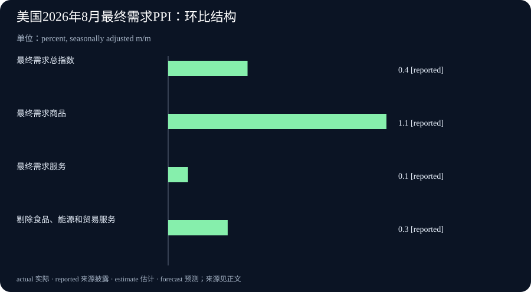

# Daily Intelligence

2026-09-11 · Friday · 上海时间早间版。信息截止本次早间检索；采用已打开正文的官方资料及公司署名新闻稿。9 月 11 日美国 CPI 尚未到计划发布时间，本文不填入未公布读数。事实、公司披露与本刊分析分别标明。

## Today’s Thesis｜AI 的规模化价值，需要跨过计算、验证与回款之间的距离

今天的主线不是再多一个能回答问题的模型，而是模型能力如何被组织成可反复使用的资源。基因变异预测被预先计算成研究图谱，云基础设施增长需要持续投入，生产者价格又提醒我们现实成本不会因为软件更聪明而消失。本刊的判断是：竞争可能从“能算出多少”转向“多少结果可以被验证、交付并持续负担”。这是一种跨新闻的分析框架，不表示三件事之间存在已经证实的因果关系。

## Executive Summary｜执行摘要

- Google 澳大利亚 9 月 10 日介绍 AlphaGenome Atlas 的研究合作进展；平台本身于 9 月 8 日发布，并非当天全新发布。其核心是把基因变异的模型预测变成可检索资源。[最新跟进](https://blog.google/intl/en-au/company-news/technology/alphagenome-atlas-helping-australian-researchers/) [原始发布](https://deepmind.google/blog/alphagenome-atlas-a-predictive-map-of-every-possible-dna-letter-change-in-the-human-genome/)
- Oracle 披露第一财季收入 193 亿美元、同比增长 30%；云基础设施收入 74 亿美元、同比增长 121%。增长事实来自公司财报新闻稿，不能据此把所有云收入都归为 AI 收入。[公司署名新闻稿，经 PR Newswire 分发转载](https://smb.panolian.com/article/Oracle-Announces-Q1-Results-Driven-by-Triple-Digit-Growth-in-Cloud-Infrastructure-Revenues/6aa30f72fb7acafcb4abac75)
- 美国 8 月最终需求 PPI 经季调环比上涨 0.4%，未经季调同比上涨 5.4%；商品与服务价格变化并不一致。北京时间今晚 20:30 的 CPI 是下一观察节点，不是今早已有结果。[PPI](https://www.bls.gov/news.release/ppi.htm) [发布日历](https://www.bls.gov/schedule/2026/09_sched_list.htm)
- 今天的经营问题：哪些输出可以重复利用，哪些仍需逐次验证，哪些投入还没有转化为现金？把这三类分别列账，比用一个“AI 效率提升”百分比概括全部工作更可靠。

## AI Daily｜预测图谱扩大了检索范围，没有自动扩大已证实知识

Google DeepMind 的原始说明称，AlphaGenome Atlas 包含对约 90 亿种单核苷酸变异影响的预计算预测，提供免费学术研究入口，并用 AVI 分数综合模型预测帮助排序。原文明确说明 AlphaGenome 尚未经过临床用途验证，也未获批任何临床用途。预测数量不能写成实验验证数量，研究入口也不能写成个人诊断工具。[范围与限制](https://deepmind.google/blog/alphagenome-atlas-a-predictive-map-of-every-possible-dna-letter-change-in-the-human-genome/)

9 月 10 日澳大利亚文章介绍本地研究合作，说明这一资源开始进入具体研究工作流；它仍是供应方对合作与潜力的说明，不是独立临床结论。本刊将它作为“发布之后如何被使用”的跟进，而不是把原始公告换一个日期重复报道。[区域研究进展](https://blog.google/intl/en-au/company-news/technology/alphagenome-atlas-helping-australian-researchers/)

从工程机制看，预计算适用于问题空间相对稳定、相似查询会反复出现的场景。一次完成较大规模计算，再让不同使用者查询同一资源，可能减少重复计算并改善响应速度。代价则是需要维护版本、更新失效结果、解释覆盖范围。它不是普遍优于实时推理：如果输入变化很快，或关键条件不在预计算范围内，查表就可能得到精确但不适用的答案。

对研究组织而言，更值得关注的是瓶颈是否发生转移。候选结果更容易获得后，筛选标准、实验容量与反例分析可能成为主要约束。如果实验资源没有同步增加，只把候选清单放大，未必能提高最终成果产出。试点评估因此应跟踪从候选、筛选、实验到可复现结果的转换，而不是只统计查询次数和下载量。

对一般知识工作也有类似启发。稳定的术语定义、经过确认的产品参数、已经审定的操作规则，可以整理成带版本的资源；需要结合具体客户情境的判断，则应保留实时核对。不要因为一段文字曾经正确，就把它当成永不过期的缓存。复用的对象应是适用范围明确的结论，而非脱离前提的漂亮答案。

一个小型验收方法是选择已知答案、存在争议和范围之外三类查询。分别检查系统是否能给出对应版本、保留不同解释、承认覆盖缺口。若只在第一类问题上表现好，就只能证明检索便利，而不能证明它已经具备面对新问题的可靠研究能力。这是本刊建议的测试方式，不是对该平台已经完成的评测。

## Business Daily｜Oracle 的增长，需要同时读取收入与资金占用

同一份 Oracle 新闻稿还披露，第一财季经营现金流为 230 亿美元，自由现金流为负 50 亿美元，剩余履约义务为 6,640 亿美元。本期采用公司经 PR Newswire 分发的正文转载；官网 PDF 在本次检索中未能直接打开。上述数字属于公司披露，不是本刊独立审计结果。[财报新闻稿正文](https://smb.panolian.com/article/Oracle-Announces-Q1-Results-Driven-by-Triple-Digit-Growth-in-Cloud-Infrastructure-Revenues/6aa30f72fb7acafcb4abac75)

本刊的商业解释是：收入增长、订单储备与现金状态回答不同问题。收入描述本期确认的业务；尚待履行的合同义务指向未来交付；现金流显示相应阶段的资金进出。它们不能互相替代，尤其不能把未来履约义务当作已经收到的现金，或当作下个季度必然确认的收入。

经营现金流为正而自由现金流为负，也不构成逻辑矛盾。企业可以一边从经营中取得现金，一边把更多资金投入长期资产。关键不是只选一个更乐观或更悲观的指标，而是核对投入期限、融资条件、未来利用率与客户履约进度。单季数字不足以证明长期投入一定成功，也不足以证明业务模式一定失败。

对于云服务采购方，供应商收入快速增长不等于自己的容量、延迟和交付时间已经得到保证。合同和试点应明确具体地区、可用资源、服务期限、费用口径与退出条件。采购判断需要从宏大的市场叙事缩小到可验收的工作负载，避免购买了名义能力，却无法在所需时间与位置使用。

对于创业团队，今天的启发不是照搬大型公司的投入规模，而是先找到可以被稳定服务的一类需求。需要分清按次收费是否覆盖推理、数据整理、质量复核和人工支持；客户愿意签长期合同是否以额外定制、账期或容量承诺为代价。增长如果靠不断扩大不可回收投入维持，就必须持续验证资金承受能力。

本刊暂不据此判断 Oracle 股票价值，也不把云基础设施整体增速等同于全行业需求增速。进一步判断需要业务结构、客户集中、合同兑现节奏和多期资本支出等资料。当前证据支持“规模扩大与资金投入并行”的描述，但不支持把未来收益写成已经实现。

## Macro Observation｜生产者价格抬升，先看结构再谈传导

美国劳工统计局 9 月 10 日公布的细项显示，8 月最终需求商品价格经季调环比上涨 1.1%，服务上涨 0.1%；能源上涨 4.2%，解释了商品涨幅的四分之三以上。剔除食品、能源和贸易服务的最终需求价格环比上涨 0.3%。这里的“剔除”口径须完整保留，不能随意简称后与其他核心指标混用。[官方数据与定义](https://www.bls.gov/news.release/ppi.htm)

本刊的解释是，总量上涨可能掩盖行业成本分化。对运输密集、原料密集和主要依赖专业服务的企业，同一个全国指数变化未必意味着同样的利润压力。企业应把自己的采购结构、合同调价周期和客户议价能力放在一起分析，而不是按总指数同比涨幅机械地调整所有报价。

PPI 也不能直接替代 CPI。两者所描述的价格对象和权重不同；生产环节成本变化是否传给消费者，还受到库存、合同、竞争与利润吸收等因素影响。因此，本期不将一个月的 PPI 上涨写成消费者价格必然同幅上涨，更不据此推断下一次利率决定。它可以提出问题，但不能独自完成答案。

今晚的发布节点尤其需要守住时间边界。官方日历安排 9 月 11 日美东时间 08:30 发布 8 月 CPI 和实际收入，换算为北京时间 20:30；今早没有该批已公布结果。后续若出现新读数，应记录公布时点、环比同比口径及修订，而不是反过来把晚间数据写进早间版，造成当时已经知道的错觉。[官方排期](https://www.bls.gov/schedule/2026/09_sched_list.htm)

对经营团队，可以先做不依赖预测的小检查：把本月采购价格变化列成清单，标出已生效合同、待协商报价和暂未变化的项目，再评估毛利影响。若没有足够数据，就保留未知，不用宏观指数代填实际成本。宏观新闻最有用的角色是帮助发现需要核验的暴露，而非替每家企业提供一个统一结论。

## Signal Dashboard｜信号仪表盘

| 信号 | 当前证据状态 | 不应混同 | 下一项验证 |
|---|---|---|---|
| 基因预测资源化 | 官方发布与研究合作介绍 | 预测覆盖量与实验确认量 | 独立复现与适用范围 |
| 云基础设施扩张 | 公司季度财报披露 | 云收入与纯 AI 收入 | 交付能力与客户使用 |
| 长期合同储备 | 剩余履约义务披露 | 合同、收入与已收现金 | 履约时间及现金兑现 |
| 商品价格强于服务 | 官方月度价格统计 | 分项涨幅与贡献百分点 | 行业成本及调价情况 |
| 今晚 CPI 发布 | 已排期，今早尚未发布 | 预测与实际读数 | 公布后再核对口径 |

## Deep Insight｜把一次能力演示变成长期生产力，需要三本账

AI 项目常以第一次成功演示赢得注意：一个复杂问题得到答案，一个长流程自动完成，一批资料被迅速整理。演示可以证明某条路径走得通，却没有说明重复执行是否稳定、输入变化后是否仍适用，以及长期成本由谁承担。本刊建议用三本彼此关联但不能合并的账来评估规模化：能力账、证据账与资源账。这样讨论的重点就会从“看起来很强”转向“什么条件下值得持续运行”。

能力账记录系统可以处理的对象和边界。它应该包含输入类型、输出格式、覆盖范围、版本以及更新方式。预先算出的结果属于某个版本的能力，不能自动覆盖后来出现的问题；相同接口也可能在数据变化后产生不同质量。一个好接口不仅让用户容易调用，还应让用户知道何时不能直接使用。否则，复用越方便，错误就可能传播得越快。

证据账则记录哪些能力已经在什么样的样本上得到验证。模型预测、供应商演示、内部试点与独立复现是不同层级，不能只用一个“通过”状态覆盖。对于事实检索，核对出处与版本可能足够；对于高影响结论，可能需要独立专家或实验。验证成本应与决策影响相称，而不是所有任务都采用最贵的方法，或者所有任务都只看输出是否流畅。

资源账记录兑现结果需要消耗什么，包括计算、存储、人员、设备、时间和资金。资源账里最容易漏掉的是下游工作：候选结果变多后，谁来筛选？自动生成更多内容后，谁来核对？新客户进来后，谁来支持？如果上游效率提高只是把队列堆到下游，组织整体吞吐量未必改善，工作甚至可能变得更难管理。

三本账之间需要有清晰连接。可以给每类交付标记所用能力版本、所通过的验证以及完成所需资源，再计算单位“合格交付”的成本。这个单位比一次调用便宜多少更贴近业务。假如生成费用下降，但复核返工和等待时间上升，项目的总收益可能没有改善；反过来，单次调用更贵，但显著减少错误和人工接手，也可能更划算。具体结论应由试点数据决定。

现金与时间还会改变评价。长期建设形成的能力可能有价值，却不能因此忽略当下资金约束；合同表明有人愿意购买，却仍需要按条件交付。团队可以分别观察承诺、交付、验收与回款各阶段，不把任何一个阶段直接当作全部成功。这样既不因为尚未回款就否定一切进展，也不因为合同数字很大就提前确认全部收益。

最小落地方案不需要新建庞大的管理系统。选一个已有工作流，用少量正常与异常样本建立基线，记录交付质量、人工分钟数、等待时间和直接费用。随后只改变一个环节，例如加入可复用的已核验资料库，比较是否真的减少完整流程成本。保留失败案例与不适用场景，才能知道效果来自改动本身，还是来自样本恰好变简单。

扩展条件也应事先写清楚：当交付质量保持稳定、下游积压没有增加、单位成本可承受时，才扩大范围；若某个条件恶化，就先定位瓶颈而不是继续加量。今天的三条新闻提供的是观察这些问题的不同窗口，并非同一个市场指标。真正值得复制的是这种核算方式：能力可以扩展，证据必须跟上，资源必须承担得起。

## Tomorrow Watch｜明日观察

- 今晚北京时间 20:30 后核对 8 月 CPI 与实际收入发布，明日早间再纳入已经公布的结果，不预写数字。[排期](https://www.bls.gov/schedule/2026/09_sched_list.htm)
- 跟进 Oracle 后续材料中的交付、资金投入与合同兑现细节；管理层展望仍标为展望，不与已报告财季混排。
- 观察 AlphaGenome Atlas 的研究采用与独立验证，区分新增证据与对既有公告的重复介绍。
- 选一个重复工作流，检查上游自动化是否只是把等待与复核转移给下游，再决定是否扩大使用。

## One Chart｜一图：同月不同价格结构

图中展示 8 月最终需求总指数、商品、服务及剔除食品能源贸易服务口径的经季调环比涨幅，分别为 0.4%、1.1%、0.1% 与 0.3%。四根柱是不同口径的涨幅，不是可相加的贡献值；商品和服务在总指数中的权重不同，不能简单取平均。它们也不是同比或年化读数。[数据来源](https://www.bls.gov/news.release/ppi.htm)

## Quote of the Day｜每日一句

> “Every program is a part of some other program and rarely fits.” — Alan J. Perlis

“每个程序都是某个更大程序的一部分，却很少能严丝合缝。”出自 Perlis《编程箴言》第 4 条。本刊借此提醒：局部自动化并不等于整体生产力，真正的检验在于它如何接上上下游。[原始出处](https://www.cs.yale.edu/homes/perlis-alan/quotes.html)

## Action Items｜行动项

- 将一个 AI 项目的指标从“生成数量”改为同时观察合格交付量、复核时间和返工情况。
- 为可复用资料补上适用范围、版本与更新时间；条件变化时重新验证，不直接沿用旧结论。
- 在业务看板上把合同、确认收入与回款分列，避免用其中一项替代全部经营状态。
- 等待今晚官方数据实际发布后再记录 CPI；当前只能记录排期，不能记录尚未知晓的结果。
