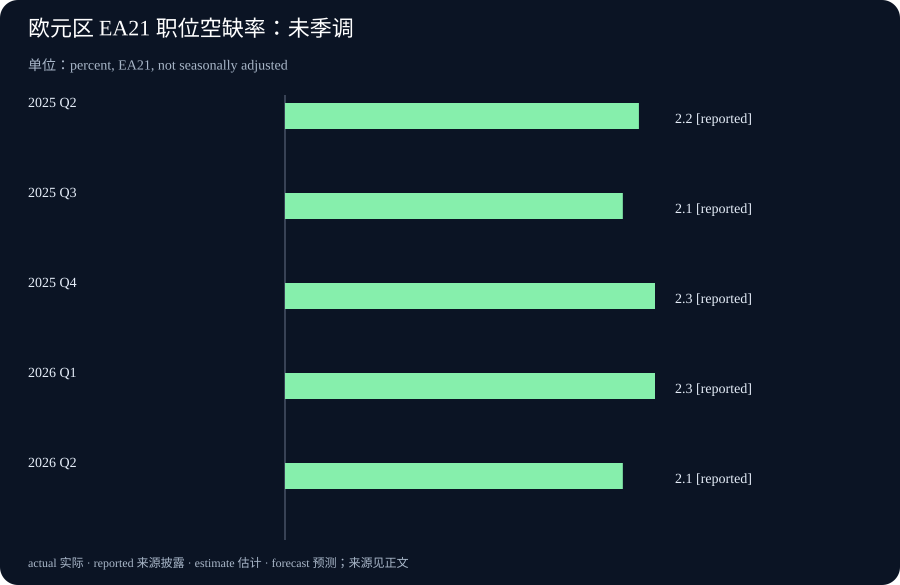

# Daily Intelligence

2026-09-16 · Wednesday · 上海时间早间版。新闻事实来自已打开核对的 9 月 15 日 NVIDIA、纽约联储及 Eurostat 一手网页；统计参考期与发布日期分开标注。厂商结果不是独立审计，文中的机制推演属于本刊分析，不构成对公司收益或市场价格的预测。

## Today’s Thesis｜电力约束下，能被调度的产能才有价值

今日主线不是又一块芯片的峰值速度，而是如何在既有资源约束下交付更多有用工作。本刊判断：对 AI 基础设施而言，分配电力、安排工作优先级和恢复被暂停任务的能力，可能与采购硬件同样重要。与此同时，制造业景气与招聘需求的数据并不同步，提醒我们不能把技术供给改善直接换算成全社会需求扩张。

## Executive Summary｜执行摘要

- NVIDIA 在 AI Infra Summit 披露 Lambda 的功率管理测试；它回答的是特定配置下的资源利用问题，并不直接回答客户需求或利润。[厂商会场披露](https://blogs.nvidia.com/blog/ai-infra-summit-vera-rubin-dsx-energy-efficiencies-tokens-per-watt-ai-factories/)
- 一项电网响应案例表明，部分计算任务可以让出用电空间；已运行案例与后续平台部署计划需要分开看。[技术与部署说明](https://blogs.nvidia.com/blog/from-megawatts-to-tokens-how-nvidia-maximizes-ai-factory-production/)
- 纽约州制造业调查与欧盟职位空缺数据呈现不同侧面的约束：前者包含价格压力，后者描述招聘岗位比例；二者不可拼成同一个经济体的周期结论。[纽约联储](https://www.newyorkfed.org/survey/empire/empiresurvey_overview.html) [Eurostat](https://ec.europa.eu/eurostat/en/web/products-euro-indicators/w/3-15092026-bp)
- 今日操作重点：核查一项效率指标的分母，并列出哪些任务允许延期、哪些必须按时完成。没有服务质量约束的吞吐量，不足以作为采购依据。

## AI Daily｜功率管理进入产能计算，实测与预测不可混写

NVIDIA 9 月 15 日披露：Lambda 在原本供 16 个满功率节点使用的电力预算内运行 19 个节点，报告集群 token 吞吐量提升 24%、每瓦性能提升 23%。同篇文章对下一代 Vera Rubin 的“最多增加 40% GPU 容量”属于特定适用环境下的前瞻能力描述，不是该次测试的实测结果。[原始披露](https://blogs.nvidia.com/blog/ai-infra-summit-vera-rubin-dsx-energy-efficiencies-tokens-per-watt-ai-factories/)

本刊技术分析：这种优化针对的是预留容量与实际负载之间的差距。静态配置为了应对高峰，可能留出平时用不到的余量；动态分配则尝试在任务之间共享余量。但共享并不是凭空创造电力，多个任务同时冲高时，系统仍须决定谁降速、谁排队，以及如何守住服务承诺。

这里必须拆开三个指标：设备数量、单位时间输出，以及满足质量与时延要求的完成量。增加设备并不保证另外两项按同比例增加；输出更多 token 也不意味着回答更正确。对于需要多轮工具调用的任务，排队时间、失败重试和外部系统等待可能改变最终效果。这些是采购验收应检查的问题，不是对本次产品存在缺陷的指控。

比较两个方案时，宜固定模型、任务集合、输入输出长度和质量门槛，再同时记录吞吐、时延分布及功率。若测试配置或任务构成不同，两个百分比不能直接相减。还应检查收益是持续出现，还是仅在某种负载组合下成立；本期没有获得独立复现实验，不能替用户估算可复制的收益。

本刊关注的下一步不是更大的宣传数字，而是测试条件是否透明、混合负载是否保持稳定，以及失败后能否恢复。若这些条件得到验证，调度软件可能提高既有设施的实际使用效率；若关键任务经常受到影响，名义容量增加也可能没有业务价值。

## Business Daily｜可延期计算可能成为资源，但先要算清履约成本

NVIDIA 另一篇 9 月 15 日文章描述了 Emerald AI Conductor 与 Silicon Valley Power 的运行案例：按预设任务优先级让出负荷，一次示例中功率由 4 MW 降至 3 MW。文章明确该案例不是 DSX Flex 安装；弗吉尼亚州 Manassas 的专用 DSX Flex 商业部署仍是未来安排。[案例及状态说明](https://blogs.nvidia.com/blog/from-megawatts-to-tokens-how-nvidia-maximizes-ai-factory-production/)

本刊商业分析：从买方角度看，“随时可用”与“允许短暂延期”是不同的产品。如果所有任务都按最高优先级购买容量，资源可能昂贵且闲置；如果所有任务都允许被暂停，服务承诺又可能失守。潜在商业空间在于准确区分二者，而不是把延期简单包装成不会影响任何人。

可讨论的合同维度包括通知提前量、单次暂停时长、每天累计延期、恢复顺序和未履约处理。这里仅提出尽调问题，没有声称案例中的实际合同包含这些条款，也没有证据支持任何补贴、奖励收入或电价折扣。商业价值必须由真实条款和运行记录共同证明。

隐藏成本同样重要。暂停可能需要保存状态，恢复可能产生额外计算；截止时间临近时，多项延后任务可能集中回来，形成新的拥堵。衡量收益时应把这些成本与让出的容量放在同一观察期，不能只截取功率下降的瞬间。

对中小企业，启示不是立即购置数据中心设备，而是先给已有工作分类：交互式服务、批量计算、历史资料整理，各自可接受的等待时间不同。将不紧急任务安排在空闲时段，是一个可测试的运营假设；是否更划算，仍取决于本企业的负载、价格和人力安排。

## Macro Observation｜成本压力与招聘降温可以并存

纽约联储 9 月制造业调查的一般商业状况指数为 7.6，投入价格指数为 63.1；回答收集于 9 月 2—10 日。这些是地区企业调查的扩散指数，不是产出增长率或通胀率，不能把后一个数字读作价格上涨 63.1%。[调查及方法说明](https://www.newyorkfed.org/survey/empire/empiresurvey_overview.html)

Eurostat 9 月 15 日发布的第二季度职位空缺率为：欧元区 2.1%、欧盟 2.0%。本期图表采用欧元区 EA21 未季调序列；分母是已占用与空缺职位之和，不是劳动人口，因此不能与失业率相加。[统计发布](https://ec.europa.eu/eurostat/en/web/products-euro-indicators/w/3-15092026-bp)

本刊宏观分析：企业可能同时面对投入成本偏高与扩张意愿有限。成本压力不必只来自需求旺盛，招聘放缓也不必只来自自动化替代；判断原因还需要订单、供应、工资与实际产出等证据。上述两组资料涉及不同地域和时间窗口，本期不据此建立跨地区因果关系。

对经营决策，更有用的是分别压力测试需求端与成本端。若销售没有加速而成本上升，效率投入的用途可能是保护利润空间，而非立刻扩大规模。若需求转强而资源受限，调度能力才可能转化为更多可交付订单。两种情景的采购节奏不同，需要企业自身数据来区分。

本期没有采用未经核验的当日股价、汇率或利率概率，也不据这些调查预测资产涨跌。宏观观察的目标是识别约束组合，而不是把每条新数据都解释为某一个交易方向。

## Signal Dashboard｜把技术能力、商业结果和宏观背景分层

| 信号 | 当前证据 | 不应推导的结论 | 下一项检查 |
| --- | --- | --- | --- |
| 功率分配优化 | 厂商披露的特定测试 | 所有客户有相同收益 | 工作负载、时延与质量条件 |
| 电网负荷响应 | 已披露的运行案例 | 所有未来部署均已落地 | 合同、恢复成本与持续记录 |
| 地区制造业 | 企业景气与价格调查 | 全国实际增长及通胀幅度 | 更多地区及实际活动数据 |
| 职位空缺 | 季度岗位比例统计 | AI 已造成净岗位减少 | 招聘、离职及岗位构成变化 |

本表对应上文来源。右侧属于本刊提出的验证方向；尚未获得某类证据，不意味着该指标为零，也不意味着项目失败。

## Deep Insight｜真正的优化对象，是按约完成的任务

以下是基于今日材料提出的分析框架，不是对任何单一公司的效果评定。想象两家供应商：一家可以在短时间内产生大量输出，另一家峰值较低，但能稳定在客户要求的时间内完成任务。若客户需要的是可依赖的交付，前者的峰值优势未必能弥补延期、错误和返工。因此，评价效率时首先要定义“什么算完成”。

一个实用的定义可以包含四个条件：结果满足质量要求、在约定期限内交付、资源使用没有越界、异常能够追踪。不同场景的门槛不同，不应强行用一个通用分数覆盖。图像草稿、财务核对和在线客服，对错误、等待和复核的容忍度并不相同；它们可以共享基础设施，却未必应该共享同一优先级。

当资源成为瓶颈时，排队规则就变成业务规则。若只按先来后到，紧急工作可能被长任务阻塞；若只追求短任务数量，复杂但重要的工作可能长期得不到处理。合理的调度需要显式表达截止时间、可暂停程度和延期代价。缺少这些信息，系统即使技术上运行稳定，也可能把资源分配给并非最重要的事情。

暂停能力的另一面是恢复能力。一个任务被暂停前，应知道已有进度保存在何处、哪些外部动作已经发生，以及再次启动会不会重复执行。只恢复计算而不能恢复业务状态，可能产生重复通知、重复订单或不一致结果。这里描述的是一般系统设计风险，不能反向推断今天报道的任何平台已经发生这些问题。

因此，“允许延期”的工作也不能成为无人负责的工作。应设最长等待时间和明确的失败出口；超过期限后是取消、升级处理还是另行安排，需要提前决定。最危险的并非系统明确告诉你失败，而是任务长期停留在看似进行中的状态，让下游误以为很快就能收到结果。

成本核算也应围绕完整任务。可用一个简单的分析口径：在同一观察期，将资源费、必要复核和失败返工一起记录，再与合格按时完成的任务数对照。它不是会计准则，也不适合把不同类型任务直接混算；作用是提醒团队不要只记录最容易看到的模型调用费，遗漏等待与恢复带来的负担。

如何验证这套判断？可以从同一类、经过授权的历史任务中选小样本，固定质量门槛，比较现有安排与一种候选调度方法。同时记录完成比例、超时原因、额外人工处理及用户影响。样本太小或负载不具代表性时，结果只能视为试验观察，不应自动扩展到全组织。

本刊结论是：资源利用率与业务可靠性需要联合设计，不能先把设备利用率推到最高，再期待服务承诺自然成立。若更聪明的调度能够保持交付质量并减少闲置，它才创造了有用产能；若只是把等待从机器转移给客户，效率数字变漂亮也未必是真正的进步。

## Tomorrow Watch｜今晚公布的数据，留到明早核对

纽约联储经济日历将 9 月 16 日美国零售销售和 Business Leaders Survey 列在美东 08:30，即上海时间今晚 20:30；这属于计划发布时间，今天早间还不能写成已知结果。零售数据可补充需求侧观察，服务业调查可用于与制造业作有边界的对照。[官方日历](https://www.newyorkfed.org/research/calendars/i-sep26.html)

明早核对时，先看参考期和是否修订，再看数值；不要只比较标题。AI 基础设施方面，继续寻找测试配置、服务质量及恢复行为的可检查材料。后者是跟踪方向，并无证据说明明天必有新公告；没有新资料时应保留原证据状态。

## One Chart｜欧元区职位空缺率：非单向变化

| 参考季度 | 职位空缺率 |
| --- | --- |
| 2025 Q2 | 2.2% |
| 2025 Q3 | 2.1% |
| 2025 Q4 | 2.3% |
| 2026 Q1 | 2.3% |
| 2026 Q2 | 2.1% |

来源为 9 月 15 日发布中的 EA21 全经济口径表，未季调；区间内不是持续单向下降。同比下降 0.1 个百分点是两端差值，不是下降 0.1%，也不说明某一种技术造成了变化。聚合统计包含国家口径限制，不宜据此给所有行业作同样判断。[数据及口径](https://ec.europa.eu/eurostat/en/web/products-euro-indicators/w/3-15092026-bp)

## Quote of the Day｜为好主意承担落地责任

“Don't have good ideas if you aren't willing to be responsible for them.”

— Alan J. Perlis

中文：如果你不愿为好主意负责，就别只顾提出好主意。

出处：耶鲁大学保存的《Epigrams in Programming》第 95 条；页面注明原文来自 1982 年 9 月 ACM SIGPLAN。[原文](https://www.cs.yale.edu/homes/perlis-alan/quotes.html)

本刊解读：好想法需要明确的完成标准、失败处理和后续责任。这里的“负责”不是阻止试验，而是不把实施成本与异常留给看不见的下游。

## Action Items｜今天完成三项具体核查

1. 从现有工作中选三类任务，分别写出截止时间、可接受等待、是否允许暂停，以及超时后的负责人；不要未经批准改变生产优先级。
2. 检查一份供应商效率材料，把实测、预测及适用条件分别标注，要求在相同任务和质量门槛下比较；不把吞吐增幅直接写进收益预算。
3. 为一个低风险流程做小样本记录，同时观察按时完成、错误复核和恢复开销。测试仅使用已获授权、去敏的数据，出现重复外部动作风险时先停下。
