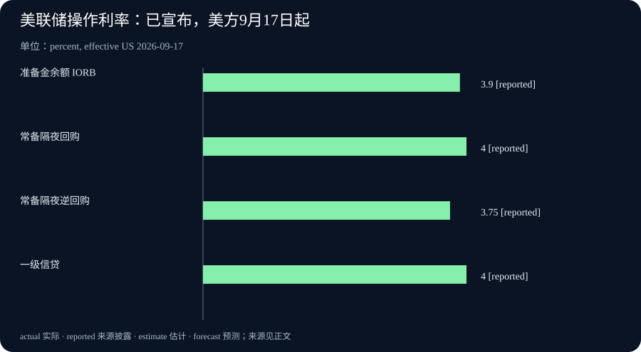

# Daily Intelligence

2026-09-17 · Thursday · 上海时间早间版。核心消息来自 9 月 16 日已公开的一手材料：MLCommons、NVIDIA、Mistral/Mozilla 与美联储。来源页面均已打开核对。文中分开标注正式政策、产品测试、公司承诺及本刊分析；不将新闻发布时间与政策生效日混为一谈。

## Today’s Thesis｜算力进步、产品入口与资金成本，必须分别过关

AI 的技术供给继续改善，模型也在进入已有浏览器场景；与此同时，美联储的新决定提醒企业，融资环境不会因为技术进步而自动放松。本刊判断，评估 AI 商业价值需要分别回答三个问题：系统能完成什么、用户为什么持续使用，以及产生回报前要占用多少资金。今日几条消息不是一条已经证实的因果链，却能帮助拆开这三个经常被混写的问题。

## Executive Summary｜执行摘要

- MLPerf Inference v6.1 加入更贴近多步骤使用的测试。应关注测量任务如何改变，而不只看最快数字。[组织方发布](https://mlcommons.org/2026/09/mlperf-inference-v6-1-results/)
- NVIDIA 的 Vera Rubin 成绩包含 preview 提交；预览结果、其他已提交结果和提交截止后优化不能归为同一证据等级。[厂商说明](https://blogs.nvidia.com/blog/vera-rubin-nvl72-mlperf-inference/)
- Mistral 与 Mozilla 宣布合作，Smart Window 仍处于 beta；法国扩展已经在 Mozilla 页面更新，英国和德国属于后续计划。[合作公告](https://mistral.ai/news/mistral-x-mozilla/) [产品更新](https://blog.mozilla.org/en/firefox/firefox-smart-window/)
- 美联储加息 25 个基点，将联邦基金利率目标区间调至 3.75%—4.00%。这是政策决定，不是企业贷款报价，也不直接决定某家公司投资回报。[正式声明](https://www.federalreserve.gov/newsevents/pressreleases/monetary20260916a.htm)

## AI Daily｜基准从单次推理走向多步骤流程

MLCommons 9 月 16 日发布 Inference v6.1，新增端到端 RAG 与边缘智能体推理测试。前者分别衡量文档入库和基于已有向量库的问答；后者涉及多轮任务与准确性约束。组织方资料同时将 NVIDIA Rubin / Vera Rubin NVL72 列为 preview，而非与全部已可用平台作相同状态描述。[测试范围及平台状态](https://mlcommons.org/2026/09/mlperf-inference-v6-1-results/)

NVIDIA 披露，Vera Rubin NVL72 的预览提交在 Qwen3-VL 上相对 GB300 NVL72 的吞吐最高达到 3.7 倍，在 DeepSeek-R1 上最高为 2.5 倍。其文章也明确指出部分提交后优化结果尚未由 MLCommons 验证。本期引用前述提交说明，不把其他性能数字合并成“全场景统一提升”。[NVIDIA 原文](https://blogs.nvidia.com/blog/vera-rubin-nvl72-mlperf-inference/)

本刊技术分析：多步骤任务往往把时间花在不同环节。检索可能很快，但排序、生成或多轮迭代仍可能拖慢结果；文档准备较慢，也可能由后续多次查询分摊。将这些环节分别计量，才有机会判断优化应发生在何处，而不是在整条链上盲目增加硬件。

基准的价值是提供比较条件，而非替代自身验收。企业仍应核对任务是否接近实际需求、数据规模是否可比，以及输出质量和等待时间是否满足要求。如果业务主要处理短查询，不能直接用长上下文任务的优势估计收益；如果大部分时间花在人工复核，推理速度也不会同比改变交付周期。

一个值得跟踪的二阶变化是采购讨论可能从“单个模型跑多快”转向“完整流程哪里受限”。但这种变化不保证某一种架构必胜。更合理的做法是记录当前最慢、最贵或最易出错的步骤，再用小范围试验确认瓶颈是否真的被解除。没有观察到业务改善时，保留技术测试结果，不夸大其商业含义。

## Business Daily｜浏览器入口扩大触达，但不能跳过用户选择

Mistral 与 Mozilla 9 月 16 日宣布，Mistral 模型用于 Firefox Smart Window beta，覆盖法国和北美，英国与德国预计年内随后加入。公告还说明默认不在 Mozilla 服务器保存对话，合作方约定零数据保留。后者是双方公开的隐私承诺，并不等于所有处理均在本地，也不是本刊完成的独立审计。[联合公告](https://mistral.ai/news/mistral-x-mozilla/)

Mozilla 的产品页于 9 月 16 日补充法国上线信息；正文原始发布日期是 8 月 18 日。页面说明 Smart Window 可选，用户决定共享哪些浏览上下文，并可关闭功能。因此，不能把旧正文描述的全部功能当成今天新发布，也不能将浏览器装机量视作 AI 活跃用户数。[更新记录与控制方式](https://blog.mozilla.org/en/firefox/firefox-smart-window/)

本刊商业分析：浏览器具备已有使用场景，模型供应商通过合作可能减少让用户另开应用、重新提供材料的步骤。不过，降低入口摩擦只解释“更容易试用”，并不证明使用会持续。若回答无法帮助用户完成原本的任务，入口再近也可能只带来一次点击。

价值分配也未必全部流向模型供应商。拥有入口的一方可以选择不同供应方，供应方则希望获得稳定调用；双方如何分担成本和回报，取决于未披露的商业条款。本期没有收入分成、采购金额或用户转化数据，不据此估算合同价值。

值得观察的是用户能否理解上下文来自哪里、怎样撤回访问，以及更换模型后体验是否连续。选择权若只是菜单上的选项，而迁移成本很高，实际竞争效果仍需检验。这是一般产品评估问题，不是对本次合作已出现锁定行为的断言。

## Macro Observation｜加息已宣布，传导仍有时间和个体差异

美联储于 9 月 16 日美东 14:00 发布声明，委员会以 12 比 0 通过加息决定。声明描述经济活动稳健、通胀仍偏高；这些是委员会的判断，不是本刊对所有行业的独立结论。该发布时间对应上海时间 9 月 17 日凌晨，已在本期信息窗口内。[决议原文](https://www.federalreserve.gov/newsevents/pressreleases/monetary20260916a.htm)

实施说明将准备金余额利率设为 3.90%，相关操作利率按美方 9 月 17 日起执行；本期图表列的是已宣布参数，而非已观测的市场成交利率。对于生效日，应采用发布机构的日期口径，不能仅因上海已进入 17 日就声称美国当地所有操作已经切换。[实施说明](https://www.federalreserve.gov/newsevents/pressreleases/monetary20260916a1.htm)

本刊宏观分析：融资基准变化对企业的影响取决于债务期限、固定或浮动安排、现金储备和再融资时点。对尚未投入运营的项目，未来现金流与当前支出之间的时间距离尤其重要；对已有固定融资且现金充足的企业，短期传导可能不同。不能把一次政策调整机械地加到每一家企业的全部成本上。

这与技术效率改善并不矛盾。某个项目可以同时拥有更低的计算成本与更高的资金门槛。最终是否扩大投入，需要看客户需求、收费能力和资金回收速度，而不是只比较单项成本。一项技术确实更高效，仍可能在不合适的需求假设下产生过度投资。

观察时宜分别保留政策、市场融资条件和公司经营证据。本期不补造股债价格、预期利率概率或具体企业贷款数据，也不据声明预测资产涨跌。今天确认的是政策决定及其操作安排，而不是未来每次会议的路径。

## Signal Dashboard｜四类证据，不共用一个“成功”标签

| 观察对象 | 当前已知 | 仍需验证 | 判断边界 |
| --- | --- | --- | --- |
| 新推理基准 | 多步骤测试范围已发布 | 自有业务是否适用 | 测试覆盖不等于所有任务覆盖 |
| 新硬件成绩 | 有预览提交及厂商解释 | 可用配置与实际工作表现 | 不混用提交后未验证结果 |
| 浏览器合作 | 产品合作和区域扩展公告 | 持续使用与商业转化 | beta 和未来计划不能写成全面落地 |
| 美国货币政策 | 新目标区间及操作说明 | 各企业融资传导 | 政策利率不是统一贷款利率 |

各行对应上文一手材料；“仍需验证”表示本期没有足够证据作更强判断，不表示相关指标为零，也不表示项目已经失败。

## Deep Insight｜谁获得效率红利，取决于技术之外的两次转化

以下是本刊的机制分析，不是任何公司已经实现的结果。技术进步首先改变的是生产一种能力的条件，例如同样资源能处理更多工作。它需要经过第一次转化：这种能力是否对应用户真实需要、是否方便使用、是否值得反复使用。只有用户需求与供给相遇，技术上的节约才可能变成可持续业务。

第二次转化是价值如何分配。即使用户愿意使用，节约也可能通过价格竞争传递给客户，或被渠道、配套服务和必要的质量控制吸收。供应方收入增长不一定与技术性能同比变化，客户获得更便宜的服务也不一定意味着供应方利润提高。因此，效率红利不能在看到测试结果时就提前归属于某个参与者。

浏览器合作提供了观察第一步的具体入口：用户已经有一个待完成的任务，工具不必从零创造使用场景。但靠近任务只是条件之一。一个产品可能很容易唤起，却因为答案无法核对、上下文选择不清楚而增加复核工作。评价产品时，应看它是否减少完成原任务的总摩擦，而不是只统计打开了多少次。

同时，更多上下文并不天然更好。无关页面可能让结果偏离问题，过时资料可能影响判断，用户未打算共享的信息也需要边界。产品设计的一个重要能力，是让人理解系统正在使用哪些材料，并允许修正选择。这里提出的是可检验的设计要求，不能从公告中的隐私措辞直接推导为已经完全满足。

回到价值分配，如果多个模型都能在某个任务上达到可接受水平，入口与服务组织就可能影响议价；若某个供应方在关键能力上难以替代，议价结构又可能不同。这两种情景都需要实际选择和迁移数据。不能仅凭“开放”或“独家”等营销标签判断竞争结果，更不应将技术兼容等同于低迁移成本。

资金约束会给这两次转化增加时间要求。一个项目也许最终有需求，却需要较长时间形成稳定回款；另一个项目技术上不那么新，却能较快服务已有客户。在其他条件相同的假设下，回报兑现更晚的投入对资金成本更敏感。但现实条件通常不同，管理者应逐项列出假设，而不是用一个利率数字替代项目分析。

更可执行的评估顺序是：先选一个明确任务，确认用户为何需要它；再测系统在真实限制下能否完成；最后把获客、服务、必要复核和资金占用放入同一观察框架。三个问题中的任何一个没有答案，都不应由其他两个看起来很强的证据自动补齐。缺少数据时写清未知，比给出精确但无依据的回报数字更有用。

本刊的结论是，技术竞争与商业竞争相关，但不等价。基准成绩描述能力边界，产品使用描述需求关系，现金流描述业务持续性。把它们分别记录、再检查连接处，才能看清一项进步究竟改善了哪一层，以及下一笔投入应该验证什么。

## Tomorrow Watch｜观察实施与需求，不预写结果

美联储实施说明规定的美方 9 月 17 日安排将成为下一步核对对象；应区别政策参数与随后实际市场数据，不用前者代替后者。[实施文件](https://www.federalreserve.gov/newsevents/pressreleases/monetary20260916a1.htm)

美国人口普查局日历把 8 月新住宅建设数据安排在 9 月 17 日发布。本期只记录日程，明早再核对是否实际发布、参考期及修订；这类实体需求资料可补充政策讨论，但不能事先预测方向。[发布日历](https://www.census.gov/economic-indicators/calendar-listview.html)

产品方面继续关注 beta 可用范围、用户控制和测试细节。区域扩展没有给出明日必然出现新进展的承诺，因此这里只设观察方向，不把它写成确定事件。

## One Chart｜美联储已宣布的操作利率，不是市场收益排名

| 工具 | 已宣布利率 | 生效口径 |
| --- | --- | --- |
| 准备金余额利率 IORB | 3.90% | 美方 2026-09-17 起 |
| 常备隔夜回购 | 4.00% | 美方 2026-09-17 起 |
| 常备隔夜逆回购 | 3.75% | 美方 2026-09-17 起 |
| 一级信贷利率 | 4.00% | 美方 2026-09-17 起 |

四项来自同一实施说明，服务对象与操作性质不同；不能相加、当作同一种资产的回报，或据其高低选择个人投资产品。图中 reported 表示官方已宣布，并非实际成交观测，也不是对下一次会议的预测。[图表来源](https://www.federalreserve.gov/newsevents/pressreleases/monetary20260916a1.htm)

## Quote of the Day｜注意力决定哪些信息真正进入经验

“My experience is what I agree to attend to.”

— William James

中文：我的经验，是我选择去关注的东西。

出处：《The Principles of Psychology》（1890）第十一章 Attention，约克大学保存的原著文本。[原文段落](https://psychclassics.yorku.ca/James/Principles/prin11.htm)

本刊解读：信息更多，不自动等于判断更好。今天的实际练习，是主动选择需要比较的证据，而不是让一个最醒目的性能数字替自己作完整决定。

## Action Items｜把今天的信息转成可检查的问题

1. 为一项 AI 采购分别列出技术能力、持续使用和资金回收三栏证据；缺项明确标注未知，不用测试成绩填补商业数据。
2. 试用浏览器 AI 前检查可共享上下文和关闭方式，仅使用已获授权、去敏材料；产品隐私承诺不能替代自身数据管理要求。
3. 将手头材料中的正式决定、beta、preview 和未来计划分别标注；检查表格中的百分点、倍数和生效日期，避免同词不同义。
