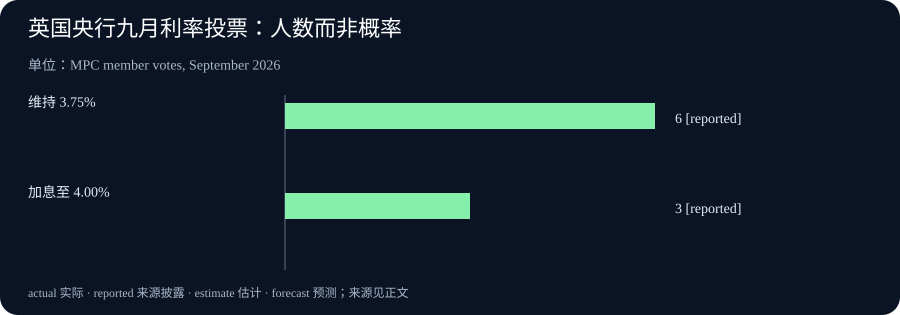

# Daily Intelligence

2026-09-18 · Friday · 上海时间早间版。核心材料为 9 月 17 日微软公告与英国央行决议，均已打开原文核对。本文区分发布日、案例观察期、未来可用时间和政策执行安排；公司自述不是独立效果评估，机制分析也不是市场预测。

## Today’s Thesis｜从“能够执行”到“能够解释执行”

今天值得关注的不是又增加了多少智能体，而是组织如何知道它们做了什么、为何这样做、产生了什么结果。企业使用 AI 的下一道考题，可以概括为执行的可解释性：产品功能有边界，案例收益有样本，政策决定有不同实施工具。把这些边界保留下来，才能判断一项看似成功的行动是否值得重复。

## Executive Summary｜三个不同层次的进展

1. 微软公布 Agent 365 的阿联酋区域可用计划，正文写的是十月开始，而不是公告当天已经全面上线。产品管理能力与部署完成状态需要分别核对。[官方公告](https://news.microsoft.com/source/emea/2026/09/agent-365-availability-in-the-uae/)
2. 微软发布内部 AI 转型案例。对采购方而言，最有用的不是摘录标题上的提效数字，而是检查原文注释中的样本、期间和比较对象。[案例与注释](https://blogs.microsoft.com/blog/2026/09/17/what-weve-learned-from-microsofts-own-ai-transformation/)
3. 英国央行维持利率，同时公布新的多年缩表安排。利率不变不等于所有政策工具都没有变化；投票人数也不是下次会议的概率。[决议原文](https://www.bankofengland.co.uk/monetary-policy-summary-and-minutes/2026/september-2026)

本刊判断：把“有能力”“已部署”“有成效”作为三个独立问题，能减少把产品公告直接换算为业务回报的错误。本期不提供未经核验的股价、收益率或交易建议。

## AI Daily｜智能体管理成为产品，但购买不等于治理完成

微软宣布 Agent 365 将从十月起向阿联酋数据中心客户提供，包含智能体登记与发现、身份和权限、审计及安全管理能力。官方新闻索引标注发布日期为 9 月 17 日。[公告正文](https://news.microsoft.com/source/emea/2026/09/agent-365-availability-in-the-uae/) [发布日期索引](https://news.microsoft.com/source/emea/tag/ai/)

这是厂商披露的功能和区域计划，不是第三方审计结论；公告没有证明每种外部智能体都已接入，也不能据“阿联酋数据中心”推断所有相关数据流都已满足特定机构的合规要求。具体覆盖范围仍需要在产品文档、合同和真实配置中核实。

本刊技术分析：一个组织首先需要回答“有哪些代理在代表我们做事”。如果目录只登记正式采购的软件，却漏掉员工临时创建的脚本，控制范围就可能不完整。随后才是“代理代表谁、能访问什么、能否写入”。这三个问题可以用测试账号与去敏任务检查，不必先授予生产权限来证明产品有用。

另一项验收是撤权的实际效果。建议选择一个低风险测试代理，先给予明确权限，再撤回权限，检查旧会话、缓存材料和后续动作是否按预期停止。这里列的是建议测试，不是声称该产品存在撤权漏洞，也不是绕过安全限制的操作方案。

日志同样不能只看有没有。记录应能将动作、输入版本、授权范围和结果对应起来；一份看起来详细但无法关联具体业务单据的日志，未必能支持复核。反过来，也不应为了“可观察”无限收集员工和客户信息。最少必要记录、可追溯和保留期限需要同时考虑。

今天可确认的是管理产品的区域扩展计划。是否改善事故发现、减少误操作或降低人工复核成本，需要部署后的证据，不能由功能清单自动推出。

## Business Daily｜案例的注释，比亮眼数字更接近采购问题

微软 9 月 17 日文章称，某销售样本中经常使用 Copilot 者的成交率比低使用者高 20%；注释限定为 687 名销售、2024 年一至六月，且经常使用有明确频次定义。另一例是九人团队在 2026 年春季从正式启动到初版交付用时 35 天；原文明确它不是公司整体研发基准。[原文及注释 1、3](https://blogs.microsoft.com/blog/2026/09/17/what-weve-learned-from-microsofts-own-ai-transformation/)

这些是微软内部记录，不是本刊独立复算。前一数字不是提高二十个百分点，也不是 2026 年全公司业绩增幅；仅凭高低使用组比较，不能排除人员能力、客户结构、管理支持等差异，更不能证明全部差距由 AI 引起。

本刊商业分析：案例可以帮助提出问题，却不应直接成为本企业预算的收益参数。一个有成熟客户基础和专门支持团队的试点，可能与资源有限的普通部门相差很大。采购评估需要明确哪些前提可以复制，哪些投入尚未计入，而不是将对方最好的一次结果视作自己的平均结果。

可以先选一个范围小、业务结果清楚的流程，记录引入工具前后的交付时间、返工和复核负担。若工作类型同时发生变化，应单独分组；如果人员也变更，需要说明可比性下降。缺少对照条件时，可以报告观察到的变化，但把因果结论留空。

收益分配也是一个单独问题：省下来的时间可能转化为更多客户服务，也可能被额外验证和新任务吸收。只有看见可持续的服务能力、质量或成本改善，才有依据扩大预算。使用次数上升只能证明使用更频繁，不能替代上述结果。

## Macro Observation｜维持利率，并非政策静止

英国央行 9 月 17 日公布的决议，以六票对三票将 Bank Rate 保持在 3.75%；三名委员主张加息至 4%。委员会同时一致通过多年安排，计划到 2034 年底将剩余用于货币政策的英国国债组合逐步降至零。[决议及投票](https://www.bankofengland.co.uk/monetary-policy-summary-and-minutes/2026/september-2026)

这不是央行全部资产归零。执行方法仍有待确定，原文说明在进一步安排期间暂停 APF 拍卖；因此不能把多年计划写成今天已开始按固定节奏卖债。[操作说明第 50—52 段](https://www.bankofengland.co.uk/monetary-policy-summary-and-minutes/2026/september-2026)

本刊宏观分析：政策利率与资产组合管理作用于金融条件的方式不同。前者是一项关键短端政策参数，后者涉及持有结构、到期与交易安排；它们相互关联，但不能折算成一个没有依据的“等效加息”数字。

对企业读者，更实用的问题是自身融资在哪里重新定价。即使官方利率保持不变，银行报价、期限溢价和企业信用条件也可能变化；反过来，一项多年安排并不意味着所有贷款明天同时变贵。这些是一般传导机制，不是本期已经观测到的市场变动。

同样，一次会议的少数意见有信息价值，却不是未来结果的投票承诺。下一次决定仍取决于新证据和委员判断。把六比三变成“未来加息三分之一概率”，会混淆决策记录与概率预测。本期选择直接呈现人数，保留它真正能够证明的内容。

## Signal Dashboard｜为每个结论保留它需要的证据

| 对象 | 本期可确认 | 尚不能推出 | 下一项验证 |
| --- | --- | --- | --- |
| 区域产品扩展 | 官方公布未来可用计划 | 已全面部署或合规自动满足 | 实际可用范围与配置 |
| 内部商业案例 | 有限定样本及观察期 | 本企业必得同等收益 | 可比流程与完整成本 |
| 货币政策决定 | 本次利率及正式投票 | 下次会议结果 | 新信息与后续决定 |
| 多年资产安排 | 计划和待定操作边界 | 今日全部执行完成 | 后续操作通知 |

本表对应上文来源。“尚不能推出”不是否定项目价值，而是提醒读者不要跨越证据能支持的范围。未来有新材料时，可以升级判断；没有材料时保留未知。

## Deep Insight｜组织真正需要的是可撤回的判断

以下为本刊机制分析。很多自动化项目把成功定义为任务能够跑完，但组织面临的难题往往出现在“跑完之后”：结果是否仍有效，是否使用了正确的版本，是否由适当的人授权，发现错误能否停止后续影响。一个系统的成熟度，不只看执行速度，还要看它允许多快地修正判断。

可以把一项日常运营决策拆成四层。第一层是输入：我们知道哪些信息，哪些仍缺失。第二层是解释：这些信息为什么可能支持某个行动。第三层是授权：谁允许系统采取什么范围内的动作。第四层是结果：实际发生了什么。四层之间要能对应，但不应互相替代。输入真实不保证解释正确，解释合理不构成行动授权，动作完成也不证明结果有价值。

这个划分会改变对智能体的验收方式。比如一个内部采购助手准确读懂了需求，但选择了尚未批准的供应方；另一个助手没有下单，只留下一个需人确认的建议。前者可能在速度指标上更好，却跨越了权限边界；后者可能更慢，却完成了被授权的工作。这里是说明机制的假设例子，不是今天报道的真实事故。

因此，评估应同时记录“完成了什么”和“没有被允许做什么”。拒绝越权、识别过期资料、发现输入不一致，有时就是正确输出。如果排行榜只奖励完成数量，系统就可能在不确定时过度行动。更合理的验收会为正确停止保留位置，并明确由谁接手；停止没有接手责任人，也可能只是把自动化变成新的待办堆积。

可撤回的判断还需要版本意识。昨天批准的方案，可能基于昨天的价格、权限和候选内容。若今天输入发生实质变化，不应把旧批准无限延伸。对高影响动作，将批准绑定到具体输入和交付物，有助于看清哪里需要重新审核；对低风险可逆操作，则可以采用较轻的流程，避免所有工作都被同一种审批拖慢。

商业评估中的类似问题是基线。试点结束后才选择最有利的比较方式，容易把复杂变化包装成漂亮故事。更有用的做法是在开始时说明要观察什么、什么结果会支持扩张、什么结果会要求收缩，并记录中途规则有没有改变。若对照组不可行，也应承认可比性限制，而不是借助更多小数位制造确定性。

这并不要求每个项目都建立庞大的治理体系。一个小团队可以从一张任务记录开始：任务对象、授权人、输入版本、预期结果、实际结果和异常处理。只有当跨团队协作、敏感信息或不可逆操作增多时，才需要更强的身份管理、审计和隔离。复杂度应跟随风险，而不是跟随工具营销用语。

宏观信息也适用同样的阅读习惯。读到一个政策结论，先辨认它是本次决定、未来计划还是条件性判断；再确认它通过什么渠道影响手头问题。这样才能避免用一条新闻同时解释所有市场变化，也能在新材料出现时只修改相关假设，而不是推翻整个判断框架。

今天的核心结论是：自动化能力越强，越需要为纠错保留明确入口。能执行、能说明、能停止、能恢复，是不同的能力。将它们分别验收，才能让扩大使用建立在可验证的进展上，而不是建立在对系统越来越熟悉的感觉上。

## Tomorrow Watch｜跟踪验证窗口，而不是制造“明日必发生”

产品方面，下一个明确窗口是十月的区域可用计划，不是明天必然完成的部署。后续应核查实际产品范围及文档，不以新闻标题替代上线记录。[区域计划](https://news.microsoft.com/source/emea/2026/09/agent-365-availability-in-the-uae/)

政策方面，后续应关注央行操作通知，把计划与正式执行分开记录。本文未确认明日有新的固定发布事件，因此这里只提出观察方向，不预写结果或把未发布数据填成零。[当前操作边界](https://www.bankofengland.co.uk/monetary-policy-summary-and-minutes/2026/september-2026)

对企业自身的试点，明天可以回看今天选定的一个任务：是否少了返工、是否有异常被及时发现、是否仍在授权范围内。日常记录不一定会立即给出显著改善，但可以减少只记得成功案例的偏差。

## One Chart｜英国央行本次利率投票人数

| 选项 | 委员人数 |
| --- | --- |
| 维持 3.75% | 6 |
| 加息至 4.00% | 3 |

图表对应 9 月 16 日结束、17 日公布的本次会议，仅统计利率决定，不统计另一项资产安排的表决。单位是委员人数，reported 表示已公布记录；它不是市场定价、民意调查或下次会议的概率。[原文第 47 段](https://www.bankofengland.co.uk/monetary-policy-summary-and-minutes/2026/september-2026)

## Quote of the Day｜让事实有机会修正漂亮的假设

“The great tragedy of Science—the slaying of a beautiful hypothesis by an ugly fact.”

— Thomas Henry Huxley

中文：科学的大悲剧：一个美丽的假说，被一个丑陋的事实扼杀。

出处：赫胥黎《Aphorisms and Reflections》原文选集第 CCXIX 节，Project Gutenberg 文本。[原文](https://www.gutenberg.org/files/38097/38097-h/38097-h.htm)

本刊解读：实务中不必把假设被推翻视作坏消息。若在扩大投入之前发现不成立的前提，付出的验证成本可能正是项目最有价值的一部分。重要的是允许事实改变决定。

## Action Items｜今天就能做的三项小检查

1. 为一个正在使用的智能体写清“允许读取、允许修改、必须交人审核”的边界，再用去敏测试任务核对实际行为；未获授权的生产动作不要拿来做演示。
2. 从一份 AI 商业案例中抽出样本、观察期、比较对象和未计入成本。将缺项标为未知，不把厂商案例的结果直接填进自身收益预算。
3. 复核一条宏观新闻：把已决定、待实施和未来情景分别圈出。若图表没有写明单位与时间窗口，先补齐再讨论结论，避免人数、概率、利率和回报率混用。
