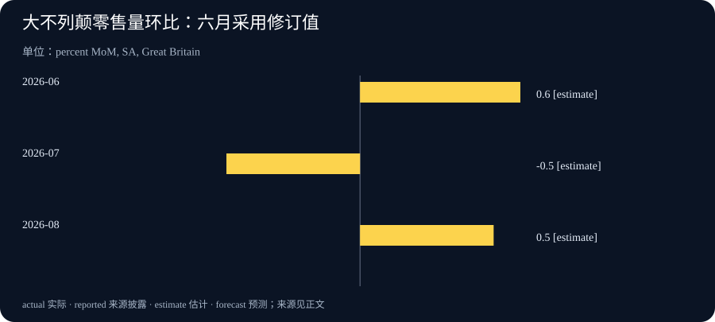

# Daily Intelligence

2026-09-20 · Sunday · 上海时间周末版。核心材料为 9 月 17—18 日已公开的一手公告、研究说明和官方统计；不把周末日期写成这些消息的发布日期。本文区分合作计划、企业自报测量与官方统计估计，分析部分另行标明，不提供未经核验的实时行情。

## Today’s Thesis｜评估正在成为一种产能，可信度却不能靠投入金额购买

本期主线是“谁来验证验证者”。更强的 AI 不仅需要更多计算，也需要能够理解工作过程、设计检验并解释局限的人。评估服务可能成为持续需求，但评估能否被信任，还取决于访问权限、资金关系和披露机制。与此同时，零售数据提醒我们：数字越像一个明确答案，越需要先确认它的范围、版本和比较基数。

## Executive Summary｜合作、测量与实际需求分开看

1. Anthropic 与 Accenture 于 9 月 18 日公布嵌入式评估合作；更深入的内部访问是其设计方向，具体运行细节仍在形成。[合作公告](https://www.anthropic.com/news/accenture-embedded-evaluation)
2. Anthropic 的另一份材料提出观察 AI 研发自动化、代理监督与算力分配的指标。它提供的是企业内部测量原型，不是已经统一的行业排行榜。[测量说明](https://www.anthropic.com/institute/measuring-pace-of-ai-development)
3. Accenture 同日公告中的投资数字是未来五年的预期投入，不应写成已收到的合同收入。[企业公告](https://newsroom.accenture.com/news/2026/accenture-and-anthropic-partner-to-build-team-of-embedded-evaluators-at-anthropic)
4. 英国官方零售数据出现月度回升，但需要连同此前下跌、修订及三个月口径阅读，不能直接扩展为全部消费或经济趋势。[官方统计](https://www.ons.gov.uk/businessindustryandtrade/retailindustry/bulletins/retailsales/august2026)

本刊判断：下一阶段值得跟踪的不只是更高的能力分数，还有可复核证据的生产成本。若客户无法分辨不同评估覆盖什么，再多报告也可能只增加信息数量，而没有减少决策不确定性。

## AI Daily｜让外部评估接近研发过程，也暴露新的检验问题

Anthropic 表示，合作由 Accenture 旗下 Faculty 牵头，覆盖模型评估、红队测试、对齐和防护检查；嵌入式人员拟获得接近员工的内部访问。公司同时承认，访问与报告标准、长期资金安排尚未定型；目前将直接支付 Accenture 的相关工作费用，合作为非排他安排。[9 月 18 日原文](https://www.anthropic.com/news/accenture-embedded-evaluation)

这是合作设计及资金关系的公开说明，并不是已经发布的独立审计结论，也不能据此宣称模型风险已降低。深度访问可能让评估人员看到发布前的选择与限制，但他们是否能自由设计测试、报告不利结果，仍需具体制度和后续执行证据。

另一份官方测量说明披露：截至八月，按其内部任务分类与权重，Claude 在 26% 的 AI 研发工作中处于“主导”层级；该层级仍有人监督，不是无人参与的完全自主。原型使用模型参与评级，并采用固定任务篮子，作者明确提示比较方法和评级局限。[测量与方法附录](https://www.anthropic.com/institute/measuring-pace-of-ai-development) 官方新闻页将该材料标为 9 月 17 日发布。[日期索引](https://www.anthropic.com/news)

本刊技术分析：自动化程度与研发加速幅度不是同一个量。一个任务更多地由 AI 执行，不必然意味着最终研究更快、更便宜或更正确；它可能需要更多复核，也可能释放了人力去做原本没有开展的工作。要评价净效果，应另看质量、总耗时与新增工作，而不是把任务比例换算成节省的人数。

固定任务篮子有助于比较相同工作随时间的变化，却可能低估新任务出现后的结构变化。这不是这一方法独有的问题：许多指数都需要在可比性与代表性之间取舍。实际阅读时，最好保留任务定义、版本和重建时点，避免把口径变更形成的跳升解释为能力突然突破。

对使用者而言，一个可操作的问题是：模型在我们的流程中究竟协助哪一步，最终责任由谁承担？内部实验可以从具体任务记录开始，不必照搬大型实验室的指标，也不应为了复现数字收集超出授权范围的员工资料。

## Business Daily｜新的专业服务需求，与尚未兑现的收入

Accenture 公告称，两家公司各自预计未来五年在 AI 安全方面投入至少十亿美元。[9 月 18 日公告](https://newsroom.accenture.com/news/2026/accenture-and-anthropic-partner-to-build-team-of-embedded-evaluators-at-anthropic) 这是预期投入表述，不是 Accenture 已获得二十亿美元订单，也不是双方已完成同额支出；本期没有据此计算合同收入、利润率或公司估值。

本刊商业分析：嵌入式评估与一次性的发布前测试不同。若工作需要长期跟随研发变化，供应方就需要同时具备技术理解、行业场景和持续服务能力。客户购买的可能不只是一组测试结果，还有发现问题后继续追踪其处置的能力。这里是对服务模式的分析，不代表本次合同已经披露了这些收费项目。

这一模式也可能面临人员供给约束。能够理解模型研发、辨认安全边界又能清楚写出证据的人，未必能随预算同步扩张。增加投入可以支持培训和工具建设，但不能保证短期内形成同等规模的成熟团队。后续应观察实际人员配置、覆盖的工作范围和可检查的产出，而不是只统计宣布的金额。

客户评估这类服务时，需要问清几件事：报告交给谁，哪些发现必须上报，商业保密如何处理，终止合同后记录由谁保存。这些安排影响服务的可用性，也影响外部人能否信任结论。它们不是单靠“独立”这个名称就能回答的问题。

还需避免另一种过度推断：由被评估企业付费，不自动证明评估失效；但资金依赖确实提出了需要解释的利益关系。合理做法是审查约束和披露，而不是在没有证据时指责评估人员，也不是在有知名品牌时跳过审查。

## Macro Observation｜英国零售回升，要先看清时间窗口

英国国家统计局 9 月 18 日公布的大不列颠零售量初步估计显示，经季节调整后，八月环比增长 0.5%，七月为下降 0.5%；六月增幅从 0.7% 修订为 0.6%。截至八月的三个月相对截至五月的三个月增长 0.9%。[统计公报](https://www.ons.gov.uk/businessindustryandtrade/retailindustry/bulletins/retailsales/august2026)

这些是零售商品数量口径，不能当成全部家庭消费，也不是九月当月需求。图表采用同一版公报中的月度环比值，保留六月修订；不把三个月增长率混入月度序列。

本刊宏观分析：短期回升至少有两种不同解释。一种是需求持续增强；另一种是销售时点变化后恢复。仅有一个月的总量变化，不能判断哪一种占主导。进一步分析需要看分项、较长时间窗口和后续修订，不宜直接推出货币政策必然转向或某类资产必然上涨。

经营者还需要区别收入与销量。销售额增加可能来自价格、数量或商品组合改变，不一定意味着消费者买了更多件商品；数量增加也未必代表利润改善。数据能够提示需求环境，但具体企业的定价、库存和采购成本仍需独立证据。

对宏观信息的一项重要纪律，是按当时可获得的版本判断。若最新公报修订了过去月份，就应该说明原值与新值，而不是悄悄保留旧图、只更新今天的解读。修订并不自动表示统计失效；它说明结论需要与证据版本一同保存。本期不虚构未取得的消费者信心、市场价格或未来数据。

## Signal Dashboard｜四个值得继续追踪的连接处

| 观察对象 | 本期证据 | 仍然未知 | 下一步看什么 |
| --- | --- | --- | --- |
| 嵌入式评估 | 合作和资金关系已披露 | 实际覆盖与报告机制 | 操作安排和公开成果 |
| 研发自动化 | 有内部测量原型及方法 | 跨实验室可比性和净收益 | 方法版本与外部复核 |
| 评估服务商业化 | 有多年预期投入 | 合同收入及实际利润 | 后续正式经营披露 |
| 零售需求 | 有带修订的官方估计 | 回升是否持续 | 分项、后续月份及修订 |

各行对应前文一手来源。未知不等于零，也不等于失败；它标记的是下一个结论需要补足的材料。不要用同一条公告同时填满投入、执行和效果三栏。

## Deep Insight｜评估的价值，在于改变决策而不是装饰决策

以下为本刊机制分析。评估服务增长的一个潜在原因，是技术供给和购买判断之间出现了距离：系统越复杂，买方越难自己判断什么情形下可用、什么情形下不该用。评估能够缩短这个距离，但前提是它提供的信息真的进入决定，而不只是被放进采购附件。

可以先区分三种结果。能力测试回答系统在限定任务上表现如何；过程检查回答组织是否按既定方法开发和部署；业务验收回答它在特定环境中能否完成被授权的工作。三者可能互相支持，却不能互相替代。一个能力很强的模型，可能没有适合某家机构的数据权限；一家流程完整的供应商，也可能在客户的特殊场景中表现不足。

因此，“通过评估”本身不是完整信息。读者需要知道谁提出问题、覆盖哪些情形、采用什么标准、哪些部分没有测到。若一项结论只适用于有限范围，就应该在传播到管理层时仍保留这个范围。删除限定词虽然会让汇报更短，却可能让后续行动建立在原报告从未支持的承诺上。

嵌入式安排的吸引力，是评估人员可能更早发现上下文：为什么选某个训练方案，某个问题曾经如何被讨论，哪些限制来自工程现实。但接近被评估团队，也可能让评估者习惯对方的假设。这是一般组织风险，不是对本次合作人员的指控。深度访问与独立判断需要同时设计，不能认为满足了前者就自然得到后者。

一种值得考虑的制度组合，是把证据采集、重大结论复核和异议处理明确分开。具体评估者可以深入协作，但关键判断应保留可追溯材料；对难以达成一致的结论，允许保留不同意见，而不是为了形成单一评分把分歧隐藏起来。实施强度应随风险调整，小型试点无需照搬大型机构的全部流程。

从经济角度看，客户购买的是更好的决策条件，而不是更多被勾选的项目。如果一份评估发现了一个不适用的场景，帮助团队缩小部署范围，它可能比一份没有改变任何决定的高分报告更有价值。反过来，若每次报告都只确认采购方原本想听的结论，就需要检查问题是否设计得过于宽松，而不是立即把一致意见当成可靠性的证据。

预算评价也应对应这种价值。将服务按发现问题数量付费，可能鼓励细碎告警；只奖励低风险评级，又可能压低不利发现。一个更平衡的观察框架，会同时看覆盖的关键场景、误报负担、问题处置和后续复测，不急于压成单一分数。这里没有万能收费方案，重点是理解指标如何改变被评估者和评估者的行为。

对普通企业，最小实践可以非常具体：先选一项真实业务决定，说明在什么证据出现时扩大使用、保持范围或暂停。评估结束后，再核对决定有没有按约定发生变化。如果发现了风险却没有负责人处理，或者条件变化后仍沿用旧结论，缺口就在组织衔接处，而不只是模型能力。

本期把这个问题与零售统计并列，并不是说两类测量拥有同等可信度，而是提醒我们共同的阅读责任：分母、时期和修订决定数字的含义。企业自报原型需要方法检验，官方统计需要正确解读。让每种材料只承担它能够承担的证明责任，才可能将更多测量转化为更少的判断错误。

## Tomorrow Watch｜进入新一周，先追踪可验证的后续

合作方面，重点是人员与工作范围是否明确，以及是否出现可核对的报告制度。公告没有承诺明天发布独立评估结论，因此这里是观察方向，不是确定事件日程。[当前合作边界](https://www.anthropic.com/news/accenture-embedded-evaluation)

零售方面，关注后续官方发布与修订，同时检查本企业的订单、退货和库存是否支持同样的需求判断。两者覆盖对象不同，出现差异时应寻找口径原因，而不是挑选更符合预期的一组数据。

对手头 AI 项目，明天可以要求供应方提供一项与实际使用场景直接对应的测试说明：输入范围、失败定义、复测方法和未覆盖项。没有材料就记录缺口，不以演示视频代替验收。

## One Chart｜同一版公报中的三个月零售量环比

| 月份 | 环比变化 | 本期采用口径 |
| --- | --- | --- |
| 2026-06 | +0.6% | 9 月 18 日公报修订值 |
| 2026-07 | -0.5% | 同一公报，未修订 |
| 2026-08 | +0.5% | 同一公报，初步估计 |

范围为大不列颠全部零售量（含汽车燃料），经季节调整。图中 estimate 表示统计估计，不是本刊预测；它不是销售额或全部消费的增长率。正负月度变化采用不同基数，不能简单相加当成累计增长，也不能由这三根柱子推定下月方向。[图表来源](https://www.ons.gov.uk/businessindustryandtrade/retailindustry/bulletins/retailsales/august2026)

## Quote of the Day｜信心需要与知识范围相称

“ignorance more frequently begets confidence than does knowledge”

— Charles Darwin

中文：无知比知识更容易产生自信。

出处：《The Descent of Man and Selection in Relation to Sex》第一卷，引言，第 3 页；此处节录原句中的一个分句，原文见 Project Gutenberg。[原文](https://www.gutenberg.org/cache/epub/34967/pg34967-images.html)

本刊解读：这句话适合先用来检视自己。面对一个看似明确的百分比，先问是否知道它的分母、测量方法和不适用范围；能说清这些限制，往往比表现得十分笃定更有帮助。

## Action Items｜把评估落到下一项决定

1. 将正在阅读的一份 AI 评估标为能力测试、过程检查或业务验收，写出它没有回答的问题，避免把一种证明当成所有证明。
2. 对一个试点预先写下扩大、维持与暂停的判据，指定异常处置负责人；只使用获授权且去敏的材料做验证。
3. 更新一张经营图表时保留来源发布日期、参考期、单位和修订说明。不要把多年计划记成已实现收入，不把单月反弹写成长期趋势。
