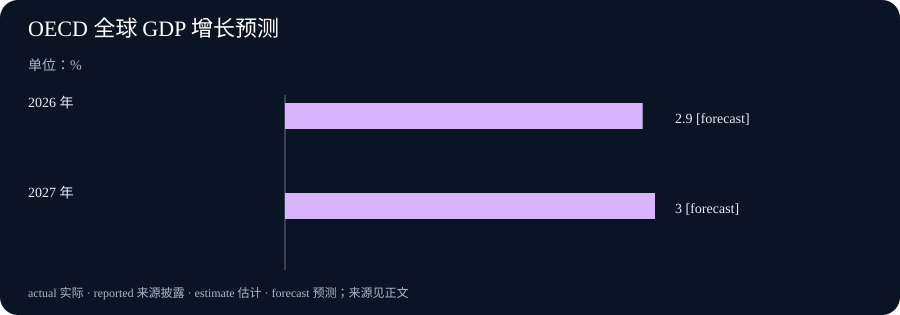

# Daily Intelligence
> 2026-09-25｜Asia/Shanghai｜补编早间版，实际编写于 2026-09-26

## Today's Thesis｜更便宜的能力，也要有更清楚的账本

模型价格和能力的变化会扩大可尝试的工作范围，但只有将委托边界、人工复核、返工和结果质量放进同一账本，成本下降才可能变成可靠的生产率。

## Executive Summary｜先看三条变化

- **代理协作**：Anthropic 9 月 24 日公布 Project Swap，用受控的图书交换实验观察代理如何代表参与者谈判与匹配。它是一个小规模研究项目，不是现实市场中代理交易已经安全可靠的证明。[Anthropic Project Swap](https://www.anthropic.com/research/project-swap?curius=2071) · [Opus 5.5 for Work](https://www.anthropic.com/webinars/opus-5-5-for-work) · [OECD 经济展望](https://www.oecd.org/en/about/news/press-releases/2026/09/global-growth-holds-up-despite-successive-shocks-but-risks-persist.html) · [OpenAI 研究加速说明](https://openai.com/index/research-acceleration-view-inside-openai/)
- **企业采用**：Anthropic 的 Opus 5.5 工作介绍强调模型能力与单位 token 成本变化。性能与价格是供应商陈述；任何团队是否节省时间、减少返工，仍须在自身任务和权限边界中验证。[Anthropic Project Swap](https://www.anthropic.com/research/project-swap?curius=2071) · [Opus 5.5 for Work](https://www.anthropic.com/webinars/opus-5-5-for-work) · [OECD 经济展望](https://www.oecd.org/en/about/news/press-releases/2026/09/global-growth-holds-up-despite-successive-shocks-but-risks-persist.html) · [OpenAI 研究加速说明](https://openai.com/index/research-acceleration-view-inside-openai/)
- **宏观背景**：OECD 的 9 月中期展望预计 2026 年全球增长 2.9%、2027 年 3.0%，并提示能源、贸易和金融条件存在下行风险。预测不能被写成已经实现的增长。[Anthropic Project Swap](https://www.anthropic.com/research/project-swap?curius=2071) · [Opus 5.5 for Work](https://www.anthropic.com/webinars/opus-5-5-for-work) · [OECD 经济展望](https://www.oecd.org/en/about/news/press-releases/2026/09/global-growth-holds-up-despite-successive-shocks-but-risks-persist.html) · [OpenAI 研究加速说明](https://openai.com/index/research-acceleration-view-inside-openai/)

## AI Daily｜从会表达偏好，到能承担委托

Project Swap 把参与者带来的图书、阅读偏好与 Claude 驱动的代理放进一个受控交换场景。研究的价值不在于把一次成功撮合夸大成通用市场能力，而在于它将“代理是否代表了用户”变成了可以观察的问题。参与者还对图书偏好排序，这给结果评价提供了一个有限但明确的参照。[Anthropic Project Swap](https://www.anthropic.com/research/project-swap?curius=2071) · [Opus 5.5 for Work](https://www.anthropic.com/webinars/opus-5-5-for-work) · [OECD 经济展望](https://www.oecd.org/en/about/news/press-releases/2026/09/global-growth-holds-up-despite-successive-shocks-but-risks-persist.html) · [OpenAI 研究加速说明](https://openai.com/index/research-acceleration-view-inside-openai/)

今天关注的是产品成本主张与受控代理实验如何共同提出一个问题：系统是否真的代表了用户，以及端到端工作是否真的更好。 当代理替人提出条件、比较对象或承诺下一步时，流畅对话并不足以证明它正确代表了委托人。要分别保留原始偏好、可接受的替代范围、价格或资源上限，以及在不确定时必须回交用户的条件。模型可以总结与比较，但权限边界应由委托关系而不是语言能力决定。

受控实验也提醒我们区分发现与外推。参与者数量、物品类型、沟通渠道和损失上限都会影响实验结果。现实采购、客户服务或资金调度涉及更复杂的身份、合规与争议处理，不能用一个交换游戏的匹配率替代。更稳健的做法是先在可逆任务中验证，再记录失败样本、人工接管和用户是否愿意再次授权。

## Business Daily｜成本下降不是自动化回报

Anthropic 在工作介绍中称 Opus 5.5 已可用，典型按 token 计费工作负载的成本约比 Opus 5 低 40%。这是一项产品和定价描述，不等于每个组织的总成本下降 40%。一次实际交付还包括上下文准备、工具调用、人工复核、错误修正、权限管理与培训时间。[Anthropic Project Swap](https://www.anthropic.com/research/project-swap?curius=2071) · [Opus 5.5 for Work](https://www.anthropic.com/webinars/opus-5-5-for-work) · [OECD 经济展望](https://www.oecd.org/en/about/news/press-releases/2026/09/global-growth-holds-up-despite-successive-shocks-but-risks-persist.html) · [OpenAI 研究加速说明](https://openai.com/index/research-acceleration-view-inside-openai/)

企业评估应把“单次模型调用更便宜”与“完成任务更便宜”分开。若更低的调用成本让团队尝试更多草稿、增加并行代理或扩大输入，账单和复核工作未必同比下降；若模型以更少尝试完成同类任务，才可能释放真实容量。两种情况都需要相同口径的任务样本、开始与结束时间、人工介入和质量标准。

部署顺序同样重要。先选择边界清楚、可撤回且有明确验收人的流程，记录基线，再逐步扩大。不要先给代理生产凭据再寻找用途；也不要把最顺利的一次演示当作长期平均。采购合同应说明数据、保留、支持和退出安排，运营记录则应显示何时由人批准、何时由系统停止以及异常由谁处理。

## Macro Observation｜宏观韧性仍须经受项目账本检验

OECD 称，替代供应路线、库存释放、海湾以外增产和较低的石油需求帮助缓冲能源冲击，AI 相关投资继续支撑贸易与增长；同时，冲突、通胀和不确定性仍是风险。全球 GDP 的 2.9% 和 3.0% 是基准预测，不能直接转化为某家公司明年的收入、融资成本或数据中心利用率。[Anthropic Project Swap](https://www.anthropic.com/research/project-swap?curius=2071) · [Opus 5.5 for Work](https://www.anthropic.com/webinars/opus-5-5-for-work) · [OECD 经济展望](https://www.oecd.org/en/about/news/press-releases/2026/09/global-growth-holds-up-despite-successive-shocks-but-risks-persist.html) · [OpenAI 研究加速说明](https://openai.com/index/research-acceleration-view-inside-openai/)

宏观材料对管理者最有用的方式是生成情景，而不是给预算盖章。可以分别评估需求稳定、能源与利率上行、以及外部冲击削弱订单时，哪些支出不可逆、哪些合同可调整、哪些指标要求暂停扩张。把 AI 投资列为增长支撑也不能替代单个项目的现金流检验。

尤其要注意口径。季度实际增长、年度预测、名义支出和项目单位成本回答的是不同问题。将它们拼成一条“景气”叙事会掩盖风险传导。更有用的是同时保留使用率、交付质量、返工、能源和资本成本，在新数据到来时只更新受到影响的假设。

## Signal Dashboard｜每个信号都要有边界

| 信号 | 本期可确认 | 暂不能推出 | 下一项验证 |
| --- | --- | --- | --- |
| Project Swap | 受控代理交换实验已披露 | 代理可安全代表所有用户交易 | 用户满意度、失败样本与边界条件 |
| Opus 5.5 工作介绍 | 产品可用与供应商成本陈述 | 本企业端到端成本同比下降 | 同类任务的质量、时间和复核记录 |
| OECD 全球增长预测 | 2026 年 2.9%、2027 年 3.0% 的预测 | 增长已实现或项目必然回报 | 后续实际数据与预测修订 |
| AI 投资支撑宏观活动 | OECD 的综合判断 | 每项 AI 支出已具正现金流 | 利用率、合同成本和业务结果 |

## Deep Insight｜委托关系比“自主程度”更接近真实问题

今天关注的是产品成本主张与受控代理实验如何共同提出一个问题：系统是否真的代表了用户，以及端到端工作是否真的更好。 当我们说一个代理“替人做事”时，真正的问题不是它有多少步骤能够自动完成，而是它在每一步代表的到底是谁、能做出什么承诺、出错后由谁承担后果。一个助手可以准确复述偏好，却在关键时刻选择了不被允许的替代；也可以在信息不足时停止并请求确认。后者看起来更慢，却可能更符合委托关系。

这需要把委托拆成几个可检查的部分。目标是希望达到什么结果；范围是可以使用哪些资料、工具和对象；限制是不能越过哪些价格、身份、时间或风险边界；升级条件是何时必须交还给人；记录是之后如何复原输入、版本和决定。不同任务的严格程度可以不同，但这几个问题不能由一句“请谨慎”代替。

代理协作尤其容易出现责任被稀释的情形。一个系统做检索，另一个系统起草，第三个系统执行工具调用；如果每个环节都只看到自己的局部目标，整体可能产生没人明确批准过的结果。因此需要一个能够看到任务契约的人或控制层，把高影响动作绑定到明确的身份和确认。并行并不免除责任，反而要求更清楚的交接。

成本讨论也应服从同一逻辑。调用价格更低会使更多工作看起来值得尝试，但只有在结果质量、返工和监督成本被一并记录时，组织才知道节省来自哪里。若系统更快地产出更多需要人工重做的内容，局部成本下降可能掩盖端到端成本上升。相反，若它减少重复查询、让人把注意力放在异常上，才可能形成可持续收益。

科学与市场实验的共同价值是允许失败被看见。一个交换没有达成、一个建议被用户否决、一个任务触发人工接管，都不是要从报告中删除的噪声；它们说明边界是否被正确理解。将失败样本与成功案例一同复盘，能够避免系统只在最适合它的场景中被评价。

最终，可靠的自动化并不要求人持续盯着每一个小动作。它要求人在授权前定义后果，在运行中保留停止与升级的能力，在运行后能从记录中理解实际发生了什么。这样，人可以把精力从重复操作移到更少但更重要的判断上。代理越能行动，委托关系越需要被写得清楚。

## Tomorrow Watch｜下一项能改变判断的证据

- **代理代表性**：关注受控实验后是否公开失败类型、用户不满意的原因和边界条件，而不是只观察成功交换的数量。[Anthropic Project Swap](https://www.anthropic.com/research/project-swap?curius=2071) · [Opus 5.5 for Work](https://www.anthropic.com/webinars/opus-5-5-for-work) · [OECD 经济展望](https://www.oecd.org/en/about/news/press-releases/2026/09/global-growth-holds-up-despite-successive-shocks-but-risks-persist.html) · [OpenAI 研究加速说明](https://openai.com/index/research-acceleration-view-inside-openai/)
- **企业成本**：用相同难度任务比较调用、人工复核与返工，确认模型价格变化是否真正改变单位交付成本。[Anthropic Project Swap](https://www.anthropic.com/research/project-swap?curius=2071) · [Opus 5.5 for Work](https://www.anthropic.com/webinars/opus-5-5-for-work) · [OECD 经济展望](https://www.oecd.org/en/about/news/press-releases/2026/09/global-growth-holds-up-despite-successive-shocks-but-risks-persist.html) · [OpenAI 研究加速说明](https://openai.com/index/research-acceleration-view-inside-openai/)
- **宏观条件**：关注能源、贸易和金融条件是否偏离 OECD 基准假设；发生变化时更新情景，不倒写成早已确定的事实。[Anthropic Project Swap](https://www.anthropic.com/research/project-swap?curius=2071) · [Opus 5.5 for Work](https://www.anthropic.com/webinars/opus-5-5-for-work) · [OECD 经济展望](https://www.oecd.org/en/about/news/press-releases/2026/09/global-growth-holds-up-despite-successive-shocks-but-risks-persist.html) · [OpenAI 研究加速说明](https://openai.com/index/research-acceleration-view-inside-openai/)

## One Chart｜OECD 全球 GDP 增长预测

| 年份 | 增长预测 | 状态 |
| --- | --- | --- |
| 2026 年 | 2.9% | 预测 |
| 2027 年 | 3.0% | 预测 |

该图为 OECD 9 月中期展望的全球 GDP 增长预测，单位为百分比；不是已实现增长，也不是特定企业或行业的收入预测。[Anthropic Project Swap](https://www.anthropic.com/research/project-swap?curius=2071) · [Opus 5.5 for Work](https://www.anthropic.com/webinars/opus-5-5-for-work) · [OECD 经济展望](https://www.oecd.org/en/about/news/press-releases/2026/09/global-growth-holds-up-despite-successive-shocks-but-risks-persist.html) · [OpenAI 研究加速说明](https://openai.com/index/research-acceleration-view-inside-openai/)

## Quote of the Day｜让边界成为行动的一部分

“There is nothing so practical as a good theory.”

— Kurt Lewin

中文：没有什么比一个好理论更实用。

出处：[原文](https://en.wikiquote.org/wiki/Kurt_Lewin)。本刊借此提醒：行动可以积极，但对未知、权限和后果的界定必须先于不可逆的承诺。

## Action Items｜把委托变成可复查的问题

1. **代理代表的是谁？** 为一个正在使用的自动化任务写下委托人、目标和不可接受的替代结果，并将它们放在任务记录而不是口头说明里。
2. **哪些动作必须回交确认？** 列出涉及付款、外部沟通、权限变更或敏感资料的动作，设置明确的人工升级条件。
3. **成本到底省在哪里？** 选择一组同类任务，同时记录模型调用、人工复核、返工和完成质量，避免只比较 token 单价。
4. **失败是否能被看见？** 在低风险环境中检查拒绝、暂停和人工接管是否留下可读记录，不把异常从指标中排除。
5. **什么证据会改变决定？** 为下一次扩张预先写下需要达到的质量、成本和权限条件；没有达到时缩小范围而不是继续堆叠试点。
