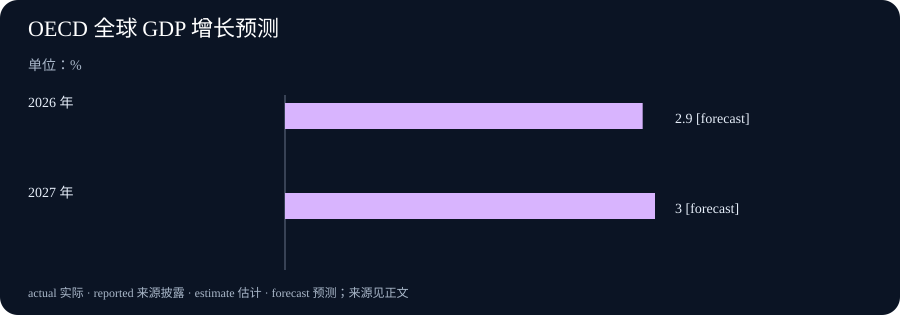

# Daily Intelligence
> 2026-10-01｜Asia/Shanghai｜早间版｜实际编写于 2026-10-01T07:03:06+08:00

## Today's Thesis｜速度提升后，验证仍要独立

模型速度、单位任务成本和可处理范围都在改善，但可靠部署的瓶颈正在从“能否产出”转向“谁来验证、何时停止、如何把结果接入真实流程”。科学发现与企业自动化都需要可复查的证据链，不能把一次评测、一次演示或一项供应商主张直接写成长期成效。

## Executive Summary｜先看三条变化

- **能力与效率同时推进**：Anthropic 于 9 月 28 日发布 Claude Sonnet 5.5，称其在典型工作中可更快生成、每项任务成本最高可低约 30%。这是供应商的产品与测试陈述；对某个团队是否节省总成本，仍需用自身任务、人工复核和返工记录验证。[Claude Sonnet 5.5](https://www.anthropic.com/claude-sonnet-5-5)
- **科学协作仍要回到实验**：Anthropic 9 月 23 日披露 Claude 在研究人员高层指导下，从 DNA 数据中提出一种带有 CRISPR 式重复序列特征的新酶系统。该成果说明模型可扩大假设空间，不等于生物学结论可脱离实验室复现与独立验证。[新型酶系统研究](https://www.anthropic.com/news/claude-discovers-novel-enzyme-system)
- **宏观环境提供背景，不提供保证**：OECD 9 月中期展望预计 2026 年全球 GDP 增长 2.9%、2027 年 3.0%，并指出能源冲击、通胀和不确定性仍是风险。AI 投资被列为支撑贸易和增长的因素之一，但不能由此推导每个 AI 项目都会得到回报。[OECD 中期展望](https://www.oecd.org/en/about/news/press-releases/2026/09/global-growth-holds-up-despite-successive-shocks-but-risks-persist.html)

## AI Daily｜从基准成绩走向可验证的工作结果

Sonnet 5.5 的发布把一个常见部署问题放到台前：模型在评测、速度与 token 消耗上的改进，如何转化为组织可以接受的结果。Anthropic 报告其 Terminal-Bench 4.0、CursorBench 等测试结果，并同时说明复杂、开放式且需要持续判断的工作仍是更高阶模型更有优势的场景。[Claude Sonnet 5.5](https://www.anthropic.com/claude-sonnet-5-5) 这不是简单的型号替换问题，而是任务分层问题。

适合规模化的通常是边界明确、可验收且后果可逆的任务：归类、提取、格式整理、初稿和有固定规则的代码修复。对于跨部门协调、外部承诺、权限调整或证据不足的判断，速度并不降低复核必要性。把这两类任务放进同一个“自动化率”指标，容易把低风险吞吐量误读成高风险可靠性。

OpenAI 在其研究加速说明中称，研究人员正更多地使用编码代理并行推进代码与实验；文中也把系统定位为在人类监督下承担定义清楚、原本需要熟练研究者数天完成的任务。[研究加速说明](https://openai.com/index/research-acceleration-view-inside-openai/) 这个限定很重要：代理扩展的是被清楚定义的工作容量，而不是取消定义、验证与监督。

## Business Daily｜单位价格下降后，端到端账本更重要

供应商给出的“快 30% 以上、每项任务成本最高低约 30%”是有用的采购信号，却不是企业收益表。实际成本还包括上下文准备、工具失败、模型重试、人工审阅、审计记录、培训和异常升级。若调用变便宜后团队扩大输入、增加并行会话或提高检查强度，账单与人工投入不一定按同样比例下降。[Claude Sonnet 5.5](https://www.anthropic.com/claude-sonnet-5-5)

因此，企业不应只比较每百万 token 的报价，也不应只看一次成功演示。更可用的对照是：选取难度相近的真实任务，记录从请求到验收的总时间、人工介入次数、返工率、错误类别和最终业务接受率。连续观察后，才知道节省来自模型本身、流程改造，还是把一部分工作转移给了复核者。

模型分层还会改变采购和架构。低成本、低延迟模型可以处理高频且规则清楚的队列；复杂任务再升级到有更长推理预算或更严格保障的模型。前提是路由规则可解释，升级失败不会把敏感内容意外发送到不应使用的通道，且每条路径都保留相同的权限与留痕标准。

## Macro Observation｜投资韧性并不消除预算约束

OECD 认为，替代供应路线、库存释放、海湾以外增产和较低石油需求缓冲了能源冲击；AI 相关投资继续支持贸易与增长。其基准预测是 2026 年全球增长 2.9%、2027 年 3.0%，但同时保留了冲突、价格压力和不确定性带来的风险。[OECD 中期展望](https://www.oecd.org/en/about/news/press-releases/2026/09/global-growth-holds-up-despite-successive-shocks-but-risks-persist.html) 这些数字是预测而非观察到的结果。

对经营决策而言，宏观展望的价值在于迫使项目团队写清情景，而不是为扩张背书。团队可分别计算：需求平稳、能源和利率上行、或客户预算收缩时，算力合同、人员安排和产品路线有哪些可逆空间。把年度 GDP 预测直接换算成某项产品收入，是把不同层级的变量混在一起。

AI 投资可能带动供给链和贸易，也可能在短期内提高资本开支、能源需求和执行风险。一个成熟的项目账本应同时记录利用率、收入或内部节省、质量、合规成本和现金支出；当宏观假设变化时，只更新受到影响的变量，而不是重新叙述已经发生的事实。

## Signal Dashboard｜用证据决定下一步

| 信号 | 本期可确认 | 不应直接推出 | 下一项验证 |
| --- | --- | --- | --- |
| Sonnet 5.5 | 供应商宣布性能、速度与任务成本主张 | 所有团队总成本均下降 | 相同任务的端到端时间、复核和返工 |
| 科学发现工作 | 模型可从 DNA 数据协助提出候选假设 | 候选系统已经完成独立复现 | 实验重复、对照和同行检验 |
| 研究代理使用 | 研究组织报告代理使用扩大 | 代理可替代开放式研究判断 | 任务定义、监督与失败分布 |
| OECD 展望 | 全球增长预测为 2.9% 与 3.0% | 项目回报已经确定 | 后续实际数据与预算敏感性 |

## Deep Insight｜验证不是流程末端的一道门

模型更快、更便宜时，组织最容易犯的错误是把验证当成部署后的刹车。实际上，验证应从任务设计开始：先决定什么结果可以被接受，什么证据足以支撑行动，什么失败会立即停止流程，然后才选择模型、提示和工具。若标准在输出之后才临时制定，评审往往只剩下为已生成结果寻找理由。

科学工作把这种差别放得很清楚。模型能够在巨大搜索空间中发现模式、提出候选机制、组织文献和设计实验，但候选不等于发现已经成立。实验室的对照、重复、测量误差和独立复现不是拖慢智能的附属手续，而是把一个看似合理的假设变成可被共同使用的知识的过程。Anthropic 对新酶系统的披露正适合这样阅读：它提供了一个值得检验的研究起点，而不是要求外界跳过检验。[新型酶系统研究](https://www.anthropic.com/news/claude-discovers-novel-enzyme-system)

企业流程也一样。一个客服代理能够更快起草回复，真正的问题却是：它是否把客户身份、承诺范围、升级规则和留档要求一并处理？一个编码代理可以提交改动，真正的问题却是：测试覆盖什么、谁批准上线、异常如何回滚？速度改变了等待时间，却没有自动改变责任归属。若系统让错误更快到达外部，后果反而可能更昂贵。

因此，验证需要分层。第一层检查输入：资料是否来自允许的来源，权限与时效是否正确。第二层检查过程：工具调用、模型版本、路由和人工接管是否有记录。第三层检查结果：它是否满足任务定义的正确性、完整性、安全和语气要求。第四层检查长期效果：返工、投诉、事件和成本是否真的改善。任何一层缺失，漂亮的最终输出都可能掩盖风险。

评测在这里的作用是筛选，而非盖章。公开基准能够帮助理解某类能力边界，内部离线评测能检验与本组织任务的贴合程度，在线监控则揭示真实输入下的漂移。它们都不可替代。模型供应商也明确指出，没有一套评估能可靠捕获每一种失败；这不是放弃评估的理由，而是要求把评估、限制和监控组合起来。[Claude Sonnet 5.5](https://www.anthropic.com/claude-sonnet-5-5)

把验证前移还有一个实际收益：团队可以更安心地自动化低风险步骤。明确了验收规则和升级条件后，日常任务不必每次都由人从头检查；人可以集中在异常、边界案例和不可逆决策上。可靠性并非来自让人永远手工执行，而是来自让系统知道何时继续、何时暂停、何时把判断交还给人。

## Tomorrow Watch｜哪些证据会改变判断

- **端到端成本**：观察同类真实任务在调用、人工审阅、返工和完成质量上的变化，而不是只引用供应商单项价格。[Claude Sonnet 5.5](https://www.anthropic.com/claude-sonnet-5-5)
- **科学验证**：关注候选酶系统后续的实验设计、复现和独立检验；研究披露不能替代可重复证据。[新型酶系统研究](https://www.anthropic.com/news/claude-discovers-novel-enzyme-system)
- **监督机制**：关注代理扩展到更复杂任务时，是否同步披露任务定义、人工接管、失败分布和监控限制。[研究加速说明](https://openai.com/index/research-acceleration-view-inside-openai/)
- **宏观假设**：留意能源、贸易和金融条件是否偏离 OECD 的基准路径，并据此调整项目情景。[OECD 中期展望](https://www.oecd.org/en/about/news/press-releases/2026/09/global-growth-holds-up-despite-successive-shocks-but-risks-persist.html)

## One Chart｜OECD 全球 GDP 增长预测

| 年份 | 全球 GDP 增长预测 | 状态 |
| --- | --- | --- |
| 2026 年 | 2.9% | 预测 |
| 2027 年 | 3.0% | 预测 |

图表采用 OECD 2026 年 9 月中期展望的全球 GDP 增长预测。它用于说明宏观情景，不能作为已实现增长或单一公司收入预测。[OECD 中期展望](https://www.oecd.org/en/about/news/press-releases/2026/09/global-growth-holds-up-despite-successive-shocks-but-risks-persist.html)

## Quote of the Day｜评估需要与限制和监控同行

“Benchmark scores capture only one facet of a model’s capabilities.”

— Anthropic，Claude Sonnet 5.5 发布说明

中文：基准分数只能捕捉模型能力的一个侧面。

出处：[Claude Sonnet 5.5](https://www.anthropic.com/claude-sonnet-5-5)。这句话提醒我们，评估结果应当配合权限限制、人工升级和运行监控，而不是被当成放开高影响动作的通行证。

## Action Items｜今天值得思考什么

1. **验收标准写在提示之前了吗？** 为一个准备自动化的任务先定义正确、完整、合规与升级条件，再决定模型和工具如何执行。
2. **成本按端到端计算了吗？** 在同类真实任务中同时记录调用、人工复核、返工与最终接受率，避免把 token 单价当成全部收益。
3. **哪些失败会立即停止？** 把外部沟通、付款、权限变更和敏感资料处理的暂停条件明确写入流程，并测试人工接管。
4. **科学候选有独立验证吗？** 对模型提出的假设保留数据来源、实验对照与复现计划，不让有说服力的叙述替代测量。
5. **宏观假设可被更新吗？** 将能源、利率和需求变化写成项目情景的输入；新数据出现时更新参数，而不是追认既有决定。
