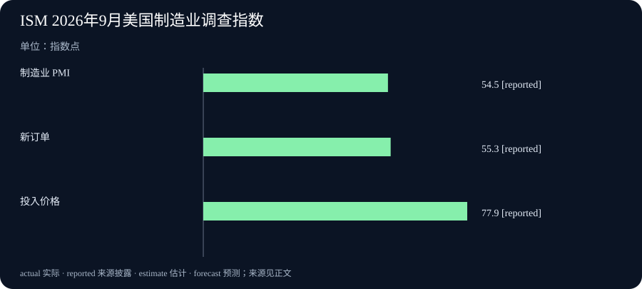

# Daily Intelligence
> 2026-10-02｜Asia/Shanghai｜修订版。实际修订时间由生成元数据记录；新闻观察窗口截至修订时前 24 小时。部分机构页面仅标注 2026-10-01、未标精确时刻；此类材料按前一日新披露处理，不能断言其精确到小时的发布时间。

## Today's Thesis｜应用开始披露规模，成本压力同时回到台前

过去一个新闻周期有了可供比较的具体进展：巴克莱银行披露 AI 工具在客服知识检索与邮件分流中的使用规模，并提出开发人员推广目标；研究者展示如何把模型擅长的编码与跨学科检索放进可计算的科学工具；微软调整 Microsoft 365 与 LinkedIn 领导安排；美国制造业调查则显示新订单改善，但投入价格指数明显上行。今天值得观察的是已发生的使用、尚未兑现的计划和外部成本约束如何分开记账，而不是把它们合并成一条“AI 已全面兑现”的叙事。

## Executive Summary｜四条新披露，四种证据

- **企业采用**：Anthropic 10 月 1 日公告称，巴克莱银行已有超过 16,000 名员工使用 Claude 支持的知识助手，系统累计处理超过一百万次检索；另一个邮件处理流程每天约处理 120,000 封邮件。这些是公告披露的现有规模，不能直接等同于节省了多少人工或改善了多少客户满意度。银行提出开发人员采用比例到 2026 年底达 50% 的目标，属于未来计划。[巴克莱与 Anthropic 公告](https://www.anthropic.com/news/barclays-scales-claude)
- **科研方法**：Anthropic 10 月 1 日刊登 Matthew Schwartz 的客座研究文章，介绍 BootLoops：将编码、精确计算与专家判断结合，以寻找适合当前模型的问题。文章报告若干跨学科探索，但这仍是作者陈述，不能当作已完成独立复现的通用科研突破。[Claude-shaped science](https://www.anthropic.com/research/claude-shaped-science)
- **组织与产品**：微软 10 月 1 日公布 Ryan Roslansky 将离职、留任顾问至年底，并调整 Microsoft 365 和 LinkedIn 的部分汇报关系。公告把 Copilot 与 Office 的整合列为战略方向；组织调整已宣布，未来产品成效尚待观察。[微软官方公告](https://blogs.microsoft.com/blog/2026/10/01/microsoft-365-and-linkedin-leadership-update/)
- **宏观成本**：ISM 10 月 1 日发布的 9 月美国制造业 PMI 为 54.5，略低于 8 月 54.6；新订单指数由 53.7 升至 55.3，投入价格指数由 71.1 升至 77.9。调查指向需求仍扩张、价格压力加大，但扩散指数不是通胀率，也不能代表所有企业的成本变化。[ISM 9 月制造业报告](https://www.ismworld.org/supply-management-news-and-reports/reports/ism-pmi-reports/pmi/september/)

## AI Daily｜把模型擅长的工作装进可检验的工具

Matthew Schwartz 的新文章提出一个具体选择：与其让模型笼统承担“像科学家一样研究”，不如找出它在大量编码、跨学科方法检索和可精确复算任务中的长处，再用软件工具约束产出。他介绍的 BootLoops 将一些定量科学计算整理成可以运行和检查的流程，并举出从理论物理延伸到生态学、种群遗传学等领域的探索。[Claude-shaped science](https://www.anthropic.com/research/claude-shaped-science)

这篇材料值得关注之处是研究设计，而不是“AI 自行发现一切”的标题。作者明确指出，一些数学计算可用独立脚本核对；到了其他学科，技术上的对应关系即便成立，也可能没有科学意义，因此还需要领域专家判断问题是否重要。把计算正确性、科学价值和可重复实验分为三个检查层次，才可能知道模型究竟贡献了什么。

文章是 10 月 1 日新刊登的客座论述；文中提到的实验和工具开发并非都在过去 24 小时发生。日报记录的是新披露的方法与结果，不能倒写成这些科研活动全部在昨天完成。与前几天反复谈论抽象“验证”不同，今天的材料给出了可执行的对象：代码能否重跑、数值能否复算、跨领域连接能否得到专业人员确认。

## Business Daily｜巴克莱的新公告，哪些是事实、哪些是目标

巴克莱与 Anthropic 扩大合作的公告提供了几种不同性质的数据。用于英国零售客户服务的 Colleague Knowledge Assistant 自 2025 年起投入使用，公告称已有超过 16,000 名员工采用，累计检索超过一百万次；全球市场业务的邮件处理平台目前每天处理约 120,000 封邮件，负责分类、补充信息和选择处理路径。[巴克莱与 Anthropic 公告](https://www.anthropic.com/news/barclays-scales-claude)

这些数字描绘了流程覆盖面，尚未提供可独立比较的客户等待时间、错误率、人工工时或净财务收益。16,000 人是已采用人数，一百万次是累计检索，120,000 封是日处理量，分母与时间尺度各不相同，不能简单相加或合成为“AI 节省的工作量”。尤其对银行而言，检索是否返回了正确政策、邮件分类是否影响客户权益，仍需要运营质量与审计证据。

公告还提出 Claude Code 采用到年底覆盖 50% 开发人员、2027 年扩至大多数工程师的目标。它说明组织下一步计划，并不证明现在已达到该比例。比较成熟的观察办法是把目标与当前实际采用、审查后的代码质量、遗留系统改造的交付周期以及事故率分开记录，再看它们是否一起改善。

微软同日的组织公告提供另一条企业信号：在推动 Copilot 与 Office 整合的同时，公司宣布 Ryan Roslansky 将离开，年内仍担任顾问，并即时调整若干团队汇报关系。[微软官方公告](https://blogs.microsoft.com/blog/2026/10/01/microsoft-365-and-linkedin-leadership-update/) 人事变动本身不能推断产品延误或客户接受度变化；值得跟踪的是新的责任安排能否保持产品路线和企业交付连续性。

## Macro Observation｜订单增长与价格上行同时出现

ISM 的 9 月调查在 10 月 1 日发布。制造业 PMI 54.5，较上月微降 0.1 点，仍在扩张区间；新订单指数升至 55.3，投入价格指数升至 77.9，后者较 8 月增加 6.8 点。[ISM 9 月制造业报告](https://www.ismworld.org/supply-management-news-and-reports/reports/ism-pmi-reports/pmi/september/) 这些是采购与供应管理人员的调查扩散指数，不是价格涨幅、实际产值增速或官方 GDP 数据。

这个组合对技术企业的意义是预算压力可能两头并存：需求并未消失，但设备、能源、金属、电子元件及物流等投入环节可能更难以固定价格。ISM 报告中有受访者提到电子元件和内存供应紧张，也有企业提到数据中心建设受到地方反对；这些是调查中的行业反馈，不能直接外推为全部 AI 基础设施都已发生短缺。[ISM 9 月制造业报告](https://www.ismworld.org/supply-management-news-and-reports/reports/ism-pmi-reports/pmi/september/)

因此，采购和投资判断应同时看合同价格、交货周期、库存与订单，而不是只看一个总 PMI。新订单走强可能支持扩张计划；价格指数上行则要求重新评估毛利与现金周转。把两条方向相反的信号放在一起，才能理解“业务可能增长、交付却更贵”的情景。

## Signal Dashboard｜别把不同性质的数字混在一起

| 信号 | 最新披露 | 证据性质 | 尚需验证 |
| --- | --- | --- | --- |
| 巴克莱知识助手 | 超过 16,000 名员工采用、累计逾一百万次检索 | 合作公告中的既有运营规模 | 检索正确率、客户体验和净节省 |
| 巴克莱邮件分流 | 每天约 120,000 封邮件 | 合作公告中的现有处理量 | 错分率、人工复核和处理时长 |
| 开发工具扩张 | 年底覆盖 50% 开发人员的目标 | 未来计划 | 实际采用率与软件质量 |
| BootLoops | 客座研究文章介绍可复算计算工具 | 方法与作者报告 | 独立运行、领域价值与复现 |
| 美国制造业 | PMI 54.5、新订单 55.3、价格 77.9 | 9 月调查、10 月 1 日发布 | 后续订单、价格与实际产出 |

## Deep Insight｜一份日报也需要自己的证据时钟

今天的新材料揭示了日报容易犯的一种编辑错误：把“今天找到的页面”当成“今天发生的事”。巴克莱公告确实在 10 月 1 日发布，但知识助手自 2025 年已运行，累计检索次数覆盖更长时间；开发人员年底采用目标则尚未发生。若不分别给这三种信息贴上时间标签，读者可能误以为 16,000 人在昨天才开始使用，也可能误以为 50% 覆盖已经实现。这些误读比遗漏一个漂亮数字更伤害报道可信度。

日报应同时记录至少三个时钟。第一个是**披露时钟**：机构何时公开这条信息。第二个是**事件时钟**：合作签署、工具上线、组织变动或调查收集发生于何时。第三个是**统计时钟**：指标覆盖哪段期间，累计值、日处理量与目标值分别如何定义。一个 10 月 1 日公开的 9 月制造业调查，是昨天的新数据披露，不是昨天制造业突然发生了一个月的变化；价格扩散指数上升，也不是价格上涨 77.9%。[ISM 9 月制造业报告](https://www.ismworld.org/supply-management-news-and-reports/reports/ism-pmi-reports/pmi/september/)

同样的区分也适用于科学文章。BootLoops 的发布日是 10 月 1 日，但作者描述的工具形成于此前的一系列探索。它的新意在于公开一种可供审查的方法和若干应用线索，尚不能据此宣布所有跨学科结果已经经过独立复现。好的科学报道不仅要问模型生成了什么，还要问外部研究者能否运行代码、复核数值，以及该结果是否解决真正重要的问题。[Claude-shaped science](https://www.anthropic.com/research/claude-shaped-science)

这三个时钟可以直接改变自动化流程。研究开始时先设定本次截止时刻和向前 24 小时的观察窗口；每条候选来源保存原文链接、页面所示发布日期、能找到的发布时间与时区，以及编辑核对时刻。只显示日期的页面可以作为前一日新披露材料，但应标明小时无法核实，不能声称严格落在 24 小时内。来源进入稿件前，再对照前两期 URL 和核心事件：同一旧新闻不能仅换一种说法就充当新头条。

接下来才是写作。先挑出真正新披露、且来源能够直接支持的事实；为每条事实写上“已发生”“既有数据”“计划”或“预测”。旧材料可用于解释因果与背景，但必须显眼地说明它为何在今天仍相关，不能占据新闻段落的主位置。今天的企业、科研与宏观材料恰好说明，读者需要的不是每天重复一句“验证很重要”，而是知道现在出现了什么、证据能说明到哪一步、下一次应看什么数据。

若一早确实没有足够的一手新来源，正确结果也应是明确报告来源不足，保留缺口；不能把旧材料拼成一个看似完整的新日报。这样做会增加一次失败通知，却能保住整份归档的日期含义。日报的日期是一项事实承诺，自动化必须像检查文件完整性一样检查这项承诺。

## Tomorrow Watch｜下一次更新应看什么

- **银行使用效果**：关注巴克莱或独立资料是否披露知识助手的正确率、客户等待时间、邮件错分率和人工复核比例；现有公告只提供覆盖规模。[巴克莱与 Anthropic 公告](https://www.anthropic.com/news/barclays-scales-claude)
- **科研复现**：关注 BootLoops 代码、示例和领域专家评论是否使结果可重复，区分计算正确与科学问题有价值。[Claude-shaped science](https://www.anthropic.com/research/claude-shaped-science)
- **组织交接**：关注微软后续是否公布 Microsoft 365 与 LinkedIn 的明确产品里程碑，不从今天的人事消息推测未披露的成败。[微软官方公告](https://blogs.microsoft.com/blog/2026/10/01/microsoft-365-and-linkedin-leadership-update/)
- **成本信号**：追踪 ISM 价格指数上升是否传导到具体采购合同和实际价格数据；扩散指数只能显示上涨更普遍。[ISM 9 月制造业报告](https://www.ismworld.org/supply-management-news-and-reports/reports/ism-pmi-reports/pmi/september/)

## One Chart｜美国制造业需求与投入价格的分化

| 指标 | 8 月 | 9 月 | 变化 |
| --- | ---: | ---: | ---: |
| 制造业 PMI | 54.6 | 54.5 | -0.1 点 |
| 新订单指数 | 53.7 | 55.3 | +1.6 点 |
| 投入价格指数 | 71.1 | 77.9 | +6.8 点 |

图中采用 ISM 10 月 1 日公布的 9 月调查数据。指数高于 50 代表调查中相应方向更普遍，不表示价格上涨 77.9% 或订单增长 55.3%。[ISM 9 月制造业报告](https://www.ismworld.org/supply-management-news-and-reports/reports/ism-pmi-reports/pmi/september/)

## Quote of the Day｜衡量采用，也衡量结果

“The true measure of any technology is the impact it has on customers, clients, and colleagues”

— Anne Marie Darling，Barclays Group Co-Chief Operating Officer

中文：衡量一项技术，最终要看它对客户、合作对象与同事产生了什么影响。

出处：[巴克莱与 Anthropic 公告](https://www.anthropic.com/news/barclays-scales-claude)。引文表达的是管理者的衡量标准，不构成该合作已经达成相关成效的证明。

## Action Items｜今天值得思考什么

1. **新披露与旧事实分开了吗？** 为今天引用的每个数字写明公布日、实际统计期间和属于既有结果还是未来目标。
2. **使用规模能证明价值吗？** 看到采用人数或处理量时，同时要求质量、人工复核、客户体验与净成本的同口径对照。
3. **科学结果可以重跑吗？** 检查代码、数据、参数和领域专家解释是否足以让别人独立验证。
4. **组织变化影响什么？** 只记录已经宣布的职责变化，把产品里程碑与成效留给后续证据。
5. **订单与价格如何一起进入预算？** 在需求仍扩张时重新测算采购、交付周期与毛利，不把 PMI 扩散指数误读为价格涨幅。
