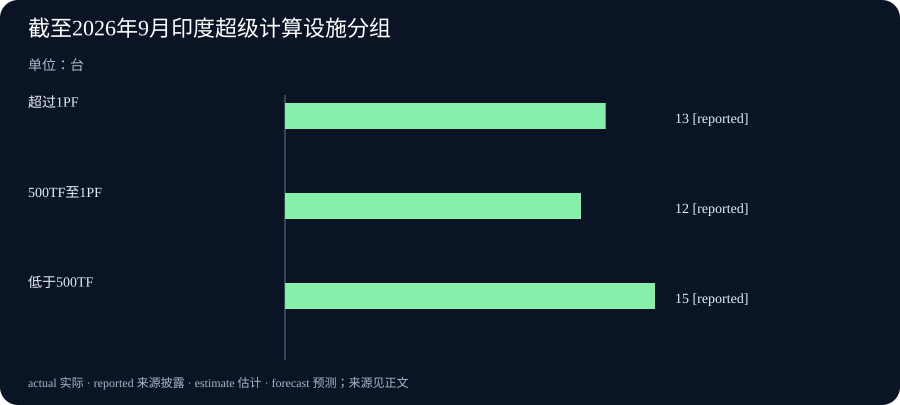

# Daily Intelligence
> 2026-10-04｜Asia/Shanghai｜补编版。实际编写于 2026-10-05；本期只采用截至 10 月 4 日已公开的原始材料。部分公告在 10 月 4 日傍晚或夜间发布，因此这是一份整日回顾，不冒充当日 07:00 已知的早间版。

## Today's Thesis｜新模型与公共工程，都要分清可用和兑现

10 月 3 日公开的 Kolibri-1 模型卡与 10 月 4 日印度政府的三份公告构成不同层次的进展：模型权重开放不等于所有技术资产开放，已建成算力不等于实际研究产出，住房资金安排不等于房屋已交付，预告航运线路不等于船舶已经启航。把状态说准确，才能决定后续该查什么。

## Executive Summary｜先看三条变化

- **模型开放的边界**：Aleph Alpha 的 Kolibri-1 模型卡标明 10 月 3 日发布，提供德英双语模型权重并列出评测和部署条件；Apache 2.0 许可在原文中限定于发布的权重与配置，不自动延伸至训练方法。[Kolibri-1 模型卡](https://huggingface.co/Aleph-Alpha/Kolibri-1)
- **算力建设与使用**：印度政府 10 月 4 日披露，截至 9 月已有 40 台超级计算机、合计 68 PF，另列出科研人员、计算任务及论文数量。这是政府对既有建设和使用的回顾，不是 10 月 4 日新增 40 台，也不单独证明 AI 模型性能提升。[印度超算说明](https://www.pib.gov.in/PressNoteDetails.aspx?ModuleId=3&NoteId=160306&lang=1&reg=48)
- **公共投资与贸易通道**：印度官方称向安得拉邦移交首批 30 万套住房相关资金并为 177 套 3D 混凝土打印住宅试点奠基；另一公告预告 10 月 5 日从迪布鲁格尔至达卡的甲醇货运航程。前者是资金与项目阶段，后者仍是计划。[住房公告](https://www.pib.gov.in/PressReleseDetailm.aspx?PRID=2318899&lang=1&reg=3) · [航运预告](https://www.pib.gov.in/PressReleseDetailm.aspx?PRID=2318945&lang=1&reg=3)

## AI Daily｜权重发布与算力可用，是两张不同的验收单

Aleph Alpha 在 Kolibri-1 的原始模型卡上把发布日期标为 2026 年 10 月 3 日。模型卡描述德英双语、推理与工具调用用途，列出硬件要求和多项自评结果。读者可以确认模型权重和配置已在发布页提供，并看到作者所用的评测设置；却不能仅凭该页断言任一企业在自己的语言、任务、成本和安全约束下已经取得相同表现。[Kolibri-1 模型卡](https://huggingface.co/Aleph-Alpha/Kolibri-1)

模型卡的许可说明值得仔细读。它写明 Apache 2.0 权利适用于仓库发布的权重和配置，并明确排除未包含的其他资产。这样一种范围限制不会抹掉开放权重的价值，却意味着采购或研究团队不能从“开放模型”四字推断训练数据、完整训练代码与所有相关知识产权都可自由使用。硬件方面，卡片对 FP8 权重给出的内存占用约 78 GB，并列出最低 GPU 配置；这说明部署仍有实际成本。[Kolibri-1 模型卡](https://huggingface.co/Aleph-Alpha/Kolibri-1)

印度新闻局 10 月 4 日发布的国家超级计算任务说明提供另一侧的基础设施视角。截至 9 月，官方统计 40 台超级计算机、合计 68 PF，其中 13 台超过 1 PF、12 台在 500 TF 至 1 PF、15 台低于 500 TF。它还称基础设施服务逾 1.6 万名研究人员、支持超过 1500 万个计算任务。这里的统计所属期间是 9 月，披露日期是 10 月 4 日；两者不能混淆。[印度超算说明](https://www.pib.gov.in/PressNoteDetails.aspx?ModuleId=3&NoteId=160306&lang=1&reg=48)

算力设施可能支持 AI、气候、医药和材料研究，但“理论算力”和“可用算力”之间仍有调度、联网、数据许可、维护、用户训练和能耗约束。官方列出的论文和计算任务也不是与某个特定模型成果之间的因果证明。若要评价这个投入，对同一类用户任务应核对排队时间、完成率、单位成本和可复现成果，而不只是把装机量相加。

## Business Daily｜把资金、奠基和启航预告分开写

印度农村发展部 10 月 4 日 17:11 的原始公告称，部长在安得拉邦向地方移交首批 30 万套住房、总额 360 亿卢比的安排，并为一个 177 套住宅、预算 1.4 亿卢比的 3D 混凝土打印试点奠基。[住房公告](https://www.pib.gov.in/PressReleseDetailm.aspx?PRID=2318899&lang=1&reg=3) 这证明公告和仪式已举行；资料并未说这 30 万套住房已经建成，也不能由预算直接推算单位住宅的最终交付成本。后续应看资金拨付、施工验收和居民入住。

项目还揭示一个容易误读的创新叙事。177 套试点的施工技术若要推广，关键不是“3D 打印”标签，而是合规、结构质量、材料供应、工期和长期维护是否优于可比方案。试点已经奠基，与批量住宅具备成熟生产体系之间仍有距离。对于建筑企业和地方财政，这些可复核指标比展示性样板更能决定复制价值。[住房公告](https://www.pib.gov.in/PressReleseDetailm.aspx?PRID=2318899&lang=1&reg=3)

同日晚 21:22，港口、航运与水道部预告次日上午从印度迪布鲁格尔出发，沿国家水道 2 号及印孟协定航线运送甲醇至达卡。[航运预告](https://www.pib.gov.in/PressReleseDetailm.aspx?PRID=2318945&lang=1&reg=3) 目标路线与货物已经具体，但截至本期目标日期，启航仍在未来。不能使用 10 月 5 日之后的消息来声称它在 4 日已经完成。商业价值还需看航道季节性、运费、通关、航次频率及可靠性；首航若实现，也只是一项可继续测试的物流样本。

## Macro Observation｜装机、拨款与通道还不是产出

本期政府数据适合做一个“存量—流量—结果”的区分。40 台超级计算机和 68 PF 是截至 9 月的存量能力；住房安排是项目资金和目标；甲醇航次是 10 月 5 日的计划。它们分别可能影响科研效率、建筑活动和区域贸易，但不能被加总为 10 月 4 日当天已经实现的经济产出。[印度超算说明](https://www.pib.gov.in/PressNoteDetails.aspx?ModuleId=3&NoteId=160306&lang=1&reg=48) · [住房公告](https://www.pib.gov.in/PressReleseDetailm.aspx?PRID=2318899&lang=1&reg=3) · [航运预告](https://www.pib.gov.in/PressReleseDetailm.aspx?PRID=2318945&lang=1&reg=3)

宏观影响还受规模和反事实约束。住房计划可能促进当地工程需求，但若缺乏拨款进度、私营投资和入住数据，就无法量化新增就业或消费。新航线可能降低特定货物的运输摩擦，但一条拟定首航不足以证明长期贸易量增加。超算扩容可能提高研究能力，然而是否减少了等待、降低了单位计算成本，还需要运营指标。这些都应成为下期观察，而不是今天的收益结论。

Kolibri-1 的发布则说明模型供给在增加，但模型卡的自评结果不是独立市场占有率，也不代表用户付费意愿。把模型发布、公共算力和实体工程放在一起看，能看到同一个问题：供给侧的可用资产增加，离稳定需求、采用和回报还有一段需要测量的距离。

## Signal Dashboard｜披露日期与状态逐项核对

| 来源 | 公开时间 | 描述对象 | 已能确认 | 尚待核对 |
| --- | --- | --- | --- | --- |
| Kolibri-1 模型卡 | 10 月 3 日，小时未披露 | 模型权重和作者评测 | 模型卡、配置和许可说明已发布 | 独立部署表现与运营成本 |
| 印度超算说明 | 10 月 4 日 17:53 | 截至 9 月的建设数据 | 官方报告 40 台、68 PF | 实际可用率与科研成果因果 |
| 印度住房公告 | 10 月 4 日 17:11 | 项目安排与试点奠基 | 资金和项目仪式已公告 | 建设、验收与入住 |
| 印度航运预告 | 10 月 4 日 21:22 | 10 月 5 日拟首航 | 路线、货物及计划已公布 | 启航、到港与持续货流 |

## Deep Insight｜为什么一份日报要把四种“已经”分开

技术和商业信息里最容易造成错觉的词，往往不是复杂术语，而是“已经”。模型已经发布，超级计算机已经建成，住房资金已经移交，货运航线已经公布。这四种说法在各自狭义上都能从原始材料找到依据；如果省略宾语，就会被读者理解为产品已经证明价值、科研成果已经产生、住宅已经住人、货物已经抵达。新闻的任务是把宾语和时间补全。

Kolibri-1 提供了一个知识产权层面的例子。“开放权重”明确指向可取得的模型文件，不是有关训练数据和训练方法的总许可。模型卡同时列出自评、适用场景和硬件要求，这给使用者提供了一个可开始测试的对象，而不是替使用者完成验收。一个医院、政府机构或企业若要引入该模型，仍需检查自己的语言样本、敏感信息处理、错误率、部署设备和许可边界。每一项都是新闻后续而不是发布日期当天自动成立的事实。

印度超算公告把另一个“已经”拆开：设备部署与设备被有效使用。官方截至 9 月的 40 台、68 PF，是资源存量的统计；逾 1.6 万名研究人员和 1500 万个计算任务则是使用痕迹。两组数字一起比单一装机量更有信息量，但它们仍不能说明某项科研突破由超算单独造成。更有价值的运营数据包括谁有资格申请、项目多久排到计算时间、任务失败率、数据是否能跨机构移动。这些数据若以后公开，才可能检验“扩大访问”是否真的改变研究机会。

住房项目让资金承诺与最终服务之间的距离更直观。公告的 30 万套是覆盖目标和资金安排，177 套 3D 打印住宅是一个刚奠基的技术试点。两者都可以成为重要公共工程，但没有施工与交付数据之前，不能声称居民住房已经改善。若新技术比常规建造更快或便宜，公开合同、材料强度、维护成本和竣工后的居住体验应能支持它；若这些证据不出现，“首个试点”的表述就只是起点。

航运预告更清楚地展示时间陷阱。10 月 4 日 21:22 的政府公告指向 10 月 5 日 11:00 的计划，二者都在真实原文里。补写 4 日日报时，如果把后一天的预定仪式说成已启航，就是拿编辑实际写作时间的信息倒灌进历史。严谨做法是保留 4 日可知状态：路线、货物、拟出发时刻和仍未发生的事实。之后如有到港记录，可另作新事件，不倒改 4 日的已知边界。

四项材料还有共同的后续问题：可用性、执行和结果应由谁提供证据。模型需要独立任务评测，算力需要运营记录，住房需要施工验收，航运需要实际货流和成本。把证据责任事先写清，能降低媒体追逐同一个新闻标签的冲动。下次看到“开放”“建成”“移交”“启动”，读者便能问出一个更实用的问题：真正被验证的是哪一步，下一步何时可以被反驳或确认。

## Tomorrow Watch｜下一轮需要什么证据

- **模型在自己的任务上能否复现？** 保存 Kolibri-1 的版本、硬件、样本与延迟数据，对照模型卡的作者评测。[模型卡](https://huggingface.co/Aleph-Alpha/Kolibri-1)
- **超算资源是否容易真正取得？** 等候运营方提供排队时间、可用率和跨机构申请规则；不要把峰值能力当成日常可用容量。[超算说明](https://www.pib.gov.in/PressNoteDetails.aspx?ModuleId=3&NoteId=160306&lang=1&reg=48)
- **住房项目会按时交付吗？** 跟踪拨款、177 套试点的施工验收和 30 万套项目的入住，不以奠基代替竣工。[住房公告](https://www.pib.gov.in/PressReleseDetailm.aspx?PRID=2318899&lang=1&reg=3)
- **拟定首航是否成为稳定线路？** 等待 10 月 5 日实际出发、到港及后续航次记录，再评价贸易成本。[航运预告](https://www.pib.gov.in/PressReleseDetailm.aspx?PRID=2318945&lang=1&reg=3)

## One Chart｜印度超算设施的官方分组

| 截至 2026 年 9 月的类别 | 台数 |
| --- | ---: |
| 超过 1 PF | 13 |
| 500 TF 至 1 PF | 12 |
| 低于 500 TF | 15 |

三组共 40 台，均来自 10 月 4 日的印度政府回顾；它们不是当天新增，也不能当成利用率或模型训练吞吐量。[印度超算说明](https://www.pib.gov.in/PressNoteDetails.aspx?ModuleId=3&NoteId=160306&lang=1&reg=48)

## Quote of the Day｜开放许可有明确范围

“The rights granted thereunder only apply to the weights and configuration files published in this repository.”

— Aleph Alpha，Kolibri-1 模型卡

中文：相应授权只适用于此仓库发布的权重与配置文件。

出处：[Kolibri-1 模型卡](https://huggingface.co/Aleph-Alpha/Kolibri-1)。这是许可范围说明，不是对模型效果的承诺。

## Action Items｜把公布的进展变成可核对的结果

1. **开放了哪些资产？** 核对 Kolibri-1 权重、配置、代码及训练资料的实际许可，不从“开放模型”推断全部开放。
2. **算力到底有多可用？** 向运营方索取申请成功率、排队时间和可复现任务的运行记录。
3. **住房何时能住人？** 分别记录资金拨付、试点竣工、整体验收和入住日期。
4. **首航真的发生了吗？** 等待次日出发与到港的原始记录，并核算后续航次频率和成本。
5. **哪些判断需要撤回？** 若独立模型测试、设备利用率或工程交付与公告预期不符，及时修正判断。
