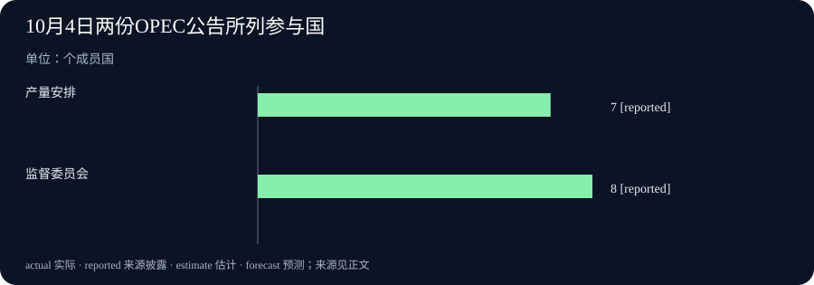

# Daily Intelligence
> 2026-10-05｜Asia/Shanghai｜早间版｜实际编写时间见本期 data.json；检索锚点为 2026-10-05 07:01:55+08:00。优先观察前 24 小时；本期原始页面只给出 10 月 4 日日期，发布小时未披露，因此不声称四项均已严格落在 24 小时窗口内。

## Today's Thesis｜新声明与新决定，都要落到可检验的结果

10 月 4 日的披露把两种不同的“进展”放在一起：多国提出让 AI 更好地服务科研，一家 AI 工具更新了运行分析；产油国则维持下一月的既定产量安排，同时强调航路与能源设施风险。声明、软件发布、政策决定和实际效果各有不同的证据门槛，不能用同一个“已经改善”概括。

## Executive Summary｜先看三条变化

- **科研合作**：美国白宫公布与另外 16 个国家认可的《京都愿景》，提出扩大科研人员对 AI 工具、数据、算力和实验设施的获取，并探索长期资助、快速拨款及科研制度创新。它是共同意向，不是这些资源已经交付或科研效率已提高。[白宫公告](https://www.whitehouse.gov/releases/2026/10/us-leads-international-coalition-to-endorse-kyoto-vision-for-a-golden-age-of-science/) · [声明原文](https://www.whitehouse.gov/wp-content/uploads/2026/10/Kyoto-Vision-for-a-Golden-Age-of-Science.pdf)
- **工具可观察性**：Future AGI 的 1.46.0 版本在模拟运行分析中调整决策排序，并修复运行数标识及查询性能。原始发布说明只证明这些代码变更已列入版本，未提供不同企业任务的准确率或节省工时数据。[Future AGI 发布记录](https://github.com/future-agi/future-agi/releases)
- **能源决策与风险**：七个 OPEC+ 参与国决定把 9 月的要求产量维持至 11 月；联合部长级监督委员会另行审阅了 7、8 月生产数据，强调航路和能源设施安全。前者是未来产量安排，后者是风险与履约监督；均不等于 11 月实际供给已确定。[七国产量公告](https://www.opec.org/pr-detail/616-4-october-2026.html) · [监督委员会公告](https://www.opec.org/pr-detail/617-4-october-2026.html)

## AI Daily｜共同愿景与运行仪表盘之间

《京都愿景》由 10 月 4 日在京都开会的多国科技主管部门共同认可。文本分别谈到科研制度、AI 辅助科研和人才培养：资助方式可包括长期奖励、快速拨款、奖励与挑战；AI 工具应与数据、算力及实验设施一同考虑；科研仍需透明、可复现，并报告误差、不确定性与负面结果。[声明原文](https://www.whitehouse.gov/wp-content/uploads/2026/10/Kyoto-Vision-for-a-Golden-Age-of-Science.pdf) 这些是政策方向与规范承诺，不是某项已完成的跨国预算、统一实验平台或已证实的模型能力。

值得注意的是，文本没有把“使用 AI”当成科研成果本身。一个工具能生成假设，与一个发现能够被独立复现，中间仍隔着数据来源、测量、对照和专业判断。若未来各国推出资助与设施访问安排，读者需要继续核对申请资格、计算资源分配、实验记录保存、以及不同国家机构是否真正可互操作。仅凭签署国数量，无法推算科研产出增长。[白宫公告](https://www.whitehouse.gov/releases/2026/10/us-leads-international-coalition-to-endorse-kyoto-vision-for-a-golden-age-of-science/)

与这类上层政策相对照，Future AGI 10 月 4 日的 1.46.0 版本是一项范围很窄、但可检查的产品改动。发布记录写明模拟运行分析的决策排序调整、运行数量标识修复、以及运行汇总查询优化。[Future AGI 发布记录](https://github.com/future-agi/future-agi/releases) 对使用评测与模拟工具的团队而言，这关系到能否更快找到需要复查的运行；但更新记录没有提供因果实验，也没有证明模型本身更安全、更准确。把一个工具界面优化写成整个行业评估能力跃升，会越过证据。

两项披露指向同一实际问题：谁能从过程记录中看到失败。科研宣言要求承认负面结果；运行分析工具则处理如何呈现执行数据。前者需要后续制度、预算和实践证明，后者需要真实用户任务与可复查的版本对照。它们可以彼此启发，却不能相互充当成效证据。上述页面均只标公开日期或显示不含时区的发布时间，小时级时效仍未得到统一验证。

## Business Daily｜决定不增产，不代表供应风险消失

OPEC 10 月 4 日公告称，沙特、俄罗斯、伊拉克、科威特、哈萨克斯坦、阿尔及利亚和阿曼决定把 2026 年 9 月的要求产量维持至 11 月，并将在 11 月 1 日再开会检视市场。[七国产量公告](https://www.opec.org/pr-detail/616-4-october-2026.html) 这是参与国关于目标水平的公告，不是对 11 月实际生产、出口或油价的观测。它也没有给出能够直接据此计算全球供应增减的完整数字表；因此本期不推算桶数和价格弹性。

另一份原始公告来自联合部长级监督委员会。其成员包括沙特、俄罗斯、伊拉克、科威特、哈萨克斯坦、尼日利亚、阿尔及利亚和委内瑞拉；委员会审阅了 7、8 月生产数据，指出海上航路和能源设施安全会影响供应与波动，并表示继续监督既有调整的履行。[监督委员会公告](https://www.opec.org/pr-detail/617-4-october-2026.html) 这是一份监督与风险声明，并非第二次独立的增产或减产决定。两份公告使用同一组织发布渠道、都发生在同一天，读者应分清其职能，不把两个链接当作两次供给冲击。

企业采购和预算应据此更新的是情景，而不是结论。如果预期产量维持，而运输或设施恢复仍有不确定性，燃料密集型业务需要同时测试交付延迟、能源价格变化与库存资金占用。合同是否含价格调整条款、供应是否可替代、关键零件能支撑多久，往往比一句“产油国维持稳定”更直接。没有来自后续实际生产、船运及价格资料的交叉证据，不能宣称供应已经恢复稳定。

## Macro Observation｜相同日期，四种不同的时间口径

本期四项来源都在 10 月 4 日有公开记录，但它们描述的时间并不相同：京都会议在 10 月 4 日召开；软件版本在当天发布；产油国对 11 月设定要求产量；监督委员会回看的是 7、8 月的生产数据。[白宫公告](https://www.whitehouse.gov/releases/2026/10/us-leads-international-coalition-to-endorse-kyoto-vision-for-a-golden-age-of-science/) · [Future AGI 发布记录](https://github.com/future-agi/future-agi/releases) · [七国产量公告](https://www.opec.org/pr-detail/616-4-october-2026.html) · [监督委员会公告](https://www.opec.org/pr-detail/617-4-october-2026.html) 把这些时间都写成“今天发生”会模糊披露日、观察期与未来执行期。

对宏观判断来说，最重要的新增事实是产量安排没有在本次会议上上调，以及监督方再次把物流和设施安全列为供给条件。它不足以单独判断油价方向：需求、库存、产品炼制能力、运输通道和政策执行都可能改变结果。若生产目标与实际产量有差距，还需看下次可核对的生产记录。京都愿景也不应被直接折算成当年 AI 投资支出；意向文件要经过预算与实施，才能进入统计。

目前证据更适合提出两个观察问题：研发合作能否转化为有明确访问条件的工具和设施；产量目标维持时，能源流通能否承受航路与设施风险。前者关注制度交付，后者关注实物流量。它们都不是从公告标题就能得到的答案。

## Signal Dashboard｜四项披露的证据边界

| 信号 | 本期可以确认 | 不能直接推出 | 后续验证 |
| --- | --- | --- | --- |
| 京都愿景 | 美国与另外 16 国认可科研合作意向 | 新资助、数据与算力已经全面交付 | 预算、申请规则、设施开放与复现记录 |
| Future AGI 1.46.0 | 模拟分析排序和运行视图等变更列入版本 | AI 模型准确率或企业回报因此提高 | 版本对照、任务样本和用户复查时间 |
| 七国产量安排 | 11 月维持 9 月的要求产量 | 11 月实际生产或油价已确定 | 实际产量、出口量与后续会议 |
| JMMC 监督 | 委员会回看 7、8 月数据并强调航路风险 | 出现新的量化供应缺口 | 航运、设施恢复与合规数据 |

## Deep Insight｜把“宣布”拆成可以追踪的四个状态

新闻写作很容易在一个动词上失去精度：宣布。政府宣布合作，软件团队宣布版本，产油国宣布目标，监督机构宣布关注风险，四者都真实，但后续需要验证的东西完全不同。若读者只看到“已宣布”，就会把行动的起点错认成结果。今天的四份材料尤其适合用一个简单的状态表重新阅读：意向、可用、决定、观测。

意向是《京都愿景》的主要性质。参与国共同列出科研资助、工具访问和人才培养方向，给后续协作一个政策坐标。它的价值不应被轻视：共用语言可能降低合作成本，也让公众有了日后检查政府承诺的文本。但它尚未指定每个机构投入多少资源、何时开放算力或怎样评估研究产出。因此，评价它不宜停在签署国数量，而应追问一年后是否有开放、可使用、可审计的机制。更重要的是，声明还把负面结果、复现与不确定性写进科研标准；这些规则若能够进入资助和论文实践，比一场发布会的声量更能说明制度变化。

可用是软件发布的一种较窄含义。Future AGI 版本说明记录了模拟分析展示和运行查询方面的具体变更；这使人可以定位代码与功能，但不证明使用者真的因此做出更好的决定。良好的验证路径是找出同一批模拟运行，比较新旧版本让审阅者发现异常所需的时间，以及哪些修复降低了误读。没有此类对照，最准确的表达是“版本列出这些变更”，而不是“评估效率已经提升”。这也提醒其他 AI 产品：功能清单和外部效果之间仍需一座测量桥梁。

决定是七个产油国对未来要求产量的安排。决定本身会影响预期，但在执行前，真实供给受到生产设施、库存、出口港、航道和市场需求约束。把“维持目标”自动翻译成“市场没有风险”，会忽略监督委员会同日提出的相反提醒。监督文件回顾 7、8 月数据，并指出航运和设施安全；这类观测与警示并不推翻产量决定，而是说明该决定的实现条件。一个负责的采购团队应同时跟踪目标和执行条件，而不是任选其一。

观测还需要时间戳。7、8 月生产记录是既有时期的数据，10 月 4 日发布或审阅它，不会使数据变成当天产量。相似地，政府在当天公布科研合作意向，也不会使未来预算提前兑现。日报若不区分公开日期、事件日期、统计所属期间和计划执行日期，几期之间就会反复使用同一事实，仿佛每天都有新进展。这里最可行的编辑纪律是给每条主线保留四个字段：第一次公开何时、描述哪个时期、哪部分已完成、哪部分需要以后检验。

今天的证据还提示一个共同的治理原则：每项公告都应配一项能够推翻乐观解读的观察。科研合作若没有可进入的设施或可复现成果，不能声称效率提升；软件界面若不能帮助用户更快发现问题，不能声称决策质量改善；产量目标若与实际交付脱节，不能声称供应稳定。列出这些反例不是唱衰，而是让公开承诺真正可问责。只有当后续数据接上，原始声明才会从新闻发展为可持续判断。

## Tomorrow Watch｜下一轮需要什么证据

- **科研政策是否落地？** 观察《京都愿景》参与国是否公布资金、开放设施及科研数据的具体安排，并检查实验复现和失败报告是否被纳入评审。[声明原文](https://www.whitehouse.gov/wp-content/uploads/2026/10/Kyoto-Vision-for-a-Golden-Age-of-Science.pdf)
- **运行分析能否改善复查？** 用同一批模拟任务比较 Future AGI 新旧版本的异常发现时间，而非把版本号视作模型能力测量。[Future AGI 发布记录](https://github.com/future-agi/future-agi/releases)
- **目标产量与实物流量是否一致？** 等待可核验的生产和出口记录，区分 11 月安排、7—8 月回顾数据与今后的实际供应。[七国产量公告](https://www.opec.org/pr-detail/616-4-october-2026.html) · [监督委员会公告](https://www.opec.org/pr-detail/617-4-october-2026.html)
- **航路风险是否变化？** 关注后续有来源的航运、能源设施恢复及库存数据，不把一次监督会议的风险提示写成已经发生的新中断。[监督委员会公告](https://www.opec.org/pr-detail/617-4-october-2026.html)

## One Chart｜两份能源公告涉及的参与国数量

| 公告对应机制 | 公告列出的国家数 | 职能 |
| --- | ---: | --- |
| 七国产量安排 | 7 | 维持 11 月要求产量 |
| 联合部长级监督委员会 | 8 | 审阅既有数据、监督履约与风险 |

图中数字只表示公告明确列出的成员国数量，不是产油量、履约率或影响大小。两份公告来自同一组织但机制不同，不能把 7 与 8 的差当作新增产量。[OPEC 公告索引](https://www.opec.org/press-releases.html) · [七国产量公告](https://www.opec.org/pr-detail/616-4-october-2026.html) · [监督委员会公告](https://www.opec.org/pr-detail/617-4-october-2026.html)

## Quote of the Day｜让负面结果也能进入证据

“recognizes negative and null results as valuable contributions to scientific knowledge”

— 《京都愿景》，2026 年 10 月 4 日

中文：承认负面结果和零结果也是科学知识的宝贵贡献。

出处：[《京都愿景》原文](https://www.whitehouse.gov/wp-content/uploads/2026/10/Kyoto-Vision-for-a-Golden-Age-of-Science.pdf)。这句话说的是科研评估标准，不是宣称任何 AI 系统已通过这种评估。

## Action Items｜把新披露变成可回答的问题

1. **合作究竟开放了什么？** 为《京都愿景》建立后续核对表，逐项记录资金、数据、算力、实验设施的责任方和实际开放日期。
2. **软件更新改善了谁的判断？** 选同一组模拟运行比较新旧界面，记录审阅者发现异常的时间与误判，而非只记安装版本。
3. **产量目标与交付相符吗？** 分开记录 11 月目标、后续实际产量和出口数据；在统计出现前不要填入估算为实际值。
4. **风险是否有独立证据？** 对航路和设施警示寻找可复核的航运、检修与库存记录，不用委员会措辞代替损失测量。
5. **什么时候修正判断？** 事先写下会推翻乐观解释的条件：科研资源未开放、工具复查无改善、或产量与运输明显偏离目标。
