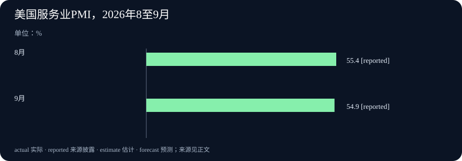

# Daily Intelligence
> 2026-10-06｜Asia/Shanghai｜早间版。检索锚点为 2026-10-06 07:00:59+08:00，优先观察此前 24 小时首次公开的材料。ISM 公告明确标注美东 10 月 5 日 10:00，落在该窗口内；另三份原始页面只标 10 月 5 日、未披露小时，不能声称严格的小时级时效已获证实。实际编写时间见本期 data.json。

## Today's Thesis｜要识别内容，也要识别情境和结果

10 月 5 日的新材料触及同一问题的三个层次：OpenAI 披露文本水印的能力与误判边界，Google 提出智能体应遵守情境中的信息与行动规范；与此同时，广告业务开始测试更直观的呈现和归因，美国服务业调查公布 9 月扩张读数。识别“谁生成了文字”不能代替判断文字是否正确，广告归因不能代替增量实验，扩张读数也不能替企业证明利润改善。

## Executive Summary｜先看三条变化

- **文本溯源**：OpenAI 10 月 5 日称，部分 API 模型从当天起可选择加入文本水印，默认仍关闭；欧盟 ChatGPT 与 Codex 的合格输出拟在未来几周逐步加入水印。其自测显示短文与改写仍可能影响检测，水印不能证明事实正确或人类参与比例。[OpenAI 文本溯源说明](https://openai.com/index/eu-text-provenance/)
- **智能体情境安全**：Google Research 公布来自 2025 年工作坊的报告，研究如何让智能体在数据流转和工具行动前核对情境、角色与规则。公告是问题框架与研究方向，不是动态政策引擎已在所有产品中实现。[Google Research 原文](https://research.google/blog/open-and-emergent-problems-in-agentic-privacy-and-security-a-contextual-angle/)
- **商业与宏观测量**：ISM 在 10 月 5 日美东 10:00 发布 9 月服务业 PMI 54.9，低于 8 月的 55.4，价格指数为 74.0；OpenAI 同日推出广告视觉格式及测量合作，但图像生成场景的初始测试计划在本月晚些时候开始。调查读数属于 9 月，广告增量效果仍需实验验证。[ISM 原始公告](https://www.prnewswire.com/news-releases/services-pmi-at-54-9-september-2026-ism-services-pmi-report-302898421.html) · [OpenAI 广告公告](https://openai.com/index/new-chatgpt-ads-format-and-measurement/)

## AI Daily｜内容水印与情境授权不能互相替代

OpenAI 10 月 5 日发表文本溯源方案。公告将当天已开放的范围限定为：全球 API 客户可在部分模型中主动选择文本水印，默认关闭；面向欧盟合格 ChatGPT 与 Codex 输出的隐形水印则计划在未来几周逐步加入。文本检测器的申请已开放，但初期访问限于获批研究者和专业组织。把“可以申请”“可选择开启”与“面向所有用户默认启用”混为一谈，会高估今天的覆盖面。[OpenAI 文本溯源说明](https://openai.com/index/eu-text-provenance/)

其技术文本同样提供了重要边界。OpenAI 报告，在目标误报率 1% 且选定心理学类文本条件下，检测器约识别出 80% 的 200-token 水印文本和 95% 的 400-token 文本；数学等用词受限内容较难检测。对 400-token 样本做同义替换时，替换 10% 的词使检测率在该实验中从约 92% 降至 66%，替换 25% 后降至 17%。这些都是作者在特定样本和条件下的测试值，不是任何文本平台上可直接使用的真实世界准确率。[OpenAI 文本溯源说明](https://openai.com/index/eu-text-provenance/)

同一天 Google Research 公布一份智能体隐私与安全工作坊报告，参与者超过 50 名，工作坊在 2025 年末举行。它关注的是智能体如何在特定关系中恰当地分享信息、调用工具和采取行动：用户让代理安排出差，可能允许它查看航班信息，却未必允许它把私人资料发给会议组织方。报告提出情境政策、监督层和动态评测环境的研究方向；它没有宣告一套通用方案已经在现实系统里解决提示注入、长任务授权或多代理串通。[Google Research 原文](https://research.google/blog/open-and-emergent-problems-in-agentic-privacy-and-security-a-contextual-angle/)

两份材料回答的是不同问题。文本水印试图提供“这段文字可能来自某类系统”的有限信号，却不告诉读者内容真伪、责任归属或授权状态；情境安全希望在行动发生前辨别“这个代理在此时此地是否该做这件事”，但目前主要是研究议程。若企业把生成内容直接交给能访问邮箱、支付或客户数据的代理，事后标记文字来源与事前限制工具权限都需要做，且二者不能互相充当证明。

## Business Daily｜广告的可归因指标离增量利润仍有距离

OpenAI 的商业公告提出 ChatGPT 中新的视觉广告格式，初步打算在本月稍晚于美国的图像生成场景与部分广告主测试。公司称广告会标注并与生成的图片区分，回答本身不会受广告影响。[OpenAI 广告公告](https://openai.com/index/new-chatgpt-ads-format-and-measurement/) 这些是供应方提出的产品规则及未来测试安排，并非今天所有用户都已看到新格式，亦未证明所有场景都能准确执行隔离。

公告还列出转化数据连接、点击与归因合作，以及与伙伴探索地理实验以测量广告增量。归因数字能说明一个渠道可能参与某次转化，却不自动说明如果没有广告，购买不会发生。OpenAI 引述个别伙伴案例，包括某客户的归因获客成本相对付费搜索基准较低；这些选择性案例不代表所有广告主的利润，也未提供足以在本期独立复算的完整随机对照结果。预算决策应区分被归因的交易、真正新增的客户、广告成本与隐私成本。[OpenAI 广告公告](https://openai.com/index/new-chatgpt-ads-format-and-measurement/)

商业模式还涉及信任。在一段对话里，用户的问题可能同时暴露健康、财务或情绪处境。OpenAI 称其使用投放护栏、自动与人工审查，并与外部机构研究品牌适配评估；这些机制的误投率、申诉与审计结果还需要可检验的披露。Google 的情境安全研究虽然不评价这项广告产品，却提醒读者：同一段数据在不同接收方、目的和传播原则下，适当性并不一样。[Google Research 原文](https://research.google/blog/open-and-emergent-problems-in-agentic-privacy-and-security-a-contextual-angle/)

## Macro Observation｜服务业扩张放缓，价格压力未消失

ISM 由自身向 PRNewswire 发布的原始服务业公告标注美东 10 月 5 日 10:00；内容统计的是美国 9 月服务业，不是 10 月 5 日当天营业额。服务业 PMI 为 54.9，仍高于 50 的扩张分界，但较 8 月的 55.4 低 0.5 个百分点。业务活动指数为 56.5，较 8 月下降 5.2 点；新订单 59.8，下降 1.1 点。调查反映受访采购与供应管理人员对当月变化的判断，不是 GDP、收入或企业利润的直接测量。[ISM 原始公告](https://www.prnewswire.com/news-releases/services-pmi-at-54-9-september-2026-ism-services-pmi-report-302898421.html)

分项呈现另一面：就业指数为 50.1，刚重回扩张区间；价格指数升至 74.0，较 8 月高 1.4 点。价格指数越高意味着更多受访者报告价格上涨，不等于消费价格同比上涨 74%。新出口订单降至 46.9，也只代表该调查分项转入收缩，不能单凭它断言全国出口金额下滑。对采购团队，最直接的使用方式是把上游价格、供应交期、库存和合同条款并排看，再用官方价格与贸易数据交叉验证。[ISM 原始公告](https://www.prnewswire.com/news-releases/services-pmi-at-54-9-september-2026-ism-services-pmi-report-302898421.html)

广告与服务业调查之间没有本期资料能建立因果关系。一个新广告格式可能带来商业机会，但宏观需求和价格环境决定企业投放的成本与回报。今天可以提出的假设是：当服务业价格压力仍高，广告主会更重视可验证的新增收益；要验证这一点，需要未来营销预算、实验设计和企业经营数据，不能由两份同日公告直接推出。

## Signal Dashboard｜四项披露各自证明什么

| 信号 | 公开与统计时间 | 本期可确认 | 仍不能推出 |
| --- | --- | --- | --- |
| OpenAI 文本水印 | 10 月 5 日公开，小时未披露 | 部分 API 模型可选择开启；欧盟产品计划分阶段启用 | 所有文本都可检出，或检测可判断真伪 |
| Google 情境安全报告 | 10 月 5 日公开；工作坊在 2025 年末 | 提出智能体上下文权限研究议程 | 通用安全机制已广泛部署 |
| OpenAI 广告格式 | 10 月 5 日公开，小时未披露 | 新格式和测量合作已宣布 | 本月晚些时候的初始测试已经完成 |
| ISM 服务业调查 | 10 月 5 日 10:00 美东发布；调查属 9 月 | PMI 54.9，价格分项 74.0 | GDP、企业利润或通胀率等同这些指数 |

## Deep Insight｜三种识别方法，都需要一个“不能证明什么”的栏位

今天的四份材料都与“识别”有关。OpenAI 希望识别文本可能由其系统处理，Google 希望智能体识别行动所处的关系和规则，广告平台希望识别哪次投放对购买有贡献，ISM 则用采购人员回答识别服务业活动方向。它们看似没有关联，却都容易在从信号走向决策时被过度解释。一个水印检测为阳性，不是事实核查报告；一次合规工具调用，不保证行为对用户有利；一次被归因的订单，不意味着广告创造了这笔订单；一个 54.9 的扩张指数，也不是经济增长率 54.9%。

关键差别在于观察对象。文本水印关注词语选择留下的统计痕迹。其优点是可嵌入内容生成过程，缺点则正由 OpenAI 自己的实验说明：文本短、表达受约束或经过改写时，信号会削弱。水印还会遇到未支持模型、不同厂商和历史文本的问题。读者若看到“没有检测到”，不能倒推出“由人独立创作”；若看到“检测到”，也不能推断文章哪部分由人编辑，更不能断言它准确或合法。这些判断属于编辑、法律和事实核验的其他流程。

情境授权关注的是谁在什么目的下能把什么资料送到哪里。Google 报告把隐私理解为适当的信息流，进一步延伸到行动是否适当。传统静态权限往往只问代理能否读取某个文件；长任务中的真实问题可能是，订机票时可以使用护照信息，但不可把它共享给不相关的营销工具。这种精细判断有研究价值，也带来挑战：规则来源、冲突处理、误拒绝和撤权时机如何检验？报告提出系统、模型、用户与生态层的方向，没有给出一个现成的万能检查器。实际部署仍要保留明确授权、沙箱、日志与人工接管。

广告测量关注另一种反事实。平台可追踪点击、转化与归因，却只有设计得当的实验才更接近回答“没有这次广告会不会购买”。OpenAI 公告中的伙伴案例提示广告主可能得到有用的早期数据，但供应方挑选展示的案例不等于整个渠道的平均增量回报。广告主还需要看品牌适配机制是否真的避免敏感对话中的不当投放，且不能靠访问私人对话来测量安全效果。隐私与测量之间的约束，应写入实验设计，而非在推出后作为附注。

ISM 的扩张指数则是调查信号，不是财务报表。54.9 说明服务业采购经理的综合回答仍处扩张区间，同时较上月略降；价格分项 74.0 指向较广泛的涨价报告，但不能换算成消费者价格涨幅。对一个需要决定库存、招聘和广告预算的企业，这些数字可以帮助提出问题：需求是否仍支持提价，供应商是否在转嫁成本，订单增速是否放缓？然而答案需要结合企业自己的订单、工资、合同和官方统计。把宏观调查直接写成某家企业的利润，是又一次越过信号边界。

把这些领域放在一起，并不是说水印、权限、广告和 PMI 用同一个算法。相反，它们都说明好的指标必须附带适用范围、时间戳和反例。每一条日报主线都可写成三问：新公开的证据到底观察了什么；它不能证明什么；下一份证据何时可能改变判断。这样做能让读者把公告当成可追踪的起点，而不是一条自动成立的结论。

## Tomorrow Watch｜下一轮需要什么证据

- **文本检测在真实编辑后还可靠么？** 关注独立研究者获得检测器访问后的误报、漏报与跨语言结果，不把实验条件下的识别率当成全网准确率。[文本溯源说明](https://openai.com/index/eu-text-provenance/)
- **代理权限能否随情境撤回？** 找到明确记录的授权、数据接收方和工具调用，在情境变化时测试阻断与人工接管。[Google Research 原文](https://research.google/blog/open-and-emergent-problems-in-agentic-privacy-and-security-a-contextual-angle/)
- **广告是否带来真正新增交易？** 等待本月晚些时候的初始测试与可复核的增量实验，区分点击、归因和净利润。[OpenAI 广告公告](https://openai.com/index/new-chatgpt-ads-format-and-measurement/)
- **服务业价格压力会如何传导？** 对照后续价格、订单和利润数据，避免把 ISM 指数读成通胀率。[ISM 原始公告](https://www.prnewswire.com/news-releases/services-pmi-at-54-9-september-2026-ism-services-pmi-report-302898421.html)

## One Chart｜美国服务业 PMI 的本月与上月

| 调查月份 | 服务业 PMI |
| --- | ---: |
| 2026 年 8 月 | 55.4 |
| 2026 年 9 月 | 54.9 |

两个月读数都高于 50，但 9 月比 8 月低 0.5 个百分点。该图仅展示 ISM 调查扩张指数，不是 GDP 增速或通胀率。[ISM 原始公告](https://www.prnewswire.com/news-releases/services-pmi-at-54-9-september-2026-ism-services-pmi-report-302898421.html)

## Quote of the Day｜检测信号不是结论

“Strong performance under ideal conditions does not guarantee reliable detection in everyday use.”

— OpenAI，10 月 5 日文本溯源说明

中文：理想条件下表现良好，并不能保证日常使用中也能可靠检测。

出处：[OpenAI 文本溯源说明](https://openai.com/index/eu-text-provenance/)。该句是公司对其自身检测器局限的提醒，不是独立第三方的全面评估。

## Action Items｜把新信号变成可回答的问题

1. **检测到底覆盖哪些文本？** 记录水印默认状态、支持模型、地区和语言，再决定怎样处理阳性及阴性结果。
2. **代理此刻该使用哪些资料？** 为每次工具调用标明任务、接收方、目的和可撤回权限，并模拟越界情境。
3. **广告产生的是新增交易吗？** 对照有无投放的可比群组，连同广告费和品牌安全事件一起计算净效果。
4. **服务业指数如何影响本企业？** 将 ISM 读数与本企业订单、报价、招聘及库存比较，不直接照搬宏观结论。
5. **什么时候修正判断？** 预先写下会推翻积极解读的证据，例如高误报、无法撤权、低增量或价格压力恶化。
