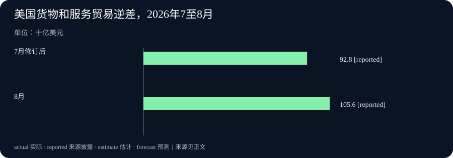

# Daily Intelligence
> 2026-10-07｜Asia/Shanghai｜早间版。检索锚点为 2026-10-07 07:02:28+08:00。美国 10 月 6 日 08:30 美东发布的贸易数据与 09:00 美东发布的 Teradyne 公告处于此前 24 小时窗口；Mistral 与 IBM 页面只标 10 月 6 日，小时未披露，不能声称已核实其严格小时级时效。统计所属月份、已实现事项和未来计划分别标注。实际编写时间见 data.json。

## Today's Thesis｜新能力要接上交付与核验

10 月 6 日的一手材料并非又一轮笼统的“AI 更强”。Mistral 开放新模型预览，但权重尚待发布；IBM 与 Red Hat 宣布修补既有 Java 依赖中的缺陷；Teradyne 将 AI 芯片的可靠性应力测试纳入已投产平台。与此同时，美国公布的 8 月贸易逆差扩大，提醒读者技术发布和经济结果处于不同时间轴。今天值得追踪的是从能力声明走向可检查的交付：模型可否独立复测、补丁能否被生产系统采用、芯片能否通过可靠性验证，以及进口增长的构成能否持续。

## Executive Summary｜三条真正的新披露

- **模型预览与发布边界**：Mistral 于 10 月 6 日推出 Large 4 公共预览，称模型采用约一万亿总参数、490 亿活跃参数；权重计划月底发布，因此今天不能称为权重已经开放。性能数字主要来自公司披露，独立复测仍待观察。[Mistral 原文](https://mistral.ai/news/mistral-large-4/)
- **安全与硬件交付**：IBM 和 Red Hat 同日称 Lightwell 已识别并修复 400 多个此前未知的软件缺陷，并开放企业优先修复请求；Teradyne 同日称增强可靠性应力测试的 Titan HP 已可用且部署于生产。前者是供应方公布的修复数量，后者是平台交付状态，均不自动证明每家客户的实际风险或良率改善。[IBM 原文](https://newsroom.ibm.com/2026-10-06-ibm-and-red-hat-remediate-more-than-400-previously-unknown-open-source-vulnerabilities) · [Teradyne 原文](https://investors.teradyne.com/news-events/press-releases/detail/452/teradyne-introduces-titan-hp-platform-with-burn-in-capabilities-for-advanced-ai-data-center-devices)
- **宏观新数据**：美国人口普查局与 BEA 于 10 月 6 日 08:30 美东公布，8 月货物和服务逆差为 1,056 亿美元，较修订后的 7 月扩大 127 亿美元。进口增加 172 亿美元，高于出口增加的 45 亿美元；这是 8 月交易的最新披露，不是 10 月当月贸易量。[美国官方原始报告](https://www.census.gov/foreign-trade/Press-Release/ft900/ft900_2608.pdf)

## AI Daily｜把模型规模和防御结果分开看

Mistral 10 月 6 日宣布 Large 4 进入公共预览，文中明确说现在可通过 Mistral Studio 试用预览 API，而模型权重将在月底发布。公司称该原生多模态模型总参数约一万亿、每次推理活跃参数 490 亿；开发与训练使用其欧洲自有数据中心中的 3,800 个 NVIDIA Grace Blackwell GPU。这些参数规模和基础设施信息说明其路线与可部署性的意图，但参数量不是推理质量或成本效益的充分证据。权重未发布时，任何关于本地部署的实际可行性也需要等许可、文件、硬件需求与第三方测量到位。[Mistral 原文](https://mistral.ai/news/mistral-large-4/)

Mistral 给出的编码、网络安全、金融、法律和视觉定位指标多为自己选择并执行的评测。它披露在 Lakera B3 安全基准上抵抗 93.3% 攻击，也称在一个视觉定位测试上略高于 GPT-6 Astra。两者的样本、提示、版本、统计不确定性和任务分布都需要核查；尤其不能从某个基准的一点优势推断真实生产环境中的全面领先。公司表示仍在红队测试，权重计划月底发布，这使“模型今天能试用”和“开放权重已交付”成为两件不同的事。[Mistral 原文](https://mistral.ai/news/mistral-large-4/)

IBM 与 Red Hat 的公告将镜头转向 AI 系统所依赖的软件底座。两家公司称 Lightwell 在广泛使用的 Java 库中识别并修补 400 多个此前未知的缺陷，并推出 Lightwell Clearinghouse，允许企业针对特定开源依赖请求优先审查与修复。公告明确讨论为仍在生产使用的旧版本回移补丁，因此价值并不只是发现一个漏洞，而是补丁是否兼容既有系统、可否经过测试并被部署。[IBM 原文](https://newsroom.ibm.com/2026-10-06-ibm-and-red-hat-remediate-more-than-400-previously-unknown-open-source-vulnerabilities)

这则安全披露没有证明所有 400 多个缺陷都有公开 CVE、已被攻击者利用或所有客户已经安装修复。企业应按依赖清单、版本、补丁可得性与上线记录验证自身暴露面。把 Mistral 的模型预览和 IBM 的依赖治理放在一起看，新的智能体能力可能扩大工具与软件调用范围，但“能力提升”并不会自动提供供应链修复。模型层的红队结果与应用依赖层的补丁记录应分别维护。[Mistral 原文](https://mistral.ai/news/mistral-large-4/) · [IBM 原文](https://newsroom.ibm.com/2026-10-06-ibm-and-red-hat-remediate-more-than-400-previously-unknown-open-source-vulnerabilities)

## Business Daily｜芯片测试进入可靠性环节

Teradyne 10 月 6 日 09:00 美东发布 Titan HP 平台新能力，称可在 AI 数据中心器件运行真实工作负载时将各器件维持在目标结温，以执行 burn-in 可靠性应力测试。公司称增强版今天已可用，并部署在生产环境。重要区别是：这是测试设备及流程的交付，不是某款 AI 芯片的良率、寿命或数据中心总体成本已经改善的独立证据。[Teradyne 原文](https://investors.teradyne.com/news-events/press-releases/detail/452/teradyne-introduces-titan-hp-platform-with-burn-in-capabilities-for-advanced-ai-data-center-devices)

从晶圆探测、封装测试、系统级测试到可靠性应力测试，验证环节越多，缺陷定位和产能安排越需要可追踪的数据。Teradyne 的表述强调按器件控制热条件；若客户采购团队评估此类平台，下一步应索取故障筛出率、误杀率、测试时间、吞吐量和单位器件成本，并与现有生产线的基线比较。公告未公开足以计算行业平均收益的客户样本，不能因“部署在生产环境”就写成整个产业已经普遍采用。[Teradyne 原文](https://investors.teradyne.com/news-events/press-releases/detail/452/teradyne-introduces-titan-hp-platform-with-burn-in-capabilities-for-advanced-ai-data-center-devices)

Mistral 对模型的商业承诺也处于类似的交付链条。预览 API 可试并不意味着权重、生产支持、可审计基准和全部行业方案都到位。对企业买方来说，合理试点应把准确率、推理成本、数据驻留、安全表现与可退出性并列，而非只看总参数量。供应方声称的性能应先转为本企业任务上的盲测，再转为部署预算。[Mistral 原文](https://mistral.ai/news/mistral-large-4/)

## Macro Observation｜贸易逆差是八月结果，十月才披露

人口普查局与 BEA 的报告在 10 月 6 日 08:30 美东发布，统计的是美国 8 月货物和服务贸易。逆差从修订后的 7 月 928 亿美元扩大至 8 月 1,056 亿美元，增加 127 亿美元。出口达到 3,152 亿美元，较 7 月增加 45 亿美元；进口达到 4,208 亿美元，增加 172 亿美元。逆差扩大在会计上主要来自进口增幅大于出口增幅，并不意味着出口绝对额下降。[官方原始报告](https://www.census.gov/foreign-trade/Press-Release/ft900/ft900_2608.pdf)

货物逆差增加 128 亿美元至 1,366 亿美元，服务顺差约 310 亿美元、变化不足 1 亿美元。报告的商品明细显示，资本货物进口增加 62 亿美元，其中半导体进口增加 24 亿美元；商品出口方面半导体增加 10 亿美元。这些是经季节调整后的月度金额变化，不足以单独证明 AI 投资是全部进口上升的原因。总进口还包含原油、非货币黄金等其他变化；价格与数量也不能由名义金额直接拆分。[官方原始报告](https://www.census.gov/foreign-trade/Press-Release/ft900/ft900_2608.pdf)

同一份报告还指出年初至今逆差比上年同期低 19.9%，这与单月逆差扩大并不矛盾，因为比较期不同。对企业而言，月度贸易数据可以帮助校验跨境需求和设备采购的方向，但不能代替自己的订单、库存与现金流。尤其应注意 8 月交易到 10 月才披露的滞后，避免把它写成 10 月 6 日发生的贸易冲击。[官方原始报告](https://www.census.gov/foreign-trade/Press-Release/ft900/ft900_2608.pdf)

## Signal Dashboard｜新披露、旧统计和未实现目标

| 主线 | 首次公开或披露时点 | 已确认 | 不能直接推出 |
| --- | --- | --- | --- |
| Mistral Large 4 | 10 月 6 日，小时未披露 | 公共预览 API 可试；权重计划月底发布 | 权重已发布或独立性能全面领先 |
| IBM/Red Hat Lightwell | 10 月 6 日，小时未披露 | 两家公司称已修复逾 400 个未知缺陷，企业请求渠道已开放 | 所有客户已打补丁或风险已消失 |
| Teradyne Titan HP | 10 月 6 日 09:00 美东 | 增强可靠性测试能力已可用且被称已投入生产 | 全行业良率和芯片寿命得到证明 |
| 美国 8 月贸易 | 10 月 6 日 08:30 美东披露 | 逆差 1,056 亿美元，进口增幅超过出口 | 这是 10 月贸易结果或由 AI 单独驱动 |

## Deep Insight｜真正的新闻是“验证链”更长了

今天的四条主线可以按一条链来读：模型产生新能力，企业软件提供它运作的依赖，芯片测试支撑计算设施的可靠性，贸易统计则在更广的经济账本里记录设备和商品的跨境流动。这不是四条新闻之间已经被证明存在直接因果关系，而是一种检查问题的顺序。若把任何一个环节的公告当成整条链的最终结果，就会夸大这一天真正发生的变化。

首先，Mistral 预览模型的关键不是一万亿参数这个醒目数字，而是预览、权重交付、部署和独立测量的时间顺序。今天用户能够访问预览 API；月底发布权重仍是未来计划。在公开权重和运行配置之前，第三方难以完整重现供应方的成本、安全和性能主张。即使权重如期交付，企业也仍要检查许可证、基础设施、红队结果以及敏感数据的处理方式。公开预览降低试验门槛，但不能跳过采购与生产验收。

其次，IBM 与 Red Hat 的 400 多个缺陷给“安全改进”一个可追问的交付单位。数字来自供应方，而且不同缺陷的严重性和受影响版本可能差异很大。组织需要先知道自己的应用用了哪些版本，再问有没有可适配的修复、测试后会不会影响业务、谁负责回移以及何时上线。一个被发现的缺陷与一个已经在客户生产环境中修好的缺陷之间，隔着软件清单、回归测试和变更窗口。AI 辅助工程可加速前半段，但公告本身不能证明后半段全部完成。

再次，Teradyne 把可靠性筛查推向单个器件的热条件与真实工作负载。它回答的是芯片交付过程里的一个具体问题：能否在上市前更有效地暴露潜在故障？采购方真正要验证的不是宣传中的“面向 AI 数据中心”，而是同等质量条件下的筛出效率、测试时间、误判损失和每颗器件成本。测试覆盖更细可能改善管理，也可能增加制造环节的复杂性；没有对照数据，就无法量化净收益。

最后，8 月美国贸易逆差的 10 月披露，说明宏观统计不仅有口径，也有时间差。半导体进口月增 24 亿美元，与资本品进口增加相伴，但不能据此断言某一种模型、某一个数据中心项目或 AI 需求解释了全部变化。报告还同时记录原油和黄金等项目的变动。月度名义贸易额可以提供观察线索，却不能直接分离价格、数量、提前备货与长期需求。年初至今逆差低于去年同期，也提醒读者不要把一个月的方向当作全年趋势。

因此，今天最有用的编辑方法是为每一条“新”消息附上四个标签：何时首次公开、何时真正交付、观察了什么结果、下一步能否独立复核。Mistral 的标签是预览已开放而权重待交；IBM 的标签是修复数量已宣称而客户部署待查；Teradyne 的标签是设备已投产而广泛经营收益待测；贸易报告的标签是 10 月新公布、8 月旧统计。将这些标签明确写出来，比堆叠更大的模型参数或单月金额，更能减少连续日报看起来相似、却说不清今天究竟多了什么证据的问题。

## Tomorrow Watch｜哪些后续证据会改变判断

- **Mistral 权重如期发布吗？** 观察月底文件、许可证、推理配置与独立基准，不用预览当天的厂商指标提前宣布胜负。[Mistral 原文](https://mistral.ai/news/mistral-large-4/)
- **修复真正进入生产吗？** 对照受影响依赖、补丁版本、回归测试和部署记录，而非只累加缺陷数量。[IBM 原文](https://newsroom.ibm.com/2026-10-06-ibm-and-red-hat-remediate-more-than-400-previously-unknown-open-source-vulnerabilities)
- **可靠性测试带来净收益吗？** 要求可比器件上的筛出率、误判率、吞吐量与单位成本。[Teradyne 原文](https://investors.teradyne.com/news-events/press-releases/detail/452/teradyne-introduces-titan-hp-platform-with-burn-in-capabilities-for-advanced-ai-data-center-devices)
- **进口增长属于一次性备货还是持续需求？** 等下一期贸易数据和价格、数量明细，结合企业库存再下判断。[官方原始报告](https://www.census.gov/foreign-trade/Press-Release/ft900/ft900_2608.pdf)

## One Chart｜美国贸易逆差的七月与八月

| 统计月份 | 货物和服务贸易逆差，十亿美元 |
| --- | ---: |
| 2026 年 7 月，修订后 | 92.8 |
| 2026 年 8 月 | 105.6 |

8 月较 7 月扩大 12.7 十亿美元。该图描述的是美国官方月度名义贸易差额，不是 GDP 增速、10 月交易额或 AI 投资的直接量度。[官方原始报告](https://www.census.gov/foreign-trade/Press-Release/ft900/ft900_2608.pdf)

## Quote of the Day｜别把预览写成权重交付

“Weights drop end of this month.”

— Mistral，10 月 6 日模型公告

中文：模型权重将在本月底发布。

出处：[Mistral 原文](https://mistral.ai/news/mistral-large-4/)。这是公司未来交付计划，尚非权重已发布的事实。

## Action Items｜把发布转成可检验的问题

1. **模型今天能交付什么？** 将预览 API、计划中的权重和生产支持分成三列，逐项索取可复核材料。
2. **哪些软件依赖真的已修补？** 用本企业组件清单匹配版本、补丁与上线记录，不以公告数字代替风险清零。
3. **测试设备改善了哪项指标？** 以相同器件与工作负载比较筛出率、误判、吞吐量和成本。
4. **贸易数据对应哪个月份？** 把 10 月披露的 8 月交易与当期经营数据分开放置，并核对进口品类。
5. **什么证据会推翻判断？** 预先写下权重延期、补丁不兼容、测试成本过高或进口回落等反例。
