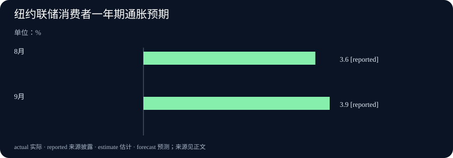

# Daily Intelligence
> 2026-10-08｜Asia/Shanghai｜早间版。检索锚点为 2026-10-08 07:01:31+08:00，回看此前 24 小时。Analog Devices 公告标注美东 10 月 7 日 09:30，处于窗口内；Anthropic、OpenAI、IBM 与纽约联储页面标注 10 月 7 日但未披露小时，不能据此确认它们均严格落在小时级窗口。纽约联储调查覆盖 9 月 1 日至 30 日；其他未来安排和供应方自测均按计划或公司主张表述。实际编写时间见 data.json。

## Today's Thesis｜模型更便宜，价值仍要落到工作流

10 月 7 日的披露把 AI 竞争推向两端：Anthropic 推出面向高频任务的低价小模型，OpenAI 把 GPT‑6 推向更广用户并加入交互界面；企业服务商则把 ERP 数据基础与 AI 准备度绑定。纽约联储的消费者调查同时显示，短中期通胀预期上升、家庭财务感受转弱。重点不是宣布模型价格下降就会带来生产率，而是追问更低成本能否完成有价值的任务，以及企业和家庭是否有预算、数据与信任承接它。

## Executive Summary｜三条值得读的新变化

- **低成本模型竞争加剧**：Anthropic 于 10 月 7 日发布 Claude Haiku 5.5，称其面向高频、成本敏感任务，较 Haiku 4.5 平均运行成本约低 75%；公司也下调 Sonnet 5.5 缓存读取价格。实际节省取决于任务成功率、上下文长度和重试次数。[Anthropic 原文](https://www.anthropic.com/claude-haiku-5-5)
- **交互界面成为产品入口**：OpenAI 10 月 7 日宣布 GPT‑6 扩大至 ChatGPT 免费和付费用户，并推出可交互的 Intelligent UI。安全页同时披露若干困难测试类别的回归；这些挑战集结果不能直接当作日常使用发生率。[产品公告](https://openai.com/index/gpt-6-for-everyone/) · [部署安全更新](https://deploymentsafety.openai.com/gpt-6-october)
- **AI 落地与家庭预期出现不同步信号**：IBM 宣布 Ready for SAP Solutions，举出一家建筑企业三个月 ERP 转型后运营周期缩短 50% 的客户案例；纽约联储 9 月调查则显示一年期通胀预期升至 3.9%，家庭财务感受转弱。前者是选择性客户案例，后者是调查预期，都不是普遍生产率或实际通胀结果。[IBM 原文](https://newsroom.ibm.com/2026-10-07-ibm-teams-up-with-sap-to-help-businesses-modernize-operations-and-advance-ai-readiness) · [纽约联储调查](https://www.newyorkfed.org/newsevents/news/research/2026/20261007)

## AI Daily｜小模型降价，交互产品扩面

Anthropic 10 月 7 日推出 Claude Haiku 5.5，将其定位于摘要、上下文压缩、数据库查询、分类等高频任务，以及实时客服、浏览器操作等对速度敏感的场景。Anthropic 称，Haiku 5.5 的平均运行成本比 Haiku 4.5 低约 75%；页面列出的百万 token 价格也显示，输入与输出单价分别为 1 美元与 5 美元的 Haiku 4.5，降至 Haiku 5.5 的 0.10 美元与 0.50 美元（较长上下文区间价格不同）。这些价格表是供应方报价，尚不等于每个任务的总成本下降 90%：若模型需要更多轮次、人工复核或更长提示，单位工作成本会不同。[Anthropic 原文](https://www.anthropic.com/claude-haiku-5-5)

同次发布中，Anthropic 把 Sonnet 5.5 的缓存读取价格下调 50%，并称多数代理任务的运行成本因此约低 20%；其 Claude Max 与 Team 订阅也加入每月 API 额度。小模型低价与中型模型缓存降价分别针对吞吐和重复上下文成本，说明模型经济性正从单纯每 token 价格转向任务类型、缓存命中和代理调用结构。这里的“约 20%”是公司估算，不应直接套用于客户的全部工作负载。[Anthropic 原文](https://www.anthropic.com/claude-haiku-5-5)

OpenAI 10 月 7 日宣布 GPT‑6 在 ChatGPT 免费及付费方案中扩面，并加入 Intelligent UI：面对日常问题，回答可以生成可点击、可探索的界面，或即时创建完成任务的小工具。它改变的是回答的呈现和交互方式，不只是文字模型升级。产品公告称每周有超过 12 亿人使用 ChatGPT；这一背景数字说明潜在触达规模，但不能据此推算新功能的实际采用率、留存或商业转化。[OpenAI 产品公告](https://openai.com/index/gpt-6-for-everyone/)

OpenAI 同日公开的部署安全更新，比宣传性的能力描述更能说明发布边界。该公司将 October 版本 GPT‑6 Sol 与 GPT‑6 Luna 在网络安全、生物与化学能力上列为 Preparedness Framework 的 High 能力级别；报告也承认安全评测中有领域出现回归，例如困难自伤测试中部分表现差异具有统计显著性。报告强调，这些生产衍生的挑战集刻意选取高难度长尾案例，其违规率不代表日常流量发生率；线上系统级干预也不一定包含在模型本身评测里。因而不能只摘取“更抗越狱”或“出现回归”其中一面，而应同时看测试集、严重程度、护栏与上线后的监测。[OpenAI 安全更新](https://deploymentsafety.openai.com/gpt-6-october)

把 Anthropic 的低价模型和 OpenAI 的交互 UI 放在一起，竞争焦点逐步从“模型能回答什么”转到“单位成本下能完成多少工作，以及用户如何验证结果”。但只有真实工作流能回答这一问题：模型的成功率、调用次数、等待时间、人工纠错和用户是否接受界面都需要观察。日后的产品用量和企业账单比发布日的标价更能检验效率收益。

## Business Daily｜AI-ready 的前提是企业流程和数据整顿

IBM 于 10 月 7 日宣布 Ready for SAP Solutions，面向中型及成长型组织的云 ERP 现代化、数据整合与 AI 准备。公告列出的客户案例中，模块化建筑企业 Volumetric Building Companies 与 IBM 在三个月内完成 SAP Cloud ERP 转型，IBM 称其采购、制造和库存流程的运营周期缩短 50%。第二个案例是 Second Nature Brands 在收购 Voortman Bakery 后把业务并入共同企业平台。两例展示不同的流程整合需求，但属于服务提供方披露的案例，未给出可比行业样本，也不能将 50% 的客户指标外推为所有 ERP 转型的平均收益。[IBM 原文](https://newsroom.ibm.com/2026-10-07-ibm-teams-up-with-sap-to-help-businesses-modernize-operations-and-advance-ai-readiness)

方案目前仅在部分国家和特定行业可用，IBM 表示未来将扩大覆盖。企业采购时需先问清实施范围、迁移成本、上线后的维护责任、数据语义和系统权限。ERP 现代化可以让流程和数据更一致，降低后续 AI 项目的接入摩擦；它本身不会自动使数据准确，也不能保证接入模型后出现可量化回报。IBM 引述的“68% 企业认为加速 ERP 现代化很重要”来自其自有研究，表达的是受访企业重视程度而非项目成功率。[IBM 原文](https://newsroom.ibm.com/2026-10-07-ibm-teams-up-with-sap-to-help-businesses-modernize-operations-and-advance-ai-readiness)

另一项 10 月 7 日的跨界公告来自 Moët Hennessy、Analog Devices 与 UC Davis。合作方称他们将利用化学传感与机器学习，识别葡萄、汁液和葡萄酒释放的挥发性化学信号，较早发现新鲜蘑菇香气（Fresh Mushroom Aroma）风险。合作方称研究人员已在早期样本上识别出风险较高的样本，但更广泛的葡萄病害、土壤状况和气候相关应用仍是研究方向。公告标注美东 09:30，且表示技术旨在辅助酿酒师与种植者的判断，而非替代专业经验。现阶段应视为特定质量风险的研究演示，后续还需外部样本、不同产区的误报漏报率和商业部署数据。[ADI 与合作方原文](https://investor.analog.com/news-releases/news-release-details/moet-hennessy-analog-devices-and-uc-davis-join-forces-advance)

ERP 数据底座和酒庄传感试验都说明，行业 AI 不是仅采购一个模型。它需要清理流程、建立可重复的数据、定义异常后谁做决定，并核算错误判断的成本。供应商案例能给出试点入口，无法替代客户自己的前后对照。

## Macro Observation｜通胀预期上升，家庭财务感受转弱

纽约联储于 10 月 7 日发布 9 月 Survey of Consumer Expectations，调查实际采集期为 9 月 1 日至 30 日。受访家庭一年期通胀预期上升 0.3 个百分点至 3.9%，三年期上升 0.1 个百分点至 3.3%，五年期维持 3.0%。一年期为 2023 年 5 月以来最高读数。该调查测量消费者对未来价格变化的主观预期，并非官方 CPI 预测或实际通胀值。[纽约联储原始发布](https://www.newyorkfed.org/newsevents/news/research/2026/20261007)

同一调查呈现就业预期稍有改善、家庭感受却不完全同步：受访者认为未来一年失业率上升的平均概率降至 43.9%，失业后找到工作的平均概率升至 46.1%；但家庭财务状况的当前评价与未来预期恶化。名义家庭支出增长预期上升至 5.5%，高于过去 12 个月均值 5.0%；这不是实际消费增长，名义预期还可能受到价格预期影响。家庭预期收入增长升至 3.1%，最低债务还款逾期概率下降至 12.2%，因此本次调查并非单向转弱。[纽约联储原始发布](https://www.newyorkfed.org/newsevents/news/research/2026/20261007)

这组读数可用来提出而不能直接回答一个商业问题：当家庭预计支出增速提高、同时觉得财务前景变差时，企业应否据此扩张定价或营销？答案需要等实际零售、价格、就业和企业收入数据。调查结果是 9 月居民预期的截面，不是 10 月 7 日新发生的消费变化，也不能用来推断 AI 产品降价会改善家庭购买力。

## Signal Dashboard｜价格、案例和调查不能互换

| 信号 | 首次公开或观察时间 | 当前能确认 | 仍不能推出 |
| --- | --- | --- | --- |
| Claude Haiku 5.5 | 10 月 7 日，小时未披露 | Anthropic 宣布发布并披露价格表 | 客户每项任务总成本普遍下降 75% |
| GPT‑6 与 Intelligent UI | 10 月 7 日，小时未披露 | OpenAI 宣布 ChatGPT 扩面与交互界面 | 用户采用、留存或转化已改善 |
| IBM Ready for SAP | 10 月 7 日，小时未披露 | IBM 发布服务方案并列出两项客户案例 | 50% 周期缩短是行业平均效果 |
| 葡萄酒化学检测合作 | 10 月 7 日 09:30 美东 | 合作方报告早期样本风险识别演示 | 多产区准确率或商业收益已验证 |
| 纽约联储 SCE | 10 月 7 日，小时未披露；调查属 9 月 | 一年期通胀预期为 3.9%，五年期为 3.0% | 实际通胀或 10 月消费已经变化 |

## Deep Insight｜AI 的成本，要按完整任务核算

“模型变便宜”很容易成为一句结论，却不是用户最终感受到的成本。Anthropic 对 Haiku 5.5 的价格变化是每百万 token 的输入与输出价格；企业真正购买的是摘要准确完成、订单被正确分类、客户请求被及时解决，或代码修改通过测试。若低价模型需要重复调用、人工复核或更长提示，成本差距会缩小；若更快的小模型能承担大量简单工作，把昂贵模型留给复杂任务，系统总成本可能下降。要知道是哪一种情况，必须按任务结果而不是 token 账单衡量。

成本结构至少包含四部分：模型调用、上下文和缓存、失败后的重试，以及人工审核。Anthropic 同时下调缓存读取价格，恰恰说明长上下文和代理式工作流会改变成本构成。对相同任务，企业应测量一次成功所需的全部调用、缓存命中率、延迟、失败原因和人工修正时间。对涉及金融、医疗、代码发布或客户承诺的任务，还要把错误损失纳入。最便宜的 token 不一定产生最便宜的成功结果。

OpenAI 的 Intelligent UI 展示另一种价值问题：答案不仅能以文本给出，也能变成可操作的界面。交互可能帮助用户探索变量或理解复杂内容，但它也改变了用户如何发现模型假设、核对数据和判断界限。界面越像一个已完成的工具，用户越可能把视觉完整误认成计算正确。有效评估应检查来源是否清晰、输入是否可修改、结果能否复算、错误能否撤销，而不仅是界面是否流畅。

同样的验证逻辑适用于企业流程案例。IBM 客户报告 50% 周期缩短，作为具体项目实例很有启发，却不能回答迁移期间的停机、实施成本、组织培训和长期运维。另一家企业整合收购对象的 ERP，体现数据与流程标准化的实际需要。企业应保留基线和对照组，记录哪一段周期缩短、由什么变化带来、是否把工作转移给了另一团队。只有明确测量单位，案例才可用于决策。

纽约联储调查让这个成本问题回到家庭。9 月家庭预期通胀升温、支出增速预期提高，同时财务感受恶化。这种组合可能说明家庭在价格压力中仍计划较高名义支出，但调查不能证明实际支出已经增加，也不能揭示不同收入群体的消费构成。企业若据此制定价格或销售策略，还需观察后续零售和工资数据。

因此，把 AI 商业化与宏观环境连接起来，不应说“模型更便宜，所以经济生产率必然提高”。更可检验的说法是：模型和工具的边际价格正在改变，企业也在投资数据与流程底座；它们能否形成净效率，要由同任务、同质量和完整成本的比较决定。消费者预期则提醒我们，外部预算与信心也影响新工具扩散。未来几周最有价值的证据，是客户级持续结果，而非发布日价格和孤立案例。

## Tomorrow Watch｜等待真实采用与独立结果

- **Haiku 5.5 的任务成本如何变化？** 比较相同任务的完整成功成本、重试率、延迟与人工审核，不只看每 token 标价。[Anthropic 原文](https://www.anthropic.com/claude-haiku-5-5)
- **Intelligent UI 是否提升可核验性？** 检查用户能否看见依据、改动假设并复算结果，同时追踪错误率和撤销操作。[OpenAI 产品公告](https://openai.com/index/gpt-6-for-everyone/)
- **企业 ERP 案例能否复制？** 索取实施前后基线、项目边界、停机与维护成本，避免把客户案例写成行业均值。[IBM 原文](https://newsroom.ibm.com/2026-10-07-ibm-teams-up-with-sap-to-help-businesses-modernize-operations-and-advance-ai-readiness)
- **家庭预期会传到实际支出吗？** 等待后续官方价格、零售与收入数据，区分调查预期和实际结果。[纽约联储原始发布](https://www.newyorkfed.org/newsevents/news/research/2026/20261007)

## One Chart｜美国一年期通胀预期

| 调查月份 | 一年期通胀预期中位数 |
| --- | ---: |
| 2026 年 8 月 | 3.6% |
| 2026 年 9 月 | 3.9% |

9 月较 8 月上升 0.3 个百分点。该指标来自纽约联储消费者预期调查，不是官方 CPI，也不是实际通胀率。[纽约联储原始发布](https://www.newyorkfed.org/newsevents/news/research/2026/20261007)

## Quote of the Day｜把价格变化放回任务中

“On average, it now costs around 75% less to run.”

— Anthropic，Claude Haiku 5.5 公告

中文：平均而言，现在运行成本约低 75%。

出处：[Anthropic 原文](https://www.anthropic.com/claude-haiku-5-5)。这是公司对模型运行成本的描述，具体任务的总成本仍取决于成功率、重试和人工复核。

## Action Items｜先定义成功，再比较成本

1. **这项任务怎样才算成功？** 写出可验收结果、容错范围和人工接管条件，再比较不同模型。
2. **低价是否降低了完整成本？** 把 token、缓存、重试、等待与人工审核列入同一张账单。
3. **交互界面让结果更可核验吗？** 检查来源、假设、输入编辑、复算和撤销路径是否清楚。
4. **企业案例的基线是什么？** 记录流程边界、前后周期、实施成本和迁移期间的业务影响。
5. **预期与实际是否一致？** 将纽约联储调查与随后公布的通胀、消费和就业数据分开跟踪。
