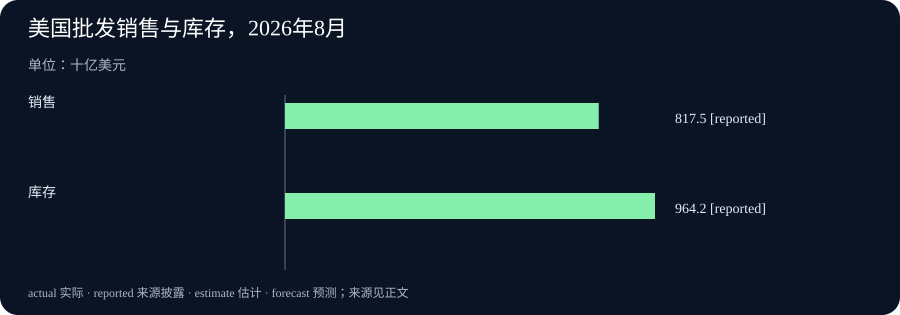

# Daily Intelligence
> 2026-10-09｜Asia/Shanghai｜早间版。检索锚点为 2026-10-09 07:01:24+08:00，回看此前 24 小时。美国人口普查局批发贸易报告标注 10 月 8 日，具体小时未在页面正文中显示；Anthropic、OpenAI 与 HP 页面也只标日期、未披露小时，因此不把它们写成已确认落在严格小时窗口。观察期与发布日期分开记录，实际编写时间见 data.json。

## Today's Thesis｜AI治理开始写进可执行边界

10 月 8 日的新披露集中在“如何把能力放进边界”：Anthropic 更新使用政策，把欺骗性活动、武器软件、监控和高风险人工复核写得更明确；同日又推出面向关键基础设施和开源软件的网络防御计划。OpenAI披露针对AI支持的“假前台”行动的安全研究，HP则将代理式界面放进有限客户测试。商业数据方面，美国批发商8月销售和库存同步增加。今天真正要追踪的，是政策措辞、免费扫描、客户试点和库存读数能否转化成可验证的执行结果。

## Executive Summary｜三条新变化

- **使用政策进入操作层**：Anthropic发布2026年使用政策更新，新增对欺骗性活动的集中条款，并明确高风险场景需要具备权限的人在环。政策 11 月 12 日生效，今天是规则发布日，不是所有部署已经完成合规改造。[Anthropic 政策](https://www.anthropic.com/news/2026-usage-policy-update)
- **防御工具开始外放**：Anthropic推出 Cyber Mission、关键基础设施防御计划与免费 OSS Scanner，拟为电力、水务、交通及开源项目提供扫描和研究支持。项目范围与实际覆盖仍要靠后续参与者、修复提交和误报数据检验。[Anthropic Cyber Mission](https://www.anthropic.com/news/anthropic-cyber-mission)
- **代理体验与库存数据并行**：HP宣布 Experience AI 在美国少量客户中测试，网站可按用户意图动态调整；美国批发商8月销售8175亿美元，库存9642亿美元，销售环比增长1.8%，库存环比增长0.5%。批发数据属8月统计，HP测试也不等于全面上线。[HP公告](https://www.hp.com/us-en/newsroom/blogs/2026/hp-experience-ai-agentic-web-platform.html) · [美国批发贸易报告](https://www.census.gov/wholesale/current/index.html)

## AI Daily｜规则、扫描与代理体验要分开评估

Anthropic的政策更新把原先散落在选举、欺诈、隐私和虚假信息章节中的限制，集中成“不得从事欺骗性活动或人工制造活动”。公司描述的范围包括掩盖消息背后主体、利用虚假账户或帖子放大内容，以及建设影响行动的工具和基础设施。政策自 11 月 12 日起生效。这个时间差很重要：规则已经公开，但企业内部的权限、审计、产品拦截与申诉流程是否同步，仍需要逐项检查。[Anthropic 政策](https://www.anthropic.com/news/2026-usage-policy-update)

更新还把武器软件和自主车辆的武装行为写得更清楚，要求高风险健康、法律、金融和生计决策保留具备权限的人在环，并向受影响者说明使用了 AI。对于连接硬件并可能造成伤害的设备，合格操作员必须能够观察和停止，设备在模型断开时仍要保持安全状态。这些是供应方的使用规则和产品要求，不代表监管机构已采用同样的定义，也不说明每个客户系统都已经具备阻断能力。

Anthropic同日发布 Cyber Mission，第一步面向关键基础设施和开源软件。Critical Infrastructure Defense Program 计划为电网、水务、交通和政府系统的防御者提供模型、现场工程师和威胁研究；OSS Scanner 则为开源项目提供定期安全扫描。免费工具可以降低扫描门槛，但安全价值取决于发现问题后的修补、回归测试、发布和维护。一个扫描结果不是修复结果，扫描器的覆盖率和误报率也需要由项目维护者独立衡量。[Anthropic Cyber Mission](https://www.anthropic.com/news/anthropic-cyber-mission)

OpenAI的安全栏目同日列出“false front”行动，主题是识别利用 AI 伪装真实组织或来源的活动。它与 Anthropic 政策里的欺骗性活动相互呼应，但研究披露和使用规则仍是两种不同工具：前者帮助识别威胁，后者约束用户和产品可以做什么。把一次模型识别结果直接当作归责证据，会跳过来源核验、平台日志和人工调查。[OpenAI安全栏目](https://openai.com/news/?topics=announcements)

HP Experience AI则代表更偏产品化的一端。HP称其代理式网站能根据用户自然语言意图动态改变展示内容，目前只在美国少量客户中测试，并计划在年内扩展。动态页面可能减少搜索步骤，但也引入新的核验问题：模型如何解释意图、推荐是否覆盖商业利益、用户能否看到依据、错误选择能否撤回。有限测试中的“可用”不能写成所有客户已经拥有这项能力。[HP公告](https://www.hp.com/us-en/newsroom/blogs/2026/hp-experience-ai-agentic-web-platform.html)

## Business Daily｜从安全规则到企业试点

Anthropic两项公告把AI商业化的衡量单位从模型发布，推向制度和维护。Usage Policy把高风险场景的人在环、硬件安全状态和披露要求写进规则；Cyber Mission则把防御服务交给关键基础设施和开源项目。企业若采用这些服务，需要记录谁接收扫描结果、谁批准补丁、怎样证明恢复成功。服务“可用”与组织真正改变故障流程之间仍有一段治理距离。

HP的 Experience AI 试点提供另一种商业信号：代理式网页不只是聊天窗口，而是根据意图改变导航、比较和选择。它的价值要看完成一次购买研究所需的时间、推荐错误、转化质量、隐私披露和人工客服转接，而不是界面是否更像对话。HP只说在有限美国客户中测试，不能把测试反馈外推到全球客户或所有产品类别。

对于企业采购，今天可用的比较表应至少包含五项：目标任务、数据来源、可撤销权限、人工接管和失败成本。网络扫描要看修复闭环，代理网页要看推荐与撤回闭环，政策更新要看内部控制映射。三者共同说明，AI的商业价值越来越依赖持续运营，而非一次模型上线。

## Macro Observation｜批发销售和库存一起增加

美国人口普查局10月8日发布《Monthly Wholesale Trade Report: August 2026》。报告显示，批发商8月销售额经季节调整后为8175亿美元，较修订后的7月增加1.8%，较2025年8月增加15.6%。8月末库存为9642亿美元，较修订后的7月增加0.5%，同比增加6.4%。这些是名义金额，报告明确没有按价格变化调整。[美国批发贸易报告](https://www.census.gov/wholesale/current/index.html)

销售增长高于库存增长，通常会改善库存销售比，但不能直接证明终端需求健康。批发商销售可能受价格、产品结构、提前备货和渠道变化影响；库存增加也可能代表为未来订单准备，或代表商品周转变慢。要判断对制造商、零售商和现金流的影响，还需结合后续零售、制造出货和企业财报。

本次数据统计的是8月，披露在10月8日。把它写成10月当周的实时消费会掩盖两个月时间差。它可以作为企业库存和订单的基线，却不是对AI基础设施投资、消费者信心或GDP增速的直接结论。库存的价值按成本计量，也不能从金额直接拆出数量和价格。

## Signal Dashboard｜规则、试点和存货各自证明什么

| 信号 | 首次公开或统计时间 | 当前能确认 | 不能直接推出 |
| --- | --- | --- | --- |
| Anthropic使用政策 | 10月8日，小时未披露；11月12日生效 | 欺骗活动、高风险人工复核和硬件安全要求被重新说明 | 所有组织已完成合规改造 |
| Anthropic Cyber Mission | 10月8日，小时未披露 | 宣布关键基础设施计划和免费 OSS Scanner | 扫描已经覆盖全部开源项目并完成修复 |
| HP Experience AI | 10月8日，小时未披露 | 美国少量客户进入代理式网站测试 | 全球上线或推荐准确率已证明 |
| 美国批发贸易 | 10月8日披露，统计属8月 | 销售8175亿、库存9642亿美元 | 10月需求、实际销量或利润已经确定 |

## Deep Insight｜安全治理的单位是闭环

今天的材料看起来分散：一份政策、一项防御计划、一个代理网站和一份库存报告。但它们共同提醒我们，新闻中的“宣布”只是闭环的第一格。政策需要转成权限和培训，扫描需要转成补丁和回归测试，代理网页需要转成可解释和可撤销的推荐，库存数字需要转成订单、现金和周转的跟踪。

Anthropic的政策更新最容易被误读成“限制更多”或“限制更少”。更准确的读法是规则边界被重新组织，部分原有禁令被集中说明，部分合法用途被保留。比如个性化投票信息并非一概禁止，但欺骗选民、冒充候选人或滥用个人数据仍被禁止。规则的价值不在措辞本身，而在客户能否把具体应用映射到相应条款，并在冲突时留下可审计的决定记录。

Cyber Mission把同一问题放到了软件供应链。扫描器若发现缺陷，下一步是谁判断严重程度、谁写补丁、谁向下游通知、谁验证没有破坏功能？如果这些步骤没有明确责任，免费扫描可能只增加待处理告警。关键基础设施还需要离线运行、应急切换和人工接管，这与普通网页漏洞扫描的节奏不同。

HP的代理式网站则把“意图理解”放到客户旅程前端。传统搜索错误通常显示错误结果；代理界面可能替用户筛选、排序甚至组合方案。它更省步骤，也更需要展示为什么这样推荐。若商业利益改变排序，用户需要知道；若数据不足，系统要能承认不确定。好的产品体验不是让不确定性消失，而是让用户知道何时需要自己判断。

批发销售和库存数据提供了宏观层面的同类提醒。8月销售增长和库存增长并存，单一数字不能说明利润。库存可能支持未来增长，也可能压住现金。将数据放回供应链、价格和融资条件，才能判断它是扩张信号还是周转压力。新闻编辑也应对每个指标写明“观察对象”和“不能证明什么”。

因此，今天可以用一个简单的四问框架审阅AI新闻：规则是否已生效，工具是否已可用，结果是否已在真实环境验证，失败由谁承担？Anthropic的政策还未生效，Cyber工具需要维护者参与，HP仍是有限测试，批发数据是两个月前的统计。把这四个状态写清楚，连续日报就不会把不同阶段的消息混成同一天的已实现趋势。

## Tomorrow Watch｜等待闭环证据

- **政策何时真正生效？** 对照11月12日后的产品规则、审计记录和申诉案例，不把发布日当作合规完成日。[Anthropic政策](https://www.anthropic.com/news/2026-usage-policy-update)
- **扫描能否减少真实漏洞？** 观察OSS Scanner发现、修复、合并和回归测试的完整链条。[Anthropic Cyber Mission](https://www.anthropic.com/news/anthropic-cyber-mission)
- **代理网站是否提升决策质量？** 追踪推荐准确率、解释可见性、误导投诉和人工转接率。[HP公告](https://www.hp.com/us-en/newsroom/blogs/2026/hp-experience-ai-agentic-web-platform.html)
- **库存增长会不会压低周转？** 对照9月销售、库存销售比、价格变化和企业现金流，不把8月金额当作10月需求。[美国批发贸易报告](https://www.census.gov/wholesale/current/index.html)

## One Chart｜美国批发销售与库存，2026年8月

| 指标 | 2026年8月，十亿美元 |
| --- | ---: |
| 批发销售 | 817.5 |
| 批发库存 | 964.2 |

销售和库存都采用经季节调整的名义金额，库存为期末存量，不能直接当作实际数量或利润。[美国批发贸易报告](https://www.census.gov/wholesale/current/index.html)

## Quote of the Day｜政策要跟上能力变化

“We'll keep updating our Usage Policy as Claude's capabilities and risks change.”

— Anthropic，2026年使用政策更新

中文：随着 Claude 的能力和风险变化，我们会继续更新使用政策。

出处：[Anthropic政策](https://www.anthropic.com/news/2026-usage-policy-update)。这是公司对政策持续修订的承诺，不是对风险已经消失的判断。

## Action Items｜把宣布变成可追踪的问题

1. **规则何时生效？** 标记政策发布日期、生效日期和内部控制完成日期，避免把承诺写成已执行。
2. **扫描发现如何闭环？** 为每个漏洞记录负责人、补丁版本、回归测试和上线证据。
3. **代理推荐能否复核？** 要求显示依据、利益关系、用户可修改的输入和撤回路径。
4. **库存增长代表什么？** 将销售、库存、价格和周转放在同一张表里，区分备货与滞销。
5. **什么证据会改变判断？** 预先写下政策延期、扫描误报、推荐投诉或库存周转恶化等反例。
